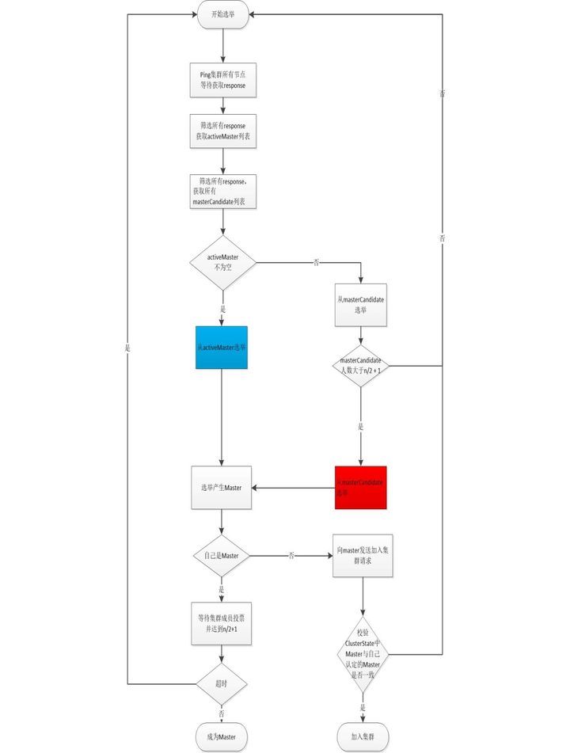

# elasticsearch

## 选举


>1，网络区域内，会根据集群名称，组建集群

>activeMaster列表是其它节点认为的当前集群的Master节点
>masterCandidates列表是当前集群有资格成为Master的节点，elasticsearch.yml中配置: node.master:true

### 1，es节点成员首先向集群中的所有成员发送Ping请求，得到activeMasters列表或者masterCandidates列表
>1,Elasticsearch节点成员首先向集群中的所有成员发送Ping请求，elasticsearch默认等待discovery.zen.ping_timeout时间，然后elasticsearch针对获取的全部response进行过滤，筛选出其中activeMasters列表或者masterCandidates列表

```
List<DiscoveryNode> activeMasters = new ArrayList<>();
for (ZenPing.PingResponse pingResponse : pingResponses) {
    //不允许将自己放在activeMasters列表中
    if (pingResponse.master() != null && !localNode.equals(pingResponse.master())) {
        activeMasters.add(pingResponse.master());
    }
}

List<ElectMasterService.MasterCandidate> masterCandidates = new ArrayList<>();
for (ZenPing.PingResponse pingResponse : pingResponses) {
    if (pingResponse.node().isMasterNode()) {
        masterCandidates.add(new ElectMasterService.MasterCandidate(pingResponse.node(), pingResponse.getClusterStateVersion()));
    }
}

```
#### 脑裂
>如上代码，elasticsearch在获取activeMasters列表的时候会排除本地节点，目的是为了避免脑裂，假设这样一个场景，当前最小编号的节点P0认为自己就是master并且P0和其它节点发生网络分区，同时es允许将自己放在activeMaster中，因为P0编号最小，那么P0永远会选择自己作为master节点，那么就会出现脑裂的情况


### 2，如果activeMasters列表不为空，从activeMasters列表选举Master节点，Bully算法：优先级高，节点id最小
>如果activeMasters列表不为空，elasticsearch会优先从activeMasters列表中选举，也就是对应着流程图中的蓝色框，选举的算法是Bully算法，笔者在前文中详细介绍了Bully算法，Bully算法会涉及到优先级比较， 在activeMasters列表优先级比较的时候，如果节点有成为master的资格，那么优先级比较高，如果activeMaster列表有多个节点具有master资格，那么选择id最小的节点

```
private static int compareNodes(DiscoveryNode o1, DiscoveryNode o2) {
    if (o1.isMasterNode() && !o2.isMasterNode()) {
        return -1;
    }
    if (!o1.isMasterNode() && o2.isMasterNode()) {
        return 1;
    }
    return o1.getId().compareTo(o2.getId());
}

public DiscoveryNode tieBreakActiveMasters(Collection<DiscoveryNode> activeMasters) {
    return activeMasters.stream().min(ElectMasterService::compareNodes).get(); 
}
```

### 3，如果activeMasters列表为空，从masterCandidates列表选举Master节点：先比较版本号（最新），再比较优先级（最高），最后节点id（最小）
>masterCandidates选举也会涉及到优先级比较，masterCandidates选举的优先级比较和masterCandidates选举的优先级比较不同。它首先会判断masterCandidates列表成员数目是否达到了最小数目discovery.zen.minimum_master_nodes。如果达到的情况下比较优先级，优先级比较的时候首先比较节点拥有的集群状态版本编号，然后再比较id，这一流程的目的是让拥有最新集群状态的节点成为master

```
public static int compare(MasterCandidate c1, MasterCandidate c2) {
    int ret = Long.compare(c2.clusterStateVersion, c1.clusterStateVersion);
    if (ret == 0) {
        ret = compareNodes(c1.getNode(), c2.getNode());
    }
    return ret;
}

```

### 4，本地节点是master
>经过上述选举之后，会选举出一个准master节点， 准master节点会等待其它节点的投票，如果有discovery.zen.minimum_master_nodes-1个节点投票认为当前节点是master，那么选举就成功，准master会等待discovery.zen.master_election.wait_for_joins_timeout时间，如果超时，那么就失败。在代码实现上准master通过注册一个回调来实现，同时借助了AtomicReference和CountDownLatch等并发构建实现

```
if (clusterService.localNode().equals(masterNode)) {
    final int requiredJoins = Math.max(0, electMaster.minimumMasterNodes() - 1); 
    nodeJoinController.waitToBeElectedAsMaster(requiredJoins, masterElectionWaitForJoinsTimeout,
            new NodeJoinController.ElectionCallback() {
                @Override
                public void onElectedAsMaster(ClusterState state) {
                    joinThreadControl.markThreadAsDone(currentThread);
                    nodesFD.updateNodesAndPing(state); // start the nodes FD
                }
                @Override
                public void onFailure(Throwable t) {
                    logger.trace("failed while waiting for nodes to join, rejoining", t);
                    joinThreadControl.markThreadAsDoneAndStartNew(currentThread);
                }
            }
    );
```
>本地节点是Master的时候，Master节点会开启错误检测(NodeFaultDetection机制)，它节点会定期扫描集群所有的成员，将失活的成员移除集群，同时将最新的集群状态发布到集群中，集群成员收到最新的集群状态后会进行相应的调整，比如重新选择主分片，进行数据复制等操作

### 5，本地节点不是master
>当前节点判定在集群当前状态下如果自己不可能是master节点，首先会禁止其他节点加入自己，然后投票选举出准Master节点。同时监听master发布的集群状态(MasterFaultDetection机制)，如果集群状态显示的master节点和当前节点认为的master节点不是同一个节点，那么当前节点就重新发起选举。
非Master节点也会监听Master节点进行错误检测，如果成员节点发现master连接不上，重新加入新的Master节点，如果发现当前集群中有很多节点都连不上master节点，那么会重新发起选举



* [es选举-如上内容出处](https://zhuanlan.zhihu.com/p/110079342)