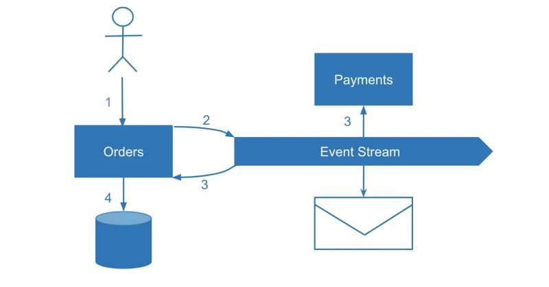

# 微服务架构下的数据一致性

>1、分布式带来一致性挑战；

>2、2PC 效率太低，选择 SAGA 保证最终一致；

>3、SAGA 的补偿环节可能失败，需要进行对账；

>4、对账需要日志，需要记录日志；

>5、用更改优先的方式记日志，更适合跨域操作，域内推荐事件优先；

>6、用事件优先的方式记日志，即属于 CQRS 的一种模式；

>7、CQRS 或者事件优先，也有并发和乱序的挑战，很难实现；

>8、退而求其次，可以采用“设计一致性”；

>9、实在无法一致，那就接受不一致。

## SAGA
>SAGA 对分布式事务的实现，依赖于应用程序为失败的情况，写好修正的逻辑代码，以便回滚时调用。这也就是“ 应用程序级 ”的含义。但在 SAGA 模式中，一个复杂的事务被拆分成若干个事务，并通过流程管理器串接，从而降低了整体事务管理的复杂性。

## 事件日志
>多步事务的情况。如何确定在对账过程中哪些事务在哪些环节上失败了？一种解决方案是检查每个事务的状态。在某些情况下，这个方法并不适用（比如无状态的邮件服务发送电子邮件或生成其他类型的消息）。在其他一些情况下，我们可能希望获得事务状态的即时可见性（也就是实时知晓其当前的状态），特别是在具有多个步骤的复杂场景中。例如，一个多步骤的订单，包括预订航班、酒店和转乘。

## 变更优先原则
>在主要业务操作中，我们修改自己的服务状态，而单独的流程则可靠地捕获相关变更并生成事件。这种技术被称为变更数据捕获(CDC)

## “事件优先”原则 ：event-sourcing
>让我们对“基准数据”做一个逆向思考。如果我们不是首先写入数据库，而是先触发一个事件并与我们自己和其他服务共享这个事件呢？在这种情况下，事件成为基准数据。这将是一种 event-sourcing 的形态，在这种情况下，服务状态实际上变成了一个读模型，而每个事件都是一个写模型

>这也是一种命令查询责任分离(CQRS)模式，将读写模型分离开来，但是 CQRS 本身并没有关注解决方案中最重要的部分，即如何由多个服务来对事件进行处理。相反，事件驱动体系结构关注多个系统对事件的处理，但不突出强调事件是数据更新的基准数据。所以我想引入 “事件优先”原则作为此方法的名称：通过发出单个事件来更新微服务的内部状态-包括对我们自己的服务和任何其他感兴趣的微服务。

>将和该对象相关的所有事件按照事件发生先后顺序从先到后再全部应用一遍即可还原得到该对象的最新状态，这个过程就是所谓的事件溯源。

## 设计一致性：在划分业务领域微服务的时候，除了DDD，业务亲和性，还要关注数据一致性，尽量减少分布式事务，减少数据一致性挑战
>与其只关注领域驱动的设计，我建议采取务实的态度，并考虑所有设计选项的含义。其中一个含义是微服务隔离与事务边界的匹配程度。事务只驻留在微服务中的系统不需要上述任何解决方案。在设计系统时，一定要考虑事务边界。在实践中，可能很难以这种方式设计整个系统，但我认为我们的目标应该是尽量减少数据一致性的挑战