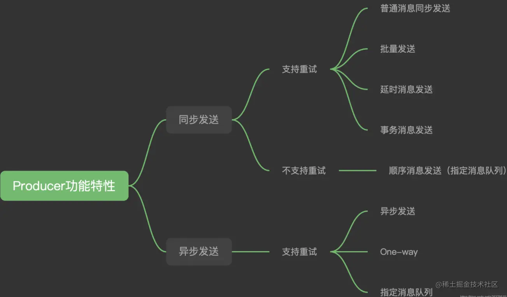

# RocketMQ

>1,消息领域有一个对消息投递的QoS定义（Quality of Service，服务质量），分为：最多一次（At most once）、至少一次（At least once）、仅一次（ Exactly once）

>2,目前火热的几款MQ，比如RocketMQ、Kafka、RabbitMQ、ActiveMQ等，都是保证的至少一次(At least Once)，它指每个消息必须投递一次。既然是至少一次，那么他们就避免不了重复消费的问题，因此这个问题最终还是要靠业务代码来解决

## 重复消费的原因
>1,重复消费的的原因大概可以分为两个，一个是生产者发送消息的时候发送了重复的消息，另一个是消费者消费的时候消费了重复的消息

## 重试机制

Producer的send方法本身支持内部重试，重试逻辑如下：

至多重试2次。
如果同步模式发送失败，则轮转到下一个Broker，如果异步模式发送失败，则只会在当前Broker进行重试。这个方法的总耗时时间不超过sendMsgTimeout设置的值，默认10s。
如果本身向broker发送消息产生超时异常，就不会再重试。

以上策略也是在一定程度上保证了消息可以发送成功。如果业务对消息可靠性要求比较高，建议应用增加相应的重试逻辑：比如调用send同步方法发送失败时，则尝试将消息存储到db，然后由后台线程定时重试，确保消息一定到达Broker。

