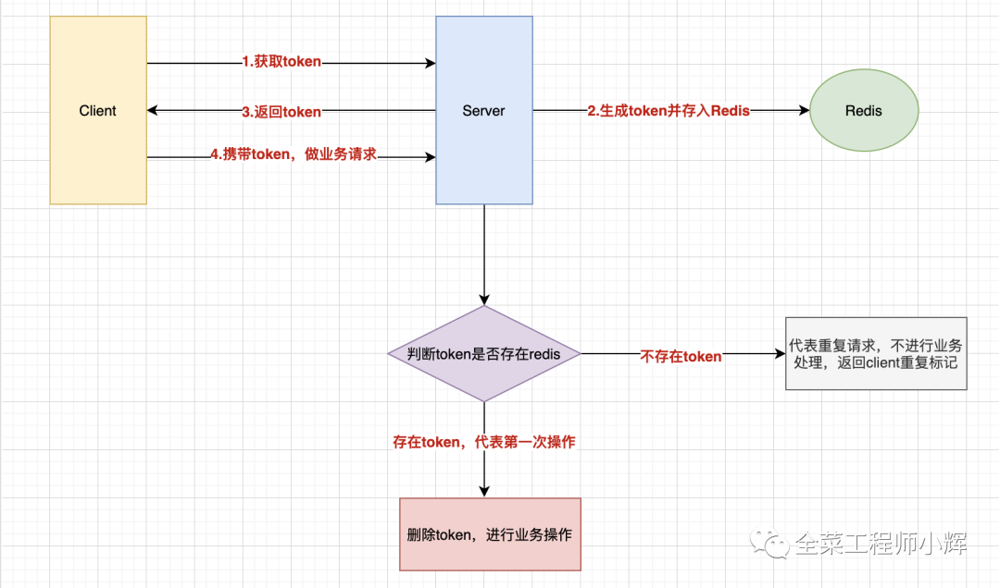

# 幂等

## 三种处理角度
请求唯一标识：每一个请求必须有一个唯一标识。

处理唯一标识：每次处理完请求之后，必须有一个记录标识这个请求处理过了。

逻辑判断处理：每次接收请求需要进行判断之前是否处理过的逻辑处理。根据请求唯一标识查询是否存在处理唯一标识。

## 方案

### 方案一：token机制

### 方案二：分布式锁

### 方案三：基于redis的reqId去重

### 方案四：基于严格有序的状态机，使用于有严格有序的状态的业务场景，例如一个订单已支付状态，又收到该订单的支付请求，则可以忽略

