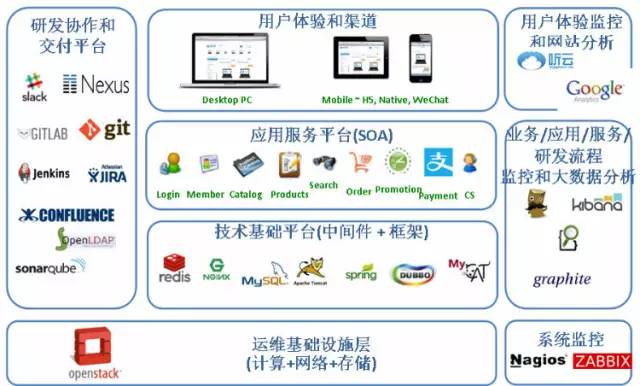

# 架构

>全局视角和系统思维
>强化反馈环：任何过程改进的目标都是加强和缩短反馈环
>没有监控或者监控不完善的系统相当于裸奔，开车上高速无仪表盘

>1，58 同城沈剑：好的架构源于不停地衍变，而非设计
>2，宜人贷系统架构–高并发下的进化之路

## 架构师的艺术:系统架构的目标是解决利益相关者的关注点
>架构系统前，架构师的首要任务是尽最大可能找出所有利益相关者，业务方，产品经理，客户 / 用户，开发经理，工程师，项目经理，测试人员，运维人员，产品运营人员等等都有可能是利益相关者，架构师要充分和利益相关者沟通，深入理解他们的关注点和痛点，并出架构解决这些关注点。架构师常犯错误是漏掉重要的利益相关者，沟通不充分，都会造成架构有欠缺，不能满足利益相关者的需求。利益相关者的关注点是有可能冲突的，比如管理层（可管理性）vs 技术方（性能），业务方（多快好省）vs 技术方（可靠稳定），这需要架构师去灵活平衡，如何平衡体现了架构师的水平和价值。

* [架构师&康威定律](https://www.infoq.cn/article/every-architect-should-study-conway-law)

### 强化反馈环 & 监控
>1，系统层监控计算网络存储，构建系统层的反馈环
>2，应用服务层，监控业务、应用、服务，甚至整个研发流程，构建应用和服务层的反馈环
>3，客户体验层，监控端用户和分析网站用户的行为，构建和客户的反馈环

* [度量驱动开发的理念，即所谓 MDD，在系统，应用和业务三个层次，通过三级监控，构建三个反馈环，在监控测量基础上持续改进系统和架构](http://www.infoq.com/cn/articles/metrics-driven-development)
  

### 《软件架构师的 12 项修炼》
>1，soft skills are always hard than hard skills，软技能比硬技能难
>2，choosing relationship over correctness ，注重关系重于谁对谁错
>3，架构的政治性，在中大型公司里工作的架构师尤其要学习

>政治指的是和他人协作将事情搞定的艺术，架构是一种社交活动，在技术的世界里，个人主义很容易被打败，即使你的目的是好的技术是最优的，技术决策是政治决策（technical decisions are political decisions），一个技术产品，一波人可以做，另一波人也可以做，到底谁做的好，真不好说

>反思：读书是要有思考的，就好比看这个书，可能对于我来说，咋一看，都挺对，但是因为阅读前自己没有要待解决的问题，可能看看也就过了，而且你看还因为看过这个书，而不再看，还沾沾自喜自己“看过”，但是你可能不是真的看懂过。思考，理解，内化成自己的观点，能真实的指导实践，才是真的懂真的读过。
>有一种读书是为了解决实际问题的。当你没有问题，说明脑子没思考。思考而得的能力，才是个人屏障。

### 架构牛人物:马丁福勒，adrian cockcroft 

### 技术驱动数据高效，数据驱动业务成长

### MDD:度量驱动开发
>1,主要原则有：1)给度量拥有者分配度量项.2)创建分层的指标，相互关联、发现趋势.3)利用度量做决定
>2，类似性能测试，找到每个环节的性能度量，找到优化和改善点，促进开发更好的平台服务
>3，推荐的工具：Zabbix 

### TDD:测试驱动开发

### BDD:行为驱动开发

## 
>Organizations which design systems are constrained to produce designs which are copies of the communication structures of these organizations. - Melvin Conway(1967)
>康威定律：设计系统的架构受制于产生这些设计的组织的沟通结构。
>从语言学的角度，那其实语言的结构也受制于逻辑结构
>按原作者的意思并不局限于软件系统。据说这篇文章最初投的哈佛商业评论，无情被拒，康威就投到了一个编程相关的杂志，所以被误解为是针对软件开发的。最初这篇文章显然不敢自称定律（law），只是描述了作者自己的发现和总结。后来，在Brooks Law著名的人月神话中，引用这个论点，并将其“吹捧”成了现在我们熟知“康威定律”

>There is never enough time to do something right, but there is always enough time to do it over。时间再多一件事情也不可能做的完美，但总有时间做完一件事情
