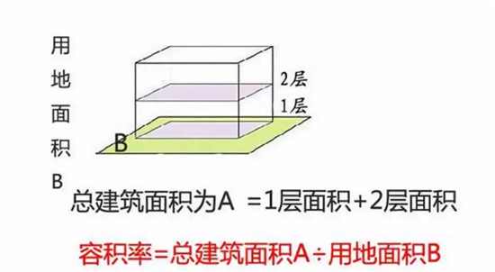
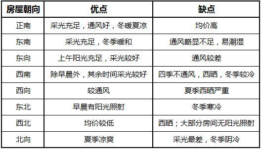
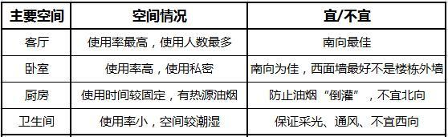

# 购房细则
>注：所有数据仅供参考，需再进一步验证

## 概念

### 得房率

>得房率=套内建筑面积÷建筑面积
>举例：小明买了一套房，建筑面积为100㎡，套内建筑面积为83㎡，那么得房率为
>83÷100×100%=83% 

>公摊系数越大，得房率越小，你的房屋实际使用面积就越小
>得房率也不是越高越好,如果公摊面积太小，会使得公共区域拥挤不堪
>目前市场上约定俗成的得房率标准，要求高层建筑得房率不低于70%，多层建筑得房率不得低于75%，办公楼为55～60% 【数据待验证】

### 公摊系数

>公摊系数＝小区总分摊面积之和/小区各套内建筑面积之和

>和得房率等于套内建筑面积除以建筑面积不同的是，公摊系数是按总分摊面积来计算的，包含了管道井、楼梯间、公共墙体、设备间、电梯井、变电室、过道公共门厅、保安室等。

>和得房率一样，公摊面积不宜过大，也不宜过小，一般是10-25%左右。【数据待验证】

### 容积率

>容积率=建筑面积÷用地面积

>一般而言，容积率分为：【数据待验证，例如查一下国家商品房标准】   
>独立别墅为0.2~0.5,
>联排别墅为0.4~0.7,
>6层以下多层住宅为0.8~1.2,
>11层小高层住宅为1.5~2.0,
>18层高层住宅为1.8~2.5,
>19层以上住宅为2.4~4.5,
>住宅小区容积率小于1.0的，为非普通住宅

### 绿地率&绿化覆盖率
>绿地率=绿地面积÷小区用地面积
>绿化覆盖率＝绿化垂直投影面积之和÷小区用地面积

>绿地率要求非常严格，不是所有长草的地方可以视为绿地率，距建筑外墙1.5米和道路边线1米以内的土地或地表覆土达不到3米深度的土地，不管它们上面是否有绿化，都不计入绿地面积     
>绿化覆盖率要求比较宽松，像树下面的影子、凡是能够种草的地方都可归入绿化覆盖率    

>国家规定新区建设的绿化率不低于30%，旧区改建的绿化率不应低于25%，在这么比例以上越高越好，40%以上保证居住舒适，50%以上可以看作花园式小区   

### 车位比

>车位比＝总户数/车位总数

>比例越高越好，现在普通小区要求的车位比是1：0.6，高档住宅要求的车位比是1：2以上

### 楼间距

>楼间距说的是同一个小区里两栋相邻的楼与楼之间的距离，楼与楼之间要有足够的距离才能保证日常的透光、通风、隔音等，保证生活质量。

>房屋前后间距：普通小区居住用房可以用：楼高：楼间距=1：1.2比值计算  
>房屋左右间距：多层（4-6层及以下）与多层建筑间距为6米，多层与高层（12层及以上）为9米，高层与高层之间为13米     

### 噪音比

## 税费

>1.购房需交纳的第一组税费是契税、印花税、交易手续费、权属登记费。
>2.契税金额是房价的1.5%，一般情况下是在交易签证时交50%，入住后拿房产证时交50%。
>3.印花税金额为房价的0.05%，在交易签证时交纳。
>4.交易手续费一般是每平方米2.5元，也在交易签证时交纳。
>5.权属登记费100元到200元之间。

## 选房

### 朝向:先厅后卧的窗户朝向

>选择朝南的房子为佳

#### 如何判断房子朝向
>看户型图时，先根据指向标分清南北，然后看客厅和主卧的窗户（阳台）朝向，从而判断房屋朝向。
>例如客厅、主卧的窗户都朝南，那么，该户型的朝向应为南。
>如果客厅和主卧的窗户（阳台）朝向不一致，则一般按照“先厅后卧”的方法确定房屋朝向，即以客厅朝向为房屋朝向。

### 房型
>方正
>通风
>布局合理
>阳台

### 开间&进深

>通常，我们把房间的主采光面称为开间（面宽），与其垂直的称为进深。也可以根据房间门的朝向来确定开间与进深，房门进入的方向的距离为进深，左右两边的距离为开间

>在12米以下，这个数字比较合理。一般来说，板式多层或小高层住宅的进深在10.5至12米之间比较理想
>开间，就是采光面，当然是越开阔越好。一般，两室一厅80平方米左右的住宅，其客厅开间最大不可超过3.9米;120平方米的住宅，客厅开间在3.9米至4.2米之间

### 层高
>一般商品房的层高是2.9米，如果减去楼板及地砖等的厚度，有2.7米的净高

### 楼层

>一般而言，高层住宅选择规则为：总层数的1/3以上、2/3以下为最优选择

楼层    |         概要            | 缺点 | 优点 
--------------:|:-----------------------------:|:-----------:|:----------
 1－4楼  | 价格低，出行方便，但易返潮、光照差   | 潮湿、私密性弱、安全性弱（最易发生偷盗事件）光照差、灰尘大、虫蚊多，房间较暗开灯时间比较长。受楼栋内部噪音影响 |通常来说价格低；遇到什么突发事件，成功离开的几率非常大；部分项目购买一楼会赠送一个小花园，以促进成交，会有一个活动空间；夏天温度比上面楼层要低点；水压足够           
 5－7楼   | 视野一般，适合有老小家庭   |同样，光照不会很好，视野受影响，安全性不高  | 价格同样较低，较适合行动不便的老年人居住。贴近绿化，噪音被过滤，空气较好
 8－10楼   | 适合居住，价格适中，视野并不是最佳   |虽然有风景，但视野不是很好    | 楼层不高不矮适合居住，价格适中，光照不错，有风景看，电梯出什么问题爬楼也不累，也不用担心潮湿问题；蚊虫问题也不大
 10－12楼 | 高度适合居住，但担心空气质量问题   |通从扬灰层的角度来考虑的话，空气质量不佳 | 楼层高度很适合居住，光照够、风景不错
13－23楼 | 最优楼层，价格最高   |这几层的价格往往偏贵，出行相对不方便，比如停水或者停电后供水和电梯不正常。对三代同堂的家庭来说楼层太高不适合。  | 很多人眼里的最佳楼层，采光不错，日照时间长，噪声影响小，视野很开阔
24－30楼 | 视野佳，不适合支气管炎等病人   |楼层太高，如果窗户的隔音不好会有风声和噪声，此外，如果家中有老人和小孩，25层以上谨慎选择，不适合心脏病、慢性支气管炎等病人居住。 | 站得高看得远，景观无遮挡，夜景漂亮，环境安静，私密性强。风大，凉爽，无蚊虫

>注，仅供参考

## 时机和趋势
>1,银行动向
>2,供需关系
>3,自身需求
>4,中介反应
>5,政策倾向
>6,房价变动
>7,烂尾及复工项目销售情况
>8,变现情况

## 长沙

### 公积金贷款最高70W

