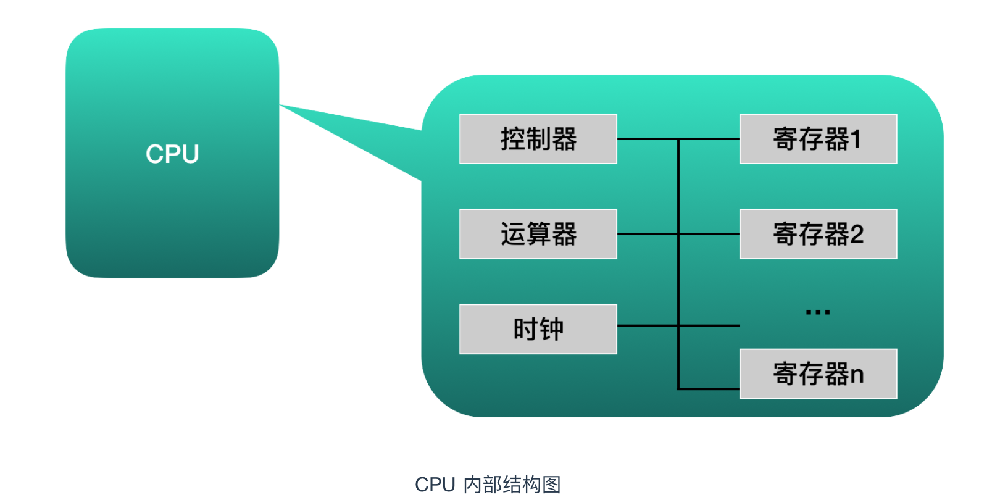

# CPU

>1,物理CPU               
  实际Server中插槽上的CPU个数
  物理cpu数量，可以数不重复的 physical id 有几个           
>2,逻辑CPU               
  Linux用户对 /proc/cpuinfo 这个文件肯定不陌生. 它是用来存储cpu硬件信息的
  信息内容分别列出了processor 0 – n 的规格。这里需要注意，如果你认为n就是真实的cpu数的话, 就大错特错了
  一般情况，我们认为一颗cpu可以有多核，加上intel的超线程技术(HT), 可以在逻辑上再分一倍数量的cpu core出来
  逻辑CPU数量=物理cpu数量 x cpu cores 这个规格值 x 2(如果支持并开启ht)
  备注一下：Linux下top查看的CPU也是逻辑CPU个数              
>3,CPU核数           
  一块CPU上面能处理数据的芯片组的数量、比如现在的i5 760,是双核心四线程的CPU、而 i5 2250 是四核心四线程的CPU              
  一般来说，物理CPU个数×每颗核数就应该等于逻辑CPU的个数，如果不相等的话，则表示服务器的CPU支持超线程技术

  # 查看物理CPU个数
cat /proc/cpuinfo| grep "physical id"| sort| uniq| wc -l

# 查看每个物理CPU中core的个数(即核数)
cat /proc/cpuinfo| grep "cpu cores"| uniq

# 查看逻辑CPU的个数
cat /proc/cpuinfo| grep "processor"| wc -l

多核(心)处理器是指在一个处理器上集成多个运算核心从而提高计算能力，
也就是有多个真正并行计算的处理核心，每一个处理核心对应一个内核线程。
内核线程（Kernel Thread， KLT）就是直接由操作系统内核支持的线程，这种线程由内核来完成线程切换，内核通过操作调度器对线程进行调度，并负责将线程的任务映射到各个处理器上。
一般一个处理核心对应一个内核线程，比如单核处理器对应一个内核线程，双核处理器对应两个内核线程，四核处理器对应四个内核线程。

超线程技术将一个物理处理核心模拟成两个逻辑处理核心，对应两个内核线程，所以在操作系统中看到的CPU数量是实际物理CPU数量的两倍.

程序一般不会直接去使用内核线程，而是去使用内核线程的一种高级接口——轻量级进程（Light Weight Process，LWP），轻量级进程就是我们通常意义上所讲的线程(我们在这称它为用户线程)，由于每个轻量级进程都由一个内核线程支持，因此只有先支持内核线程，才能有轻量级进程。

多对多模型的优点有：1.一个用户线程的阻塞不会导致所有线程的阻塞，因为此时还有别的内核线程被调度来执行；2.多对多模型对用户线程的数量没有限制；3.在多处理器的操作系统中，多对多模型的线程也能得到一定的性能提升，但提升的幅度不如一对一模型的高。

CPU 是多核时是支持多个线程同时执行(并行)

### CPU 是一系列寄存器的集合体

种类|	功能
---------|----------
累加寄存器|	存储运行的数据和运算后的数据。
标志寄存器|	用于反应处理器的状态和运算结果的某些特征以及控制指令的执行。
程序计数器|	程序计数器是用于存放下一条指令所在单元的地址的地方。
基址寄存器|	存储数据内存的起始位置
变址寄存器|	存储基址寄存器的相对地址
通用寄存器|	存储任意数据
指令寄存器|	储存正在被运行的指令，CPU内部使用，程序员无法对该寄存器进行读写
栈寄存器	|存储栈区域的起始位置

每个核都有一套自己的寄存器，每个线程独占程序计数器寄存器等，多核，则可以并行多个线程