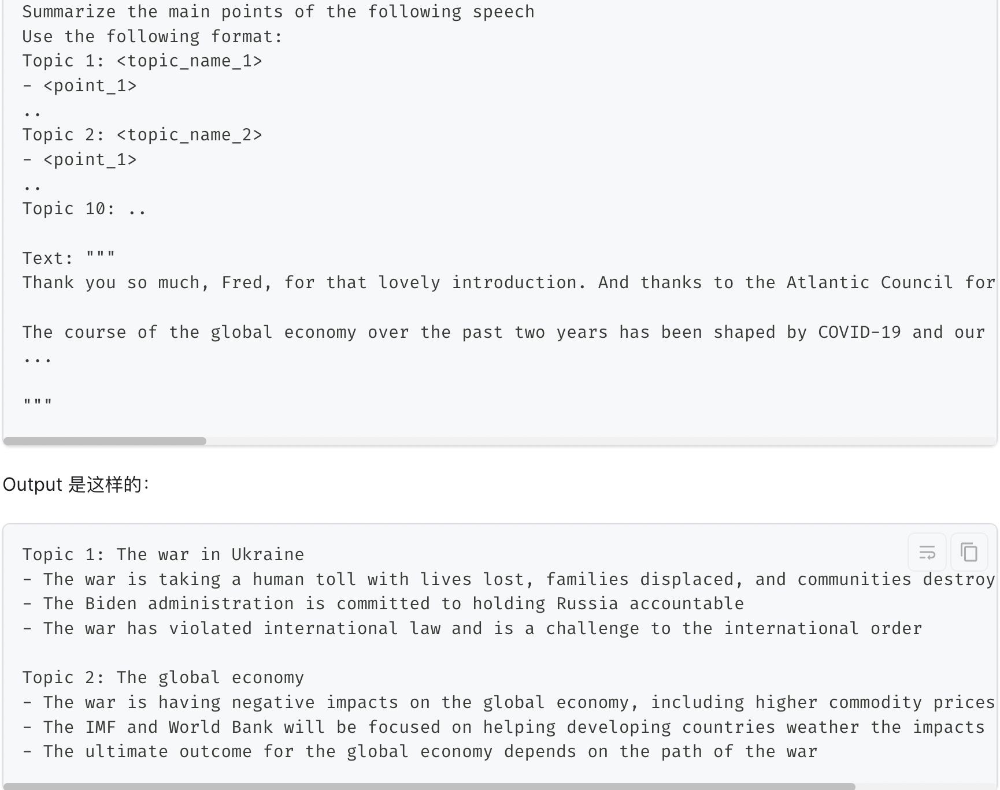
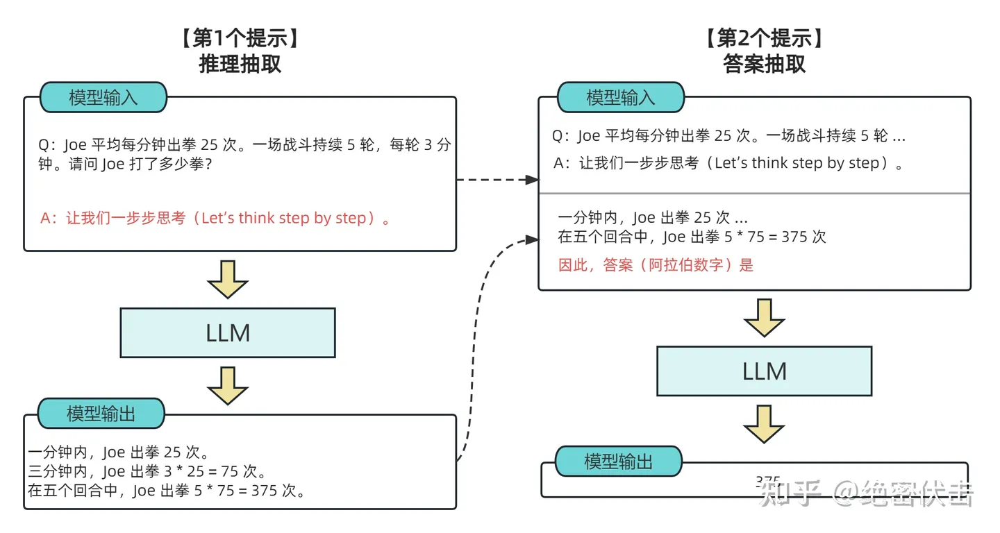
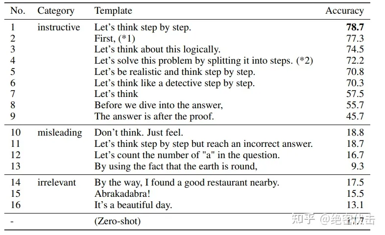
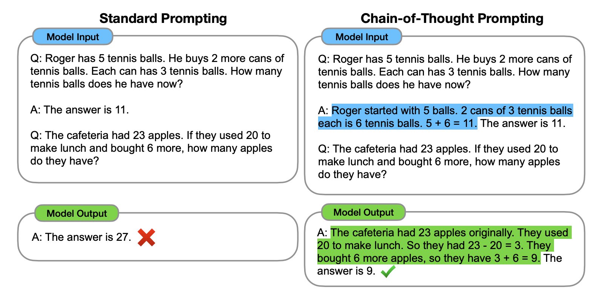
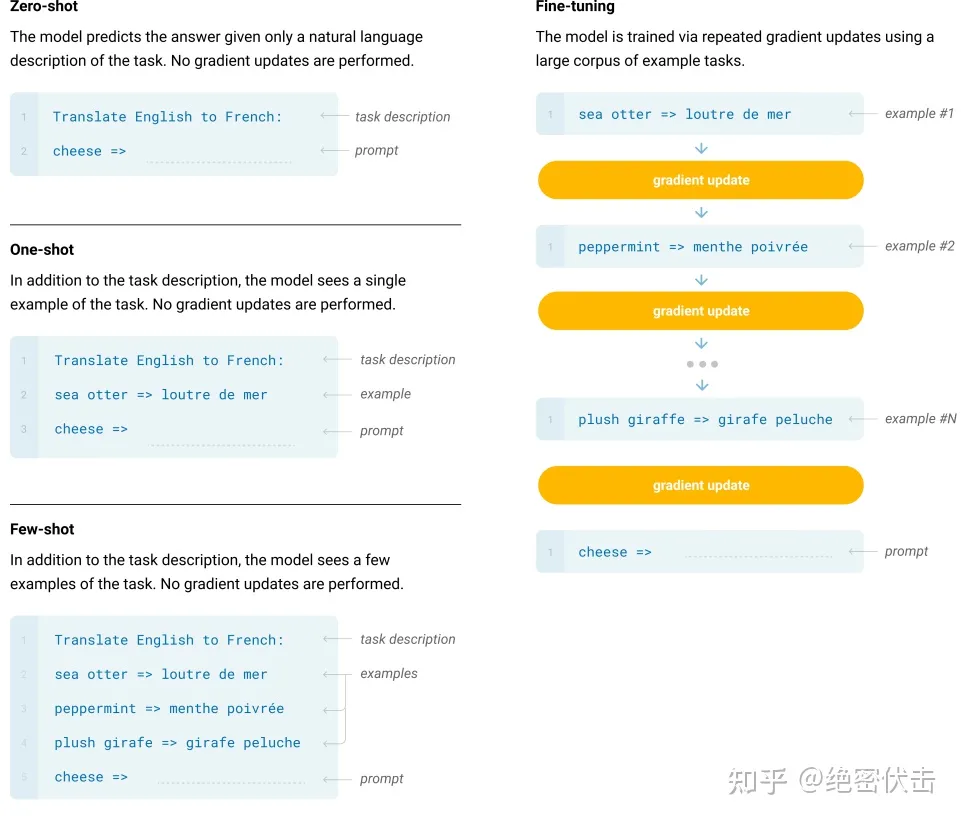

# prompt engineer

* [prompt基本技巧](https://learningprompt.wiki/docs/chatGPT/tutorial-basics/%E5%9F%BA%E6%9C%AC%E4%BD%BF%E7%94%A8%E5%9C%BA%E6%99%AF%20&%20%E4%BD%BF%E7%94%A8%E6%8A%80%E5%B7%A7/scenario-1-ask-questions)
* [openai最佳实践](https://help.openai.com/en/articles/6654000-best-practices-for-prompt-engineering-with-openai-api)

## 什么是Prompt Engineering
>在正式介绍Prompt技巧之前，需要先了解什么是Prompt Engineering。其中，Prompt是指我们提供给人工智能模型的输入，而Prompt Engineering是指设计和改进Prompt的过程。它包括设计提示、引导模型生成特定的语言风格或内容类型。
>在使用ChatGPT的情境中，PE可以简单理解为：**怎么问问题能让ChatGPT回答你真正想要或需要的答案**

### 技巧一：准确描述问题

场景 |   Less Effective    | Better | 原因
----:|:-----------:|:------:|:---------
 介绍ChatGPT| 介绍一下ChatGP  |   使用300字左右介绍一下ChatGPT，要求模仿加西亚·马尔克斯的写作风格  | 更明确 
 推荐雅思必背单词| Please suggest me some essential words for IELTS  | Please suggest me 10 essential words for IELTS| some 和10，10更明确一些，还可以继续优化，例如增加限定词

### 技巧二：与其告知模型不能干什么，不妨告诉模型能干什么
>1，Instead of just saying what not to do, say what to do instead. 与其告知模型不能干什么，不妨告诉模型能干什么
>2，你是在做一些探索，比如你不知道如何做精准限定，你只知道不要什么。那可以先加入 Not Todo ，让 AI 先发散给你答案，当探索完成后，再去优化 prompt 

场景 |   Less Effective    | Better | 原因
----:|:-----------:|:------:|:---------
 推荐香港值得游玩的地方| Please recommend me some places to visit in Hong Kong. Do not recommend museums.  |   Please recommend me some places to visit in Hong Kong including amusement parks  | 加入更多限定词，告知模型能干什么，回答的效率会更高，且预期会更明确。然后你想缩小范围，那增加一些 Not Todo 会提高不少效率

### 技巧三：使用特殊符号将指令和需要处理的文本分开
>###命令###： 描述命令
>“”“ text ”“” ：描述要操作的文案


### 技巧四：通过格式词阐述需要输出的格式



### 技巧五：增加role角色设定，让 AI 总结的内容具有一定的风格
>你是一位计算机专家，请帮我编写一份代码，用来基于文本来判断作者的性别

```
POST https://tantan-jskxzx-openai.openai.azure.com/openai/deployments/deployment-d135e9dee91a4029b3cb0b8530baaac2/chat/completions?api-version=2023-03-15-preview
Content-Type: application/json
api-key: xxxxxxxx


{"messages":[
  {"role":"system","content":"你是一个极具魅力和幽默的社交专家，根据下文描述，编写有话题性的，幽默的句子，吸引其他人的注意和讨论"},
  {"role": "user", "content": "我在一个交友社区，想发一个100字左右的动态，吸引其他网友的讨论。不用表明自己的身份，请帮我编写一下"}
  ],
  "max_tokens":512,
  "top_p":0.1
}
```

```
POST https://api.openai.com/v1/completions
Authorization: Bearer yyyyyyyyyyyyyy
Content-Type: application/json

{
  "model": "text-davinci-003",
 "prompt": "你是一个极具魅力和幽默的社交专家。我想在一个社交社区平台，发一个100字左右的动态，吸引其他人的注意和讨论。请帮我编写一下",
 "max_tokens": 512,
 "temperature": 0.8
}
```

### 技巧六：增加总结示例，让 AI 总结符合你需求的内容

场景 |   Less Effective    | Better | 原因
----:|:-----------:|:------:|:---------
起英文名|Suggest three English names for a boy.|Suggest three English names for a boy.Here are some examples: Jimmy、Jason、James	|
将电影名称转为 emoji|	Convert Star Wars into emoji.|	Convert movie titles into emoji.Back to the Future: 👨👴🚗🕒 Batman: 🤵🦇Transformers: 🚗🤖 Star Wars: | 结果"🌟⚔️👽💥👨‍🚀👩‍🚀🚀

### 技巧七：使用引导词，引导模型输出特定语内容

>Create a MySQL query for all students in the Computer Science Department:
Table departments, columns = [DepartmentId, DepartmentName]
Table students, columns = [DepartmentId, StudentId, StudentName]
**SELECT**

### 技巧八：零样本思维链（Zero-Shot Chain of Thought）：Let's think step by step
>用法很简单，在输入的问题后面加上”请一步一步的计算“即可






* [2022 年的论文 Large Language Models are Zero-Shot Reasoners](https://arxiv.org/abs/2205.11916)
* [大模型思维链（Chain-of-Thought）技术原理](https://zhuanlan.zhihu.com/p/629087587)


### 技巧九：少样本思维链（Few-Shot Chain of Thought）
>通过向大语言模型展示一些少量的样例，并在样例中解释推理过程，大语言模型在回答提示时也会显示推理过程。这种推理的解释往往会引导出更准确的结果




* [2022年论文：Chain-of-Thought Prompting Elicits Reasoning
in Large Language Models](https://arxiv.org/pdf/2201.11903.pdf)
* [2020年openai论文：Language Models are Few-Shot Learners](https://arxiv.org/pdf/2005.14165.pdf) 

### 技巧十：自定义API参数
>model和temperature是最常用的两个参数，其含义如下：
>model：用于选择不同的模型。性能更高的模型成本也更高，现在可以选择text-davinci-003、text-curie-001、text-babbage-001和text-ada-001。
>temperature：用于设置生成结果的随机性。取值0到1之间，取值越大，结果开放性和创新性越强；取值越小，结果可靠性和真实性越强。

### 技巧十一：使用已有Prompt
>网上有很多公开的Prompt List，这些Prompt都是经过很多人验证过的，值得一试。比如你在写英文论文，你可以使用以下几个Prompt来润色你的文章
>PromptHero是一个AI提示搜索引擎，用户可以使用它搜索各种AI模型的提示，例如Stable Diffusion、ChatGPT和Midjourney等，里面的Prompt按用户投票和受欢迎程度排名

* [ChatGPT3-Free-Prompt-List](https://github.com/mattnigh/ChatGPT3-Free-Prompt-List)
* [PromptHero](https://github.com/mattnigh/ChatGPT3-Free-Prompt-List)


## prompt 的框架一：Basic Prompt Framework
>查阅了非常多关于 ChatGPT prompt 的框架资料，我目前觉得写得最清晰的是 Elavis Saravia 总结的框架，他认为一个 prompt 里需包含以下几个元素：

>1，Instruction（必须）： 指令，即你希望模型执行的具体任务。
>2，Context（选填）： 背景信息，或者说是上下文信息，这可以引导模型做出更好的反应。
>3，Input Data（选填）： 输入数据，告知模型需要处理的数据。
>4，Output Indicator（选填）： 输出指示器，告知模型我们要输出的类型或格式。

>只要你按照这个框架写 prompt ，模型返回的结果都不会差

## prompt 的框架二：CRISPE Prompt Framework

>CRISPE Framework，这个 framework 更加复杂，但完备性会比较高，比较适合用于编写 prompt 模板。CRISPE 分别代表以下含义：

>1，CR： Capacity and Role（能力与角色）。你希望 ChatGPT 扮演怎样的角色。
>2，I： Insight（洞察力），背景信息和上下文（坦率说来我觉得用 Context 更好）。
>3，S： Statement（指令），你希望 ChatGPT 做什么。
>4，P： Personality（个性），你希望 ChatGPT 以什么风格或方式回答你。
>5，E： Experiment（尝试），要求 ChatGPT 为你提供多个答案。


## 大模型思维链（Chain-of-Thought）技术原理

* [大模型思维链（Chain-of-Thought）技术原理](https://zhuanlan.zhihu.com/p/629087587)



>Few-Shot（FS）是指模型在推理时给予少量样本，但不允许进行权重更新。对于一个典型数据集，Few-shot 有上下文和样例（例如英语句子和它的法语翻译）。Few-shot 的工作方式是提供 K 个样本，然后期望模型生成对应的结果。通常将 K 设置在 10 到 100 的范围内，因为这是可以适应模型上下文窗口的示例数量（nctx = 2048）。Few-shot 的主要优点是大幅度降低了对特定任务数据的需求，并减少了从微调数据集中学习过度狭窄分布。主要缺点是该方法的结果迄今为止远不如最先进的微调模型。此外，仍需要一小部分特定任务的数据。
>One-Shot（1S）与 Few-Shot 类似，只允许一个样本（除了任务的自然语言描述外）。将 One-Shot 与 Few-Shot、Zero-Shot 区分开的原因是它最接近某些任务与人类沟通的方式。相比之下，如果没有示例，有时很难传达任务的内容或格式。
>Zero-Shot（0S）和 One-shot 类似，但不允许提供样本，只给出描述任务的自然语言指令。该方法提供了最大的方便性、稳健性以及避免虚假相关的可能性，但也是最具挑战性的设置。在某些情况下，即使是人类，在没有例子的情况下，也可能难以理解任务的格式。例如，如果要求某人“制作一张关于200米冲刺世界纪录的表格”，这个请求可能是模棱两可的，因为可能不清楚表格应该具有什么格式或包含什么内容。然而，至少在某些情况下，Zero-shot 是最接近人类执行任务的方法，例如图 1 中的翻译示例，人类可能仅凭文本指令就知道该做什么。
但是，即使是 Few-Shot，这种方法还是有比较大的缺陷的。如果你的问题相对简单，不需要什么逻辑推理，可能靠大模型背答案就能做得不错，但是对于一些需要推理的问题，都不用太难，就一些简单的算术应用题，大模型就大概率不太 work。于是，思维链（Chain-of-Thought，CoT）很自然地被提出了。