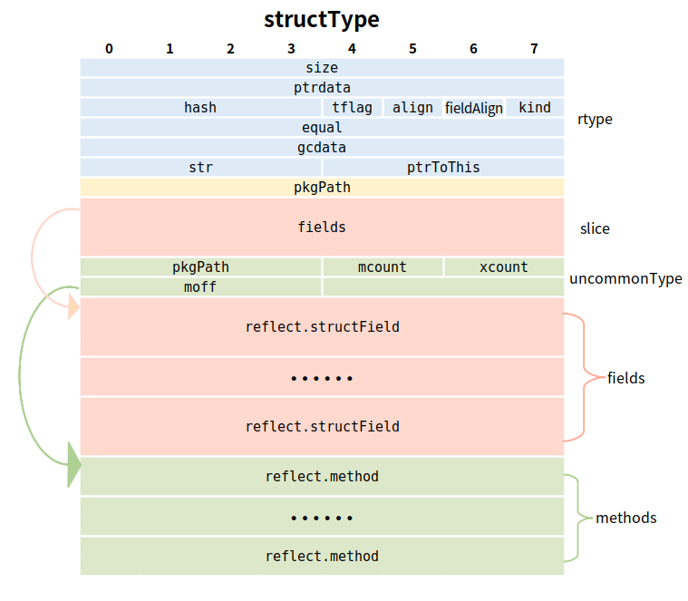

# interface

* [interface原理详解及断言效率分析](https://zhuanlan.zhihu.com/p/136949285)
* [interface原理详解](https://draveness.me/golang/docs/part2-foundation/ch04-basic/golang-interface/)


>interface其实是一组method的结合，也是鸭子类型编程（duck-type programming)的一种体现。这个名字的起源是这样描述的：“当看到一只鸟走起来像鸭子、游泳起来像鸭子、叫起来也像鸭子，那么这只鸟就可以被称为鸭子。”即不关心数据属性，只关心方法行为

interface
Go 语言根据接口类型是否包含一组方法将接口类型分成了两类：

使用 runtime.iface 结构体表示包含方法的接口
使用 runtime.eface 结构体表示不包含任何方法的 interface{} 类型；


runtime.eface 结构体在 Go 语言中的定义是这样的：

type eface struct { // 16 字节

    _type *_type

    data unsafe.Pointer

}

只有interface类型才有反射一说

Go 语言的接口类型不是任意类：与 C 语言中的 void * 不同，interface{} 类型不是任意类型

## interface
>path:src/runtime/runtime2.go

```
type iface struct {
	tab  *itab
	data unsafe.Pointer
}

type eface struct {
	_type *_type
	data  unsafe.Pointer
}

```

### interface iface:结构体表示包含方法的接口

```
type iface struct {
    tab  *itab          // 类型信息
    data unsafe.Pointer  // 接口指向对象的指针
}

// 类型信息
type itab struct {
    inter  *interfacetype    // 接口的类型信息
    _type  *_type           // 接口指向对象的类型信息
	hash  uint32 // copy of _type.hash. Used for type switches.
	_     [4]byte
    fun    [1]uintptr       // 接口方法实现列表，即函数地址列表，按字典序排序
}
//fun[0]=0时，表示_type并没有实现该接口（这里指的是itab下的_type），当实现了接口时，fun存放了第一个接口方法的地址，其他方法依次往后存放。在这里fun存储的其实是接口方法对应的实际类型的方法，每次调用发方法时实行动态分派

inter描述的是接口本身的类型，_type描述的是具体数据类型的类型信息

// 接口类型信息
type interfacetype struct {
   typ     _type
   pkgpath name
   mhdr    []imethod      // 接口方法声明列表，按字典序排序
}
```

>iface 的变量可以在编译阶段，在变量赋值处，增加拷贝指向对象（父类或者子类）的类型信息的指令，就可以在运行期完成多态的支持了


### 

```
type itab struct {
	inter *interfacetype
	_type *_type
	hash  uint32 // copy of _type.hash. Used for type switches.
	_     [4]byte
	fun   [1]uintptr // variable sized. fun[0]==0 means _type does not implement inter.
}

type _type struct {
	size       uintptr
	ptrdata    uintptr // size of memory prefix holding all pointers
	hash       uint32
	tflag      tflag
	align      uint8
	fieldAlign uint8
	kind       uint8
	// function for comparing objects of this type
	// (ptr to object A, ptr to object B) -> ==?
	equal func(unsafe.Pointer, unsafe.Pointer) bool
	// gcdata stores the GC type data for the garbage collector.
	// If the KindGCProg bit is set in kind, gcdata is a GC program.
	// Otherwise it is a ptrmask bitmap. See mbitmap.go for details.
	gcdata    *byte
	str       nameOff
	ptrToThis typeOff
}

```

>1，size描述类型的大小
>2，hash数据的hash值
>3，align指对齐
>4，fieldAlgin是这个数据嵌入结构体时的对齐
>5，kind是一个枚举值，每种类型对应了一个编号
>6，alg是一个函数指针的数组，存储了hash/equal这两个函数操作。
>7，gcdata存储了垃圾回收的GC类型的数据，精确的垃圾回收中，就是依赖于这里的gcdata
>8，nameOff和typeOff为int32，表示类型名称和类型的指针偏移量，这两个值会在运行期间由链接器加载到runtime.moduledata结构体中，通过以下两个函数可以获取偏移量

## 如何实现接口和类型之间的转换


```
func convI2I(dst *interfacetype, src *itab) *itab {
	if src == nil {
		return nil
	}
	if src.inter == dst {
		return src
	}
	return getitab(dst, src._type, false)
}

func getitab(inter *interfacetype, typ *_type, canfail bool) *itab {
	if len(inter.mhdr) == 0 {
		throw("internal error - misuse of itab")
	}

	// easy case
	if typ.tflag&tflagUncommon == 0 {
		if canfail {
			return nil
		}
		name := inter.typ.nameOff(inter.mhdr[0].name)
		panic(&TypeAssertionError{nil, typ, &inter.typ, name.name()})
	}

	var m *itab

	// First, look in the existing table to see if we can find the itab we need.
	// This is by far the most common case, so do it without locks.
	// Use atomic to ensure we see any previous writes done by the thread
	// that updates the itabTable field (with atomic.Storep in itabAdd).
	t := (*itabTableType)(atomic.Loadp(unsafe.Pointer(&itabTable)))
	if m = t.find(inter, typ); m != nil {
		goto finish
	}

	// Not found.  Grab the lock and try again.
	lock(&itabLock)
	if m = itabTable.find(inter, typ); m != nil {
		unlock(&itabLock)
		goto finish
	}

	// Entry doesn't exist yet. Make a new entry & add it.
	m = (*itab)(persistentalloc(unsafe.Sizeof(itab{})+uintptr(len(inter.mhdr)-1)*goarch.PtrSize, 0, &memstats.other_sys))
	m.inter = inter
	m._type = typ
	// The hash is used in type switches. However, compiler statically generates itab's
	// for all interface/type pairs used in switches (which are added to itabTable
	// in itabsinit). The dynamically-generated itab's never participate in type switches,
	// and thus the hash is irrelevant.
	// Note: m.hash is _not_ the hash used for the runtime itabTable hash table.
	m.hash = 0
	m.init() //把实现接口的具体类的方法，按接口内方法名，把具体类下的具体方法实现拷贝过去，完成初始化
	itabAdd(m)
	unlock(&itabLock)
finish:
	if m.fun[0] != 0 {
		return m
	}
	if canfail {
		return nil
	}
	// this can only happen if the conversion
	// was already done once using the , ok form
	// and we have a cached negative result.
	// The cached result doesn't record which
	// interface function was missing, so initialize
	// the itab again to get the missing function name.
	panic(&TypeAssertionError{concrete: typ, asserted: &inter.typ, missingMethod: m.init()})
}


func (m *itab) init() string {
	inter := m.inter
	typ := m._type
	x := typ.uncommon()//找到类型下的方法

	// both inter and typ have method sorted by name,
	// and interface names are unique,
	// so can iterate over both in lock step;
	// the loop is O(ni+nt) not O(ni*nt).
	ni := len(inter.mhdr)
	nt := int(x.mcount)
	xmhdr := (*[1 << 16]method)(add(unsafe.Pointer(x), uintptr(x.moff)))[:nt:nt]
	j := 0
	methods := (*[1 << 16]unsafe.Pointer)(unsafe.Pointer(&m.fun[0]))[:ni:ni]
	var fun0 unsafe.Pointer
imethods:
	for k := 0; k < ni; k++ {
		i := &inter.mhdr[k]
		itype := inter.typ.typeOff(i.ityp)
		name := inter.typ.nameOff(i.name)
		iname := name.name()
		ipkg := name.pkgPath()
		if ipkg == "" {
			ipkg = inter.pkgpath.name()
		}
		for ; j < nt; j++ {
			t := &xmhdr[j]
			tname := typ.nameOff(t.name)
			if typ.typeOff(t.mtyp) == itype && tname.name() == iname {//当接口的类型和方法名，和对应类型的方法和类型一致，则会获取类型下的方法，设置接口下的方法
				pkgPath := tname.pkgPath()
				if pkgPath == "" {
					pkgPath = typ.nameOff(x.pkgpath).name()
				}
				if tname.isExported() || pkgPath == ipkg {
					if m != nil {
						ifn := typ.textOff(t.ifn)
						if k == 0 {
							fun0 = ifn // we'll set m.fun[0] at the end
						} else {
							methods[k] = ifn
						}
					}
					continue imethods
				}
			}
		}
		// didn't find method
		m.fun[0] = 0
		return iname
	}
	m.fun[0] = uintptr(fun0)//拥有fun0，就可以拿到接口定义下的，具体类型实现的方法
	return ""
}
```

### 找到类型下定义的方法
>1，将_type类型的数据通过构造struc，获取到uncommontype，由此可以获取到类型下方法



```
//src/runtime/type.go

type structtype struct {
	typ     _type
	pkgPath name
	fields  []structfield
}

//src/runtime/iface.go

func (t *_type) uncommon() *uncommontype {
	if t.tflag&tflagUncommon == 0 {
		return nil
	}
	switch t.kind & kindMask {
	case kindStruct:
		type u struct {
			structtype
			u uncommontype
		}
		return &(*u)(unsafe.Pointer(t)).u
	case kindPtr:
		type u struct {
			ptrtype
			u uncommontype
		}
		return &(*u)(unsafe.Pointer(t)).u
	case kindFunc:
		type u struct {
			functype
			u uncommontype
		}
		return &(*u)(unsafe.Pointer(t)).u
	case kindSlice:
		type u struct {
			slicetype
			u uncommontype
		}
		return &(*u)(unsafe.Pointer(t)).u
	case kindArray:
		type u struct {
			arraytype
			u uncommontype
		}
		return &(*u)(unsafe.Pointer(t)).u
	case kindChan:
		type u struct {
			chantype
			u uncommontype
		}
		return &(*u)(unsafe.Pointer(t)).u
	case kindMap:
		type u struct {
			maptype
			u uncommontype
		}
		return &(*u)(unsafe.Pointer(t)).u
	case kindInterface:
		type u struct {
			interfacetype
			u uncommontype
		}
		return &(*u)(unsafe.Pointer(t)).u
	default:
		type u struct {
			_type
			u uncommontype
		}
		return &(*u)(unsafe.Pointer(t)).u
	}
}

type _type struct {
	size       uintptr
	ptrdata    uintptr // size of memory prefix holding all pointers
	hash       uint32
	tflag      tflag
	align      uint8
	fieldAlign uint8
	kind       uint8
	// function for comparing objects of this type
	// (ptr to object A, ptr to object B) -> ==?
	equal func(unsafe.Pointer, unsafe.Pointer) bool
	// gcdata stores the GC type data for the garbage collector.
	// If the KindGCProg bit is set in kind, gcdata is a GC program.
	// Otherwise it is a ptrmask bitmap. See mbitmap.go for details.
	gcdata    *byte
	str       nameOff
	ptrToThis typeOff
}

type uncommontype struct {
	pkgpath nameOff
	mcount  uint16 // number of methods
	xcount  uint16 // number of exported methods
	moff    uint32 // offset from this uncommontype to [mcount]method
	_       uint32 // unused
}
```