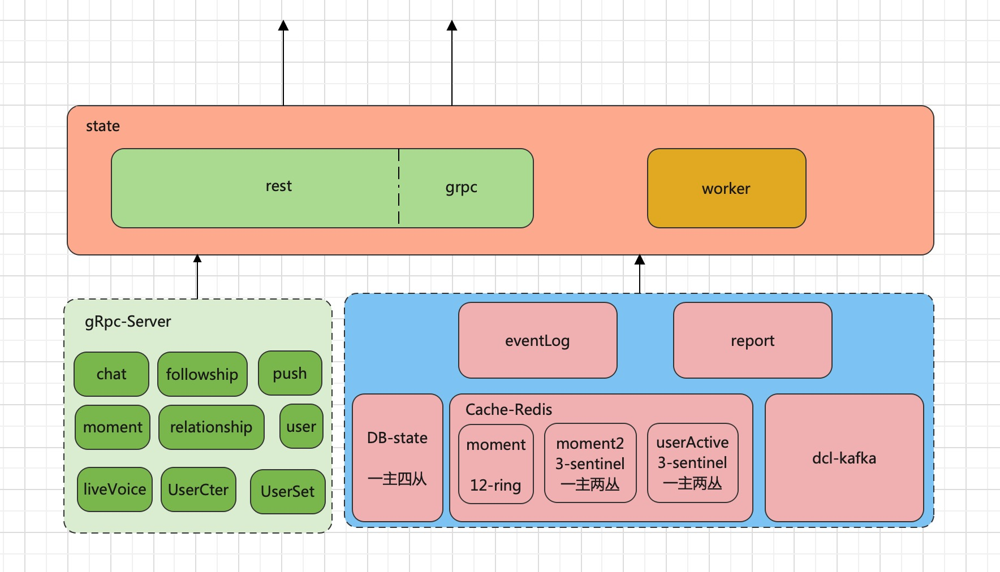
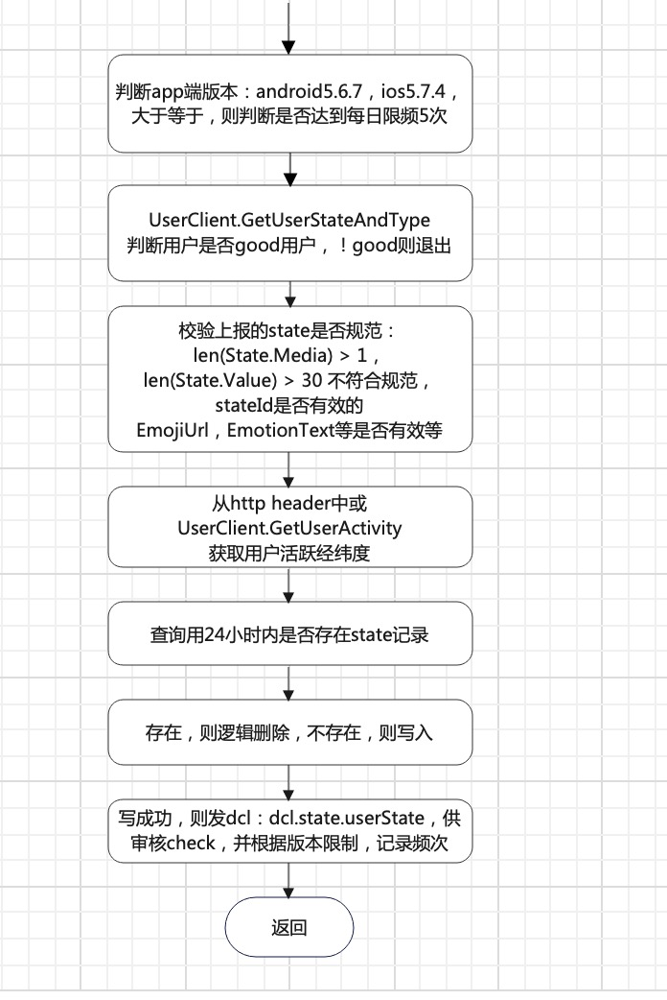
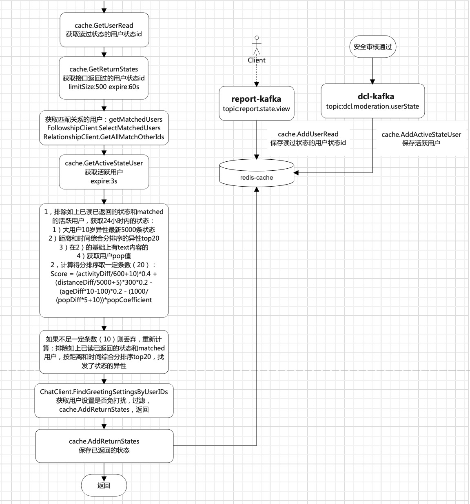
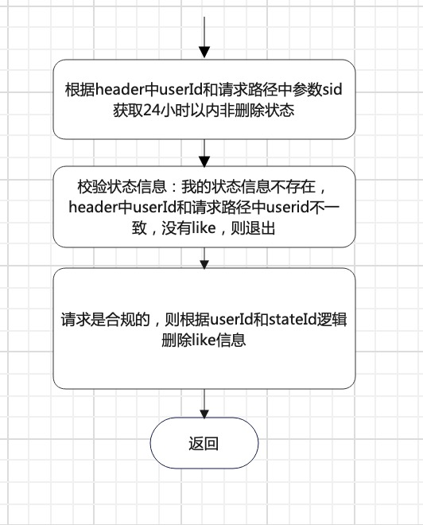
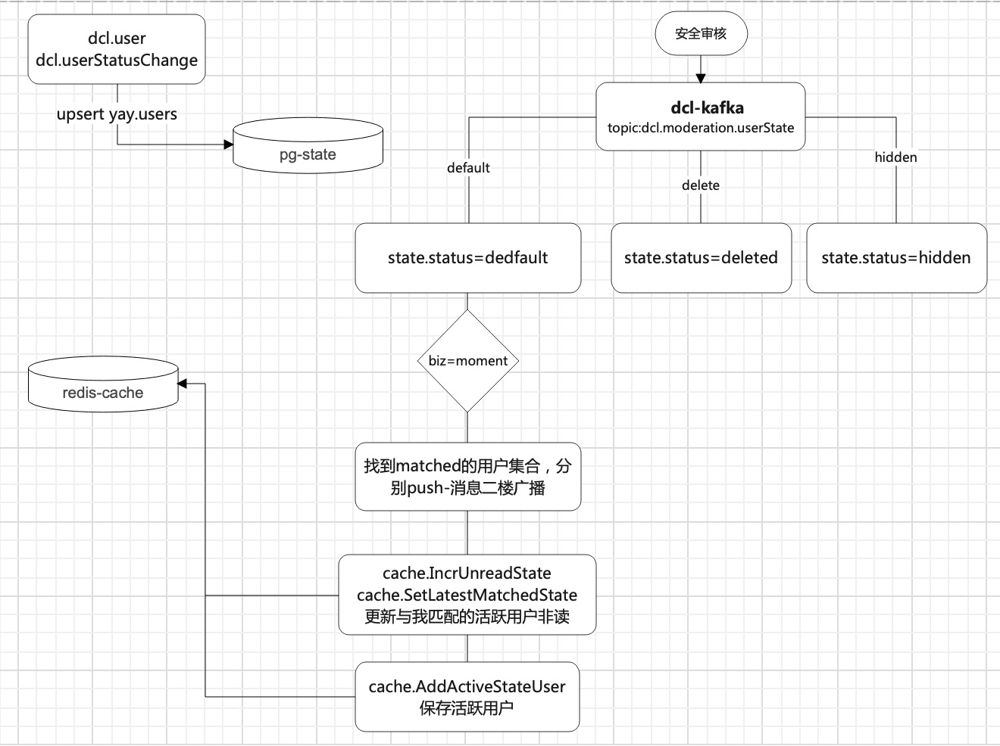

# 状态广场state


<!-- @import "[TOC]" {cmd="toc" depthFrom=1 depthTo=6 orderedList=false} -->

<!-- code_chunk_output -->

- [状态广场state](#状态广场state)
  - [一，什么是状态广场](#一什么是状态广场)
    - [状态广场的业务目标](#状态广场的业务目标)
    - [状态广场的表现形式](#状态广场的表现形式)
  - [二，主要架构](#二主要架构)
  - [三，数据库&数据结构](#三数据库数据结构)
    - [数据表](#数据表)
      - [主要的表：](#主要的表)
      - [state_likes -- 存储用户状态点赞](#state_likes---存储用户状态点赞)
      - [users -- 用户表：基于dcl.user upsert维护用户简要信息](#users---用户表基于dcluser-upsert维护用户简要信息)
      - [state_emojs  -- 状态表情表](#state_emojs----状态表情表)
      - [state_emoj_categories --状态表情分类表](#state_emoj_categories--状态表情分类表)
  - [四，接口&逻辑](#四接口逻辑)
    - [涉及的接口简介](#涉及的接口简介)
    - [接口逻辑介绍](#接口逻辑介绍)
      - [发表状态：post /v2/users/:uid/states](#发表状态post-v2usersuidstates)
      - [获取状态广场用户：get /v2/state](#获取状态广场用户get-v2state)
        - [get /v2/state?search=square](#get-v2statesearchsquare)
        - [get /v2/state?search=quickchat](#get-v2statesearchquickchat)
        - [get /v2/state?search=friend](#get-v2statesearchfriend)
      - [状态点赞：put v2/users/:uid/states/:sid/likes/me](#状态点赞put-v2usersuidstatessidlikesme)
      - [逻辑删除点赞 delete /v2/users/:uid/states/:sid/likes/me](#逻辑删除点赞-delete-v2usersuidstatessidlikesme)
      - [获取获取状态广场盲盒用户：get /v2/meets](#获取获取状态广场盲盒用户get-v2meets)
    - [consumer逻辑](#consumer逻辑)
  - [五，存在的小问题](#五存在的小问题)

<!-- /code_chunk_output -->

<!-- [TOC] -->


## 一，什么是状态广场

### 状态广场的业务目标
>1，构建低门槛的发布场景，激活存量关系，帮助已经建立关系的用户快速找到可聊天的人     
>2，面对陌生人建联场景，弥补现有异步社交场景的不足，探索实时化社交方向 

### 状态广场的表现形式


<center>图一</center>


<center>图二</center>


<center>图三</center>


<center>图四</center>


<center>图五</center>


<center>图六</center>


<center>图七</center>

>1，发布的状态审核通过后，会给followed的异性发push消息     
## 二，主要架构



<center>图八</center>

* [查看redis-ring模式-会存在数据不均衡问题](https://dba-g.p1staff.com/d/redis-cluster/redis-cluster?from=now-1h&to=now&var-job=redis&orgId=1&var-cls=redis-moment-tt&var-mode=standalone)
* [查看stateDB](https://dba-g.p1staff.com/d/pgsql-cluster/pgsql-cluster?from=now-1h&to=now&orgId=1&var-cls=pg-state-tt&var-primary=pg-state-tt-1)


## 三，数据库&数据结构 
>1，服务器的DB版本：PostgreSQL 13.5 （最新 PostgreSQL 15.2）


### 数据表

 Schema |             Name             |   Type   |   Owner    
:--------:|:------------------------------:|:----------:|:------------
 yay    | medias                       | table    | dbuser_dba
 yay    | rel_id_seq                   | sequence | dbuser_dba
 yay    | state_emoj_categories        | table    | dbuser_dba
 yay    | state_emoj_categories_id_seq | sequence | dbuser_dba
 yay    | state_emojs                  | table    | dbuser_dba
 yay    | state_emojs_id_seq           | sequence | dbuser_dba
 yay    | state_likes                  | table    | dbuser_dba
 yay    | states                       | table    | dbuser_dba
 yay    | users                        | table    | dbuser_dba


#### 主要的表：
 >1，users表：来源dcl.users upsert,或发布动态的新用户
 >2，states表：24小时内状态记录，逻辑删除
 >3，state_like表：状态点赞表

 #### states -- 存储用户发表的状态，操作以24小时为限

 Column    |            Type             | Collation | Nullable |           Default            
:--------------:|:--------------------------:|:---------:|:--------:|:---------------------
 id           | bigint                      |           | not null | next_id()
 user_id      | integer                     |           | not null | 
 value        | character varying(2000)     |           | not null | 
 location     | json                        |           |          | 
 emotion      | json                        |           |          | 
 text_theme   | json                        |           |          | 
 media_type   | media_type                  |           |          | 
 status       | status                      |           | not null | 'default'::status
 created_time | timestamp without time zone |           | not null | timezone('UTC'::text, now())
 updated_time | timestamp without time zone |           | not null | timezone('UTC'::text, now())
 biz          | biz                         |           | not null | 'moment'::biz
 emotion_id   | integer                     |           | not null | 0
 geo_location | geometry                    |           |          | 

```
Indexes:
    "states_pkey" PRIMARY KEY, btree (id)
    "state_geo_location_idx" gist (geo_location)
    "states_biz_idx" btree (biz)
    "states_created_time_geo_location_idx" gist (created_time, geo_location)
    "states_created_time_idx" btree (created_time)
    "states_created_time_idx1" btree (created_time) WHERE status = 'default'::status AND biz = 'moment'::biz AND media_type = 'text'::media_type
    "states_status_idx" btree (status) WHERE status <> ALL (ARRAY['deleted'::status, 'hidden'::status, 'pending'::status])
    "states_user_id_idx" btree (user_id)
```

>1, status:hidden, pending, default,deleted      
>2, media_type:image, video, text      
>3, biz:moment    

#### state_likes -- 存储用户状态点赞

   Column     |            Type             | Collation | Nullable |           Default            
---------------:|:-----------------------------:|:-----------:|:----------:|:------------------------------
 id            | bigint                      |           | not null | next_id()
 user_id       | integer                     |           | not null | 
 state_user_id | integer                     |           | not null | 
 state_id      | bigint                      |           | not null | 
 recalled      | boolean                     |           | not null | false
 status        | status                      |           | not null | 'default'::status
 created_time  | timestamp without time zone |           | not null | timezone('UTC'::text, now())
 updated_time  | timestamp without time zone |           | not null | timezone('UTC'::text, now())

```
Indexes:
    "state_likes_pkey" PRIMARY KEY, btree (id)
    "state_likes_state_id_user_id_unique_idx" UNIQUE, btree (state_id, user_id)
    "state_likes_user_id_idx" btree (user_id)
    "state_likes_user_id_idx1" btree (user_id) WHERE status = 'default'::status
```


#### users -- 用户表：基于dcl.user upsert维护用户简要信息

 Column    |            Type             | Collation | Nullable |           Default            
--------------:|:-----------------------------:|:-----------:|:----------:|:------------------------------
 id           | integer                     |           | not null | 
 gender       | gender                      |           |          | 
 birthdate    | date                        |           |          | 
 status       | user_status                 |           | not null | 'default'::user_status
 created_time | timestamp without time zone |           | not null | timezone('UTC'::text, now())
 updated_time | timestamp without time zone |           | not null | timezone('UTC'::text, now())

```
Indexes:
    "users_pkey" PRIMARY KEY, btree (id)
    "users_birthdate_idx" btree (birthdate)
    "users_status_idx" btree (status) WHERE status <> ALL (ARRAY['banned'::user_status, 'inactivated'::user_status, 'deleted'::user_status, 'violation'::user_status, 'pending'::user_status])
    "yay_users_id_status" btree (id) WHERE status = ANY (ARRAY['banned'::user_status, 'inactivated'::user_status, 'deleted'::user_status])
```

#### state_emojs  -- 状态表情表

Column      |            Type             | Collation | Nullable |                 Default                 
------------------:|:-----------------------------:|:-----------:|:----------:|:-----------------------------------------
 id               | integer                     |           | not null | nextval('state_emojs_id_seq'::regclass)
 emoji_url        | character varying(1024)     |           |          | 
 emotion_text     | character varying(64)       |           |          | 
 background_color | character varying[]         |           |          | '{}'::character varying[]
 icon_color       | character varying[]         |           |          | '{}'::character varying[]
 category_id      | integer                     |           | not null | 
 display          | boolean                     |           | not null | false
 sort             | bigint                      |           | not null | 0
 status           | status                      |           | not null | 'default'::status
 created_time     | timestamp without time zone |           | not null | timezone('UTC'::text, now())
 updated_time     | timestamp without time zone |           | not null | timezone('UTC'::text, now())

```
Indexes:
    "state_emojs_pkey" PRIMARY KEY, btree (id)
    "state_emojs_category_id_idx" btree (category_id)
    "state_emojs_sort_idx" btree (sort)
    "state_emojs_text_unique_key" UNIQUE, btree (emotion_text)
```

>1，moment rest get /v2/followConfig 调用state grpc获取

#### state_emoj_categories --状态表情分类表

  Column    |            Type             | Collation | Nullable |                      Default                      
--------------:|:-----------------------------:|:-----------:|:----------:|:---------------------------------------------------
 id           | integer                     |           | not null | nextval('state_emoj_categories_id_seq'::regclass)
 name         | character varying(64)       |           | not null | 
 sort         | bigint                      |           | not null | 0
 display      | boolean                     |           | not null | false
 status       | status                      |           | not null | 'default'::status
 created_time | timestamp without time zone |           | not null | timezone('UTC'::text, now())
 updated_time | timestamp without time zone |           | not null | timezone('UTC'::text, now())

```
Indexes:
    "state_emoj_categories_pkey" PRIMARY KEY, btree (id)
    "state_emoj_categories_name_unique_key" UNIQUE, btree (name)
    "state_emoj_categories_sort_idx" btree (sort)
```


id |   name    | sort | display | status  |      created_time       |      updated_time       
----:|:-----------:|:------:|:---------:|:---------:|:-------------------------:|:-------------------------
 16 | 热门状态  |   10 | t       | default | 2022-12-02 08:23:25.396 | 2022-12-02 08:23:25.396
 17 | 心情状态  |    9 | t       | default | 2022-12-02 08:23:25.428 | 2022-12-02 08:23:25.428
 18 | 我正在... |    8 | t       | default | 2022-12-02 08:23:25.482 | 2022-12-02 08:23:25.482
 19 | 找人一起  |    7 | t       | default | 2022-12-02 08:23:25.543 | 2022-12-02 08:23:25.543


 #### medias

 Column       |            Type             | Collation | Nullable |           Default            
--------------------:|:-----------------------------:|:-----------:|:----------:|:------------------------------
 id                 | bigint                      |           | not null | next_id()
 user_id            | bigint                      |           | not null | 
 resource_type      | resource_type               |           |          | 
 resource_id        | bigint                      |           | not null | 
 index              | integer                     |           | not null | 
 location           | json                        |           |          | 
 country_id         | integer                     |           | not null | 0
 picture_identifier | character varying(200)      |           | not null | 
 picture_width      | integer                     |           | not null | 0
 picture_height     | integer                     |           | not null | 0
 picture_dhash      | bigint                      |           | not null | 0
 video_identifier   | character varying(200)      |           | not null | ''::character varying
 video_width        | integer                     |           | not null | 0
 video_height       | integer                     |           | not null | 0
 video_duration     | double precision            |           | not null | 0
 shoot_time         | timestamp without time zone |           | not null | timezone('UTC'::text, now())
 status             | status                      |           | not null | 'default'::status
 created_time       | timestamp without time zone |           | not null | timezone('UTC'::text, now())

```
Indexes:
    "medias_pkey" PRIMARY KEY, btree (id)
    "medias_resource_id_type_index_idx" btree (resource_id, resource_type, index)

```

## 四，接口&逻辑

### 涉及的接口简介   

类型 |   接口名    | httpMethod | 备注     
----:|:-----------:|:------:|:---------
rest|/v2/users/:uid/states|POST|发布状态
rest|/v2/users/:uid/states|GET|如果http header中的 userId=uid，则自己看自己24小时内，没被删除的状态，否则看别人24小时内正常的状态
rest|/v2/users/:uid/states/:sid|GET|获取userId（http header中的）下24小时内stateId=sid，没被逻辑删除的状态详情
rest|/v2/users/:uid/states/:sid|POST|逻辑删除状态
rest|/v2/users/:uid/states/:sid|DELETE|逻辑删除状态
rest|/v2/users/:uid/states/:sid/likes/me|PUT|状态点赞
rest|/v2/users/:uid/states/:sid/likes/me|DELETE|逻辑删除点赞
rest|/v2/users/:uid/states/:sid/likes/me|POST|逻辑删除点赞，内部调用的DELETE
rest|/v2/users/:uid/state-counters|PATCH|更新红点，cache.ClearUnreadState
rest|/v2/users/:uid/state-counters|POST|同patch
rest|/v2/users/:uid/state-counters|GET|获取红点，已废弃
rest|/v2/states|GET|获取状态广场用户
rest|/v2/meets|GET|获取状态广场盲盒用户，请求量少，可能app上藏的太深了
grpc|StateService.FindByUserIds|GET|批量获取用户状态信息
grpc|StateEmotionService.FindAllStateEmotion|GET|分页获取状态emoji配置信息

>1，红点逻辑：post state 会发dcl.state.userState ，审核之后，会发dcl.moderation.userState。dcl审核通过之后，给这个用户的matchedUsers，每个人都新增一个未读计数，并设置当前最新状态
    

### 接口逻辑介绍

#### 发表状态：post /v2/users/:uid/states


<center>图九</center>

>1，新用户，则存入用户表

#### 获取状态广场用户：get /v2/state


<center>图十</center>


<center>图十一</center>

##### get /v2/state?search=square


<center>图十二</center>

>1，算分公式：((ST_DistanceSphere(ST_Point(?, ?), s.geo_location) / 5000)::integer + 5)*300 +
	((EXTRACT(EPOCH FROM CURRENT_TIMESTAMP AT TIME ZONE 'UTC' - s.created_time) / 600)::integer + 10) AS score   
>2，ab服务，还会调用chat的grpc获取用户过热等级，根据过热等级，继续过滤          
##### get /v2/state?search=quickchat


<center>图十三</center>

##### get /v2/state?search=friend


<center>图十四</center>

#### 状态点赞：put v2/users/:uid/states/:sid/likes/me


<center>图十五</center>

#### 逻辑删除点赞 delete /v2/users/:uid/states/:sid/likes/me


<center>图十六</center>

#### 获取获取状态广场盲盒用户：get /v2/meets


<center>图十七</center>

### consumer逻辑



<center>图十八</center>

>1，给异性follower push消息

## 五，存在的小问题
>1，广场的自动滑动的状态不支持手动自由滑动，或者滑动的不流畅           
>2，页面布局上，有的功能点藏的很深，应该告知引导或教育用户，例如盲盒，/v2/meets接口的qps很低           


<center>图十九</center>
