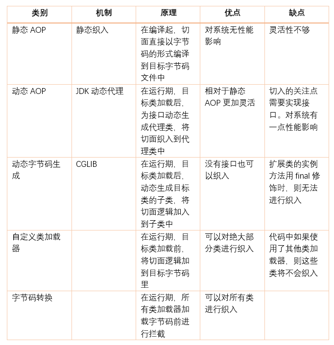

# AOP 和动态代理

* [AOP 和动态代理](https://www.studying.icu/articles/2021/09/18/1631948394690.html)

## 核心概念
>1、切面（aspect）：类是对物体特征的抽象，切面就是对横切关注点的抽象；
>2、横切关注点：对哪些方法进行拦截，拦截后怎么处理，这些关注点称之为横切关注点。；
>3、连接点（join point）：被拦截到的点，因为 Spring 只支持方法类型的连接点，所以在 Spring 中连接点指的就是被拦截到的方法，实际上连接点还可以是字段或者构造器。；
>4、切入点（pointcut）：对连接点进行拦截的定义；
>5、通知（advice）：所谓通知指的就是指拦截到连接点之后要执行的代码，通知分为前置、后置、异常、最终、环绕通知五类；
>6、目标对象：代理的目标对象；
>7、织入（weave）：将切面应用到目标对象并导致代理对象创建的过程；
>8、引入（introduction）：在不修改代码的前提下，引入可以在运行期为类动态地添加一些方法或字段。

## AOP 的实现
>AOP 要达到的效果是，保证开发者不修改源代码的前提下，去为系统中的业务组件添加某种通用功能。AOP 的本质是由 AOP 框架修改业务组件的多个方法的源代码，按照 AOP 框架修改源代码的时机，可以将其分为两类：

>1,静态 AOP 实现：AOP 框架在编译阶段对程序源代码进行修改，生成了静态的 AOP 代理类（生成的 *.class 文件已经被改掉了，需要使用特定的编译器），比如 AspectJ。
>2,动态 AOP 实现：AOP 框架在运行阶段对动态生成代理对象（在内存中以 JDK 动态代理，或 CGlib 动态地生成 AOP 代理类），如 SpringAOP。

