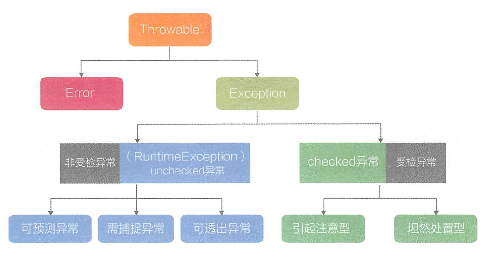
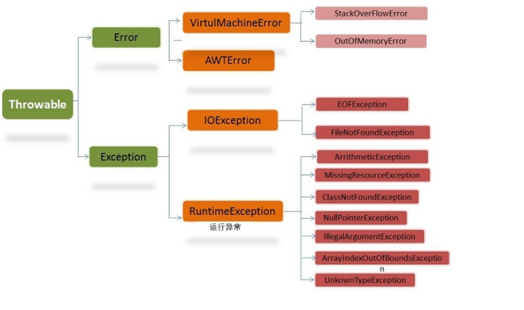

# 谈谈异常

- [谈谈异常](#%E8%B0%88%E8%B0%88%E5%BC%82%E5%B8%B8)
        - [异常分类](#%E5%BC%82%E5%B8%B8%E5%88%86%E7%B1%BB)
        - [StackOverFlowWError & OutOfMemoryError](#stackoverflowwerror--outofmemoryerror)
        - [日常开发中异常使用的经验之谈](#%E6%97%A5%E5%B8%B8%E5%BC%80%E5%8F%91%E4%B8%AD%E5%BC%82%E5%B8%B8%E4%BD%BF%E7%94%A8%E7%9A%84%E7%BB%8F%E9%AA%8C%E4%B9%8B%E8%B0%88)

### 异常分类  
>1，Throwable---》1）Error（致命错误，OutofMemoryError）和Exception（非致命错误），Exception---》checked异常和unchecked异常（RuntimeException）
>2，当遇到需要处理异常的场景时，要明确该异常属于哪种类型，是需要调用方关注并处理的checked 异常， 还是由更高层次框架处理的unchecked 异常   
>3，try-catch-finally，注意， **finally是在return表达式运行后执行的**， 此时将要return 的结果已经被暂存起来， 待finally 代码块执行结束后再将之前暂存的结果返回     
>4，Error由虚拟机生成并抛出，，属于JVM系统内部错误或者资源耗尽等严重情况，属于JVM需要担负的责任，这一类异常事件是无法恢复或者不可能捕获的，将导致应用程序中断，但是自定义Error是可以捕获的        

### StackOverFlowWError & OutOfMemoryError

### 日常开发中异常使用的经验之谈
>1，主流观点是，可恢复的、业务类的异常用checked exception，不可恢复的异常用unchecked exception，如数据库连接失败、http调用超时    
>2，调用方有责任保证参数的合法性，但函数本身对调用方应该是防御性的，因此最完备的方案是进行两次校验，一次在调用方，一次在函数内

* [异常处理经验介绍](https://novoland.github.io/%E8%AE%BE%E8%AE%A1/2015/08/17/%E5%BC%82%E5%B8%B8.html)