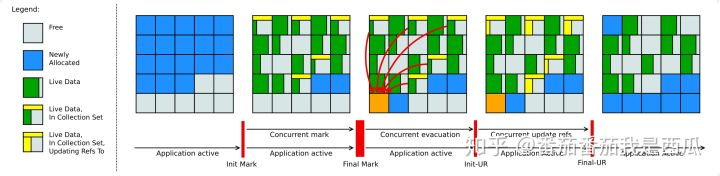

# java 内存管理，分配和回收

## 内存结构

## 分代

## 对象结构

## safepoint

## GC roots

## 垃圾收集算法

标记清除算法 mark-sweep
复制算法 copying
标记整理算法 mark-compact
分代收集算法 generational collecting

## Shenandoah收集器

## 记忆集 连接矩阵 卡表（bitmap，bytemap）

## 可转发指针

>“Brooks”是一个人的名字。1984年，Rodney A.Brooks在论文《Trading Data Space for Reduced Time and Code Space in Real-Time Garbage Collection on Stock Hardware》中提出了使用转发 指针（Forwarding Pointer，也常被称为Indirection Pointer）来实现对象移动与用户程序并发的一种解决 方案。

>扩展: 此前,要做类似的并发操作，通常是在被移动对象原有的内存上设置保护陷阱（Memory Protection Trap），一旦用户程序访问到归属于旧对象的内存空间就会产生自陷中段，进入预设好的异 常处理器中，再由其中的代码逻辑把访问转发到复制后的新对象上。虽然确实能够实现对象移动与用户线程并发，但是如果没有操作系统层面的直接支持，这种方案将导致用户态频繁切换到核心态代价是非常大的，不能频繁使用
>Brooks提出的新方案是在原有对象布局结构的最前面统一增加一个 新的引用字段，在正常不处于并发移动的情况下，该引用指向对象自己

>转发指针，是为了对象移动时，老的对象引用需要访问新对象时，设置了转发指针，当老对象访问一个已经被移走的内存空间时，通过转发指针找到新的对象所在空间，但是在并发情况下，需要设置读写屏障

>代码里对象读取的出现频率要比对象写入的频率高出很多，读 屏障数量自然也要比写屏障多得多，所以读屏障的使用必须更加谨慎，不允许任何的重量级操作。

* [jvm大局观-Shenandoah收集器](https://zhuanlan.zhihu.com/p/264195166)

* [jvm大局观-知乎-还不错](https://www.zhihu.com/column/c_1293612595426095104)

