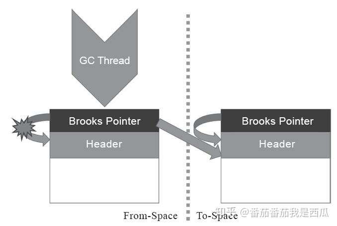
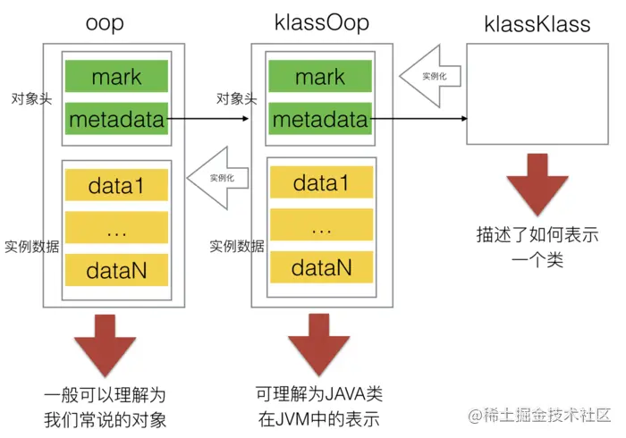

# java对象模型


## 对象头

>包括两部分（非数组对象）信息：    
>1，第一部分用于存储对象自身的运行时数据，如哈希码（HashCode）、GC 分代年龄、锁状态标志、线程持有的锁、偏向线程 ID、偏向时间戳、对象分代年龄，这部分信息称为“Mark Word”。Mark Word 被设计成一个非固定的数据结构以便在极小的空间内存储尽量多的信息，它会根据自己的状态复用自己的存储空间； 4B or 8B     
>2，第二部分是类型指针，即对象指向它的类元数据的指针，虚拟机通过这个指针来确定这个对象是哪个类的实例；  4B    
>3，如果是数组对象，那么还有第三部分：一块用于记录数组长度的数据。虚拟机可以通过普通Java对象的元数据信息确定对象的大小，但是从数组的元数据信息却无法确定数组的大小  4B     
```
class oopDesc {
  friend class VMStructs;
 private:
  volatile markOop  _mark;
  union _metadata {
    Klass*      _klass;
    narrowKlass _compressed_klass;
  } _metadata;

  // Fast access to barrier set.  Must be initialized.
  static BarrierSet* _bs;
......
}
```


## 并行整理的核心-转发指针

>“Brooks”是一个人的名字。1984年，Rodney A.Brooks在论文《Trading Data Space for Reduced Time and Code Space in Real-Time Garbage Collection on Stock Hardware》中提出了使用转发 指针（Forwarding Pointer，也常被称为Indirection Pointer）来实现对象移动与用户程序并发的一种解决 方案。

>扩展: 此前,要做类似的并发操作，通常是在被移动对象原有的内存上设置保护陷阱（Memory Protection Trap），一旦用户程序访问到归属于旧对象的内存空间就会产生自陷中段，进入预设好的异 常处理器中，再由其中的代码逻辑把访问转发到复制后的新对象上。虽然确实能够实现对象移动与用户线程并发，但是如果没有操作系统层面的直接支持，这种方案将导致用户态频繁切换到核心态代价是非常大的，不能频繁使用
Brooks提出的新方案是在原有对象布局结构的最前面统一增加一个 新的引用字段，在正常不处于并发移动的情况下，该引用指向对象自己

>从结构上来看，Brooks提出的转发指针与某些早期Java虚拟机使用过的句柄定位有一些相似之处，两者都是一种间接性的对象访问方式，差别是 **句柄通常会统一存储在专 门的句柄池中，而转发指针是分散存放在每一个对象头前面**




## oop体系
>instanceOopDesc 表示类实例， arrayOopDesc 表示数组。 也就是说，当我们使用new创建一个 Java 对象实例的时候，JVM 会创建一个instanceOopDesc对象来表示这个 Java 对象。同理，当我们使用new创建一个 Java 数组实例的时候，JVM 会创建一个arrayOopDesc 对象来表示这个数组对象


## Klass体系
>Klass 向 JVM 提供两个功能：
>1，实现语言层面的 Java 类（在 Klass 基类中已经实现）
>2，实现 Java 对象的分发功能（由 Klass 的子类提供虚函数实现）


>**在JVM中，对象在内存中的基本存在形式就是oop**。那么，对象所属的类，在JVM中也是一种对象，因此它们实际上也会被组织成一种oop，即klassOop。同样的，对于klassOop，也有对应的一个klass来描述，它就是klassKlass，也是klass的一个子类。klassKlass作为oop的klass链的端点。关于对象和数组的klass链大致如下图




## 内存存储结构
>**对象的实例（instantOopDesc)保存在堆上，对象的元数据（instantKlass）保存在方法区，对象的引用保存在栈上**     
>方法区用于存储虚拟机加载的类信息、常量、静态变量、即时编译器编译后的代码等数据   

>每一个Java类，在被JVM加载的时候，JVM会给这个类创建一个instanceKlass，保存在方法区，用来在JVM层表示该Java类。当我们在Java代码中，使用new创建一个对象的时候，JVM会创建一个instanceOopDesc对象，这个对象中包含了两部分信息，对象头以及元数据。对象头中有一些运行时数据，其中就包括和多线程相关的锁的信息。元数据其实维护的是指针，指向的是对象所属的类的instanceKlass

```
class instanceOopDesc : public oopDesc {

}

class oopDesc {
  friend class VMStructs;
 private:
  volatile markOop  _mark;
  union _metadata {
    Klass*      _klass;
    narrowKlass _compressed_klass;
  } _metadata;

  // Fast access to barrier set.  Must be initialized.
  static BarrierSet* _bs;

}
```


```
class Model
{
    public static int a = 1;
    public int b;

    public Model(int b) {
        this.b = b;
    }
}

public static void main(String[] args) {
    int c = 10;
    Model modelA = new Model(2);
    Model modelB = new Model(3);
}

```


## 多态 & 动态绑定 & 方法表 & 虚函数表

* [OOP-Klass-方法表-虚函数表](https://zhuanlan.zhihu.com/p/104725313)

>动态绑定的过程：
虚拟机提取对象的实际类型的方法表；
虚拟机搜索方法签名；
调用方法。    

```
// hotspot/src/share/vm/oops/instanceKlass.hpp
class InstanceKlass: public Klass {
...
  // 当前类的状态
  enum ClassState {
    allocated,  // 已分配
    loaded,  // 已加载，并添加到类的继承体系中
    linked,  // 链接/验证完成
    being_initialized,  // 正在初始化
    fully_initialized,  // 初始化完成
    initialization_error  // 初始化失败
  };
  // 当前类的注解
  Annotations*    _annotations;
  // 当前类数组中持有的类型
  Klass*          _array_klasses;
  // 当前类的常量池
  ConstantPool* _constants;
  // 当前类的内部类信息
  Array<jushort>* _inner_classes;
  // 保存当前类的所有方法.
  Array<Method*>* _methods;
  // 如果当前类实现了接口，则保存该接口的default方法
  Array<Method*>* _default_methods;
  // 保存当前类所有方法的位置信息
  Array<int>*     _method_ordering;
  // 保存当前类所有default方法在虚函数表中的位置信息
  Array<int>*     _default_vtable_indices;
  // 保存当前类的field信息（包括static field），数组结构为：
  // f1: [access, name index, sig index, initial value index, low_offset, high_offset]
  // f2: [access, name index, sig index, initial value index, low_offset, high_offset]
  //      ...
  // fn: [access, name index, sig index, initial value index, low_offset, high_offset]
  //     [generic signature index]
  //     [generic signature index]
  //     ...
  Array<u2>*      _fields;
...
}
```


* [OOP-Klass-方法表-虚函数表](https://zhuanlan.zhihu.com/p/104725313)

### 虚函数表：大致在对象头之下的部分
>虚函数表（vtable）主要是为了实现Java中的虚分派功能而存在。HotSpot把Java中的方法都抽象成了Method对象，InstanceKlass中的成员属性_methods就保存了当前类所有方法对应的Method实例。HotSpot并没有显式地把虚函数表设计为Klass的field，而是提供了一个虚函数表视图，并在类初始化时创建出来。


```
// 以下为方法对应实现
// hotspot/src/share/vm/oops/instanceKlass.cpp
...
// vtable()的实现
klassVtable* InstanceKlass::vtable() const {
  return new klassVtable(this, start_of_vtable(), vtable_length() / vtableEntry::size());
}
// method_at_vtable()的实现
inline Method* InstanceKlass::method_at_vtable(int index)  {
  ... // 校验逻辑
  vtableEntry* ve = (vtableEntry*)start_of_vtable();
  return ve[index].method();
}
```


