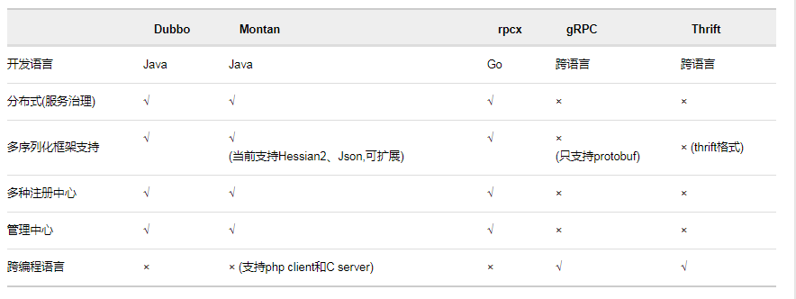
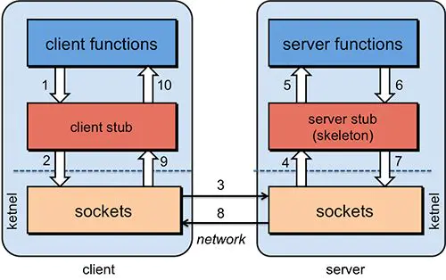

# RPC 

>主要研究一下dubbo-nacos

* [RPC比较](https://colobu.com/2016/09/05/benchmarks-of-popular-rpc-frameworks/)

* [RPC比较](https://www.jianshu.com/p/b0343bfd216e)

## IPC: Inter-Process Communication进程间通信
>1,LPC：本地过程调用
>2,RPC:远程过程调用

