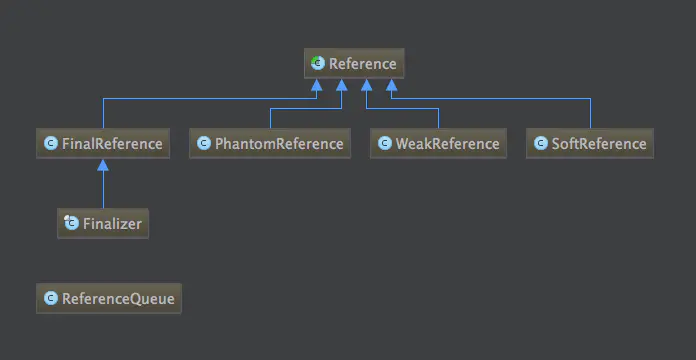
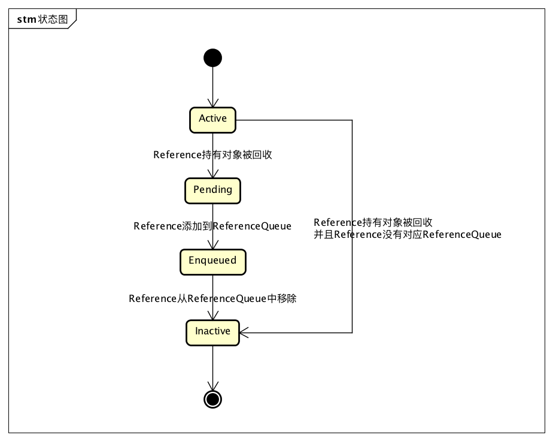

# 强引用，软引用，弱引用和虚引用

## 判断对象是否可回收
>1，引用计数算法
>2，可达性分析算法：1，对执行时间敏感，这项工作必须在能确保 **一致性的快照**中进行，不可以出现分析过程中对象引用关系还在不断变化的情况，不然无法保证分析结果的准确性，即GC进行时，必须停顿所有java执行线程（stop the world），即使号称不会发生停顿的CMS收集器中，枚举根节点也必须要停顿

### 强引用 
>普通的的引用类型，new一个对象默认得到的引用就是强引用，只要对象存在强引用，就不会被GC

### 软引用
>通过SoftReference创建，在内存空间不足的时候直接销毁，即它可能最后的销毁地点是在老年区
>相对较弱的引用，垃圾回收器会在内存不足时回收弱引用指向的对象。JVM会在抛出OOME前清理所有弱引用指向的对象，如果清理完还是内存不足，才会抛出OOME。所以软引用一般用于实现内存敏感缓存   

### 弱引用
>更弱的引用类型，垃圾回收器在GC时会回收此对象，也可以用于实现缓存，比如JDK提供的WeakHashMap 

### 虚引用
>通过PhantomReference创建，它和不存也一样，非常虚，只能通过引用队列在进行一些操作，主要用于堆外内存回收。一种特殊的引用类型，不能通过虚引用获取到关联对象，只是用于获取对象被回收的通知。

