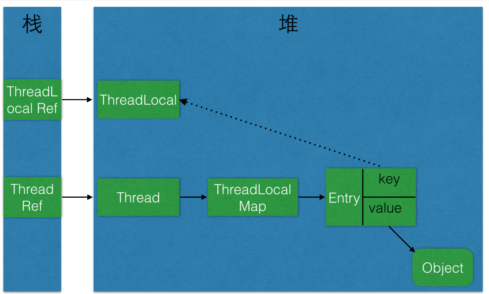

## ThreadLocal

- [ThreadLocal](#threadlocal)
    - [threadLocal结构图](#threadlocal%E7%BB%93%E6%9E%84%E5%9B%BE)
    - [源码](#%E6%BA%90%E7%A0%81)
        - [ThreadLocal结构与源码原理](#threadlocal%E7%BB%93%E6%9E%84%E4%B8%8E%E6%BA%90%E7%A0%81%E5%8E%9F%E7%90%86)
        - [ThreadLocal的HashCode与魔数0x61c88647](#threadlocal%E7%9A%84hashcode%E4%B8%8E%E9%AD%94%E6%95%B00x61c88647)
    - [ThreadLocalMap的设计特点](#threadlocalmap%E7%9A%84%E8%AE%BE%E8%AE%A1%E7%89%B9%E7%82%B9)
    - [内存泄漏](#%E5%86%85%E5%AD%98%E6%B3%84%E6%BC%8F)


### threadLocal结构图
>ThreadLocal 适用于变量在线程间隔离且在方法间共享的场景



### 源码

####  ThreadLocal结构与源码原理
>1，实质是使用的Thread.currentThread中的ThreadLocalMap，在ThreadLocalMap中是一个数组private Entry[] table;
>2，table默认大小16，翻倍扩容
```
public class ThreadLocal<T> {
 public void set(T value) {
        Thread t = Thread.currentThread();
        ThreadLocalMap map = getMap(t);
        if (map != null)
            map.set(this, value);
        else
            createMap(t, value);
    }
}

static class ThreadLocalMap {
    private static final int INITIAL_CAPACITY = 16;

    /**
    * The table, resized as necessary.
    * table.length MUST always be a power of two.
    */
    private Entry[] table;
    /**    
     * Double the capacity of the table.
    */
    private void resize();
    
}
```

#### ThreadLocal的HashCode与魔数0x61c88647
>1，多个ThreadLocal且操作的同一个当前线程时，增强其的散列性，大大减少碰撞几率   
>2，hashCode的获取是一个全局的，间隔0x61c88647增加，当在同一个当前线程中，操作多个ThreadLocal，这样可以减少碰撞     

```
public class ThreadLocal<T> {
 /**
     * The next hash code to be given out. Updated atomically. Starts at
     * zero.
     */
    private static AtomicInteger nextHashCode =
        new AtomicInteger();

    /**
     * The difference between successively generated hash codes - turns
     * implicit sequential thread-local IDs into near-optimally spread
     * multiplicative hash values for power-of-two-sized tables.
     */
    private static final int HASH_INCREMENT = 0x61c88647;

    /**
     * Returns the next hash code.
     */
    private static int nextHashCode() {
        return nextHashCode.getAndAdd(HASH_INCREMENT);
    }
}
```
### ThreadLocalMap的设计特点
>1，Entry的key设计成弱引用，因此key随时可能被GC（也就是失效快），尽量多的面对空槽
>2，(单个ThreadLocal时)当遇到碰撞时，通过线性探测的开放地址法解决冲突问题
>3，(多个ThreadLocal时)引入了神奇的0x61c88647，增强其的散列性，大大减少碰撞几率
```
static class ThreadLocalMap {
static class Entry extends WeakReference<ThreadLocal<?>> {
            /** The value associated with this ThreadLocal. */
            Object value;

            Entry(ThreadLocal<?> k, Object v) {
                super(k);
                value = v;
            }
        }
}
```
```
线性探测的开放地址法解决冲突问题，其中在get数据的时候，会再比较key

private Entry getEntry(ThreadLocal<?> key) {
            int i = key.threadLocalHashCode & (table.length - 1);
            Entry e = table[i];
            if (e != null && e.get() == key)
                return e;
            else
                return getEntryAfterMiss(key, i, e);
        }
```

### 内存泄漏
>1,根源：由于Entry的key弱引用特性（见注意），当每次GC时JVM会主动将无用的弱引用回收掉，因此当ThreadLocal外部没有强引用依赖时，就会被自动回收，这样就可能造成当ThreadLocal被回收时，相当于将Map中的key设置为null，但问题是该key对应的entry和value并不会主动被GC回收，当Entry和value未被主动回收时，除非当前线程死亡，否则线程对于Entry的强引用会一直存在，从而导致内存泄露
>2,建议： 当希望回收对象，最好使用ThreadLocal.remove()方法将该变量主动移除，告知JVM执行GC回收       
>3,注意： ThreadLocal本身不是弱引用的，Entry继承了WeakReference，同时Entry又将自身的key封装成弱引用，所有真正的弱引用是Entry的key，只不过恰好Entry的key是ThreadLocal      

