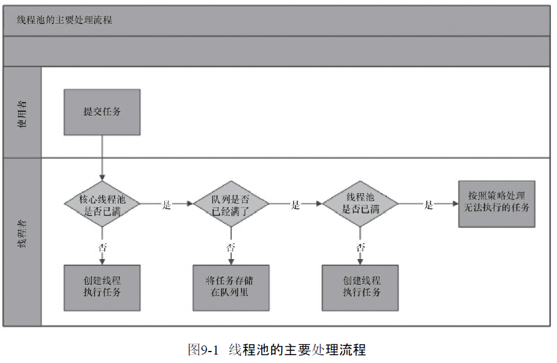
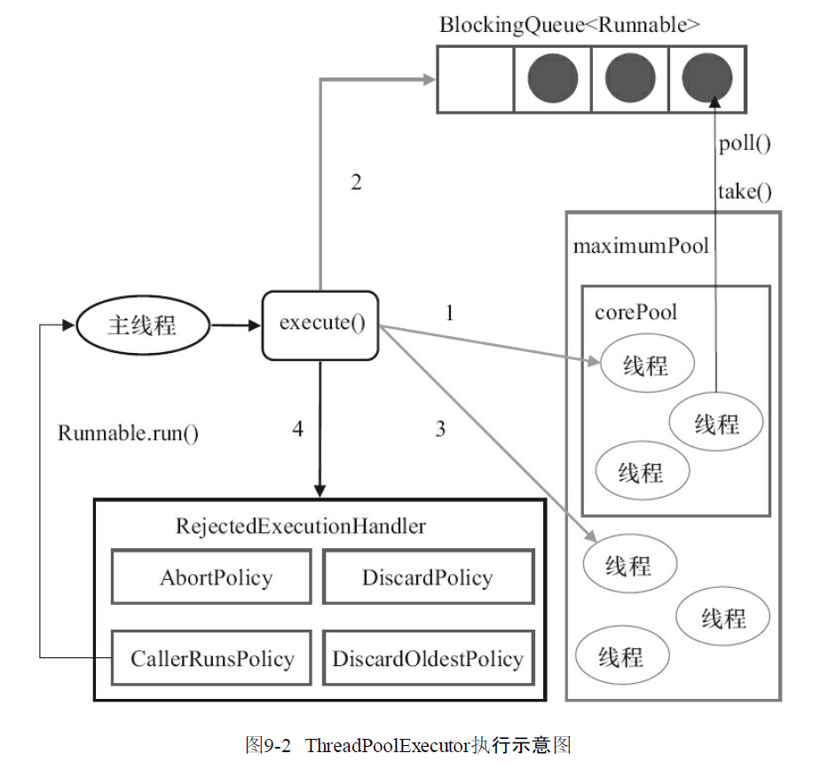
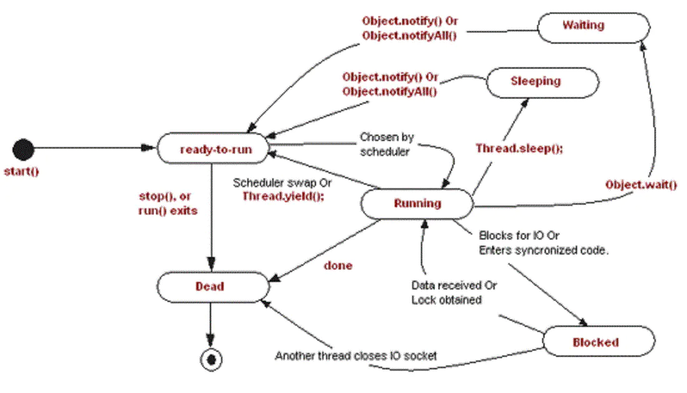

# 线程池




## Runnable接口和Callable接口
>区别是Runnable不会返回结果，而Callable可以返回结果。

## 线程池状态

```
 //1110 0000  0000 0000  0000 0000  0000 0000
    private static final int RUNNING    = -1 << COUNT_BITS;//线程池处在RUNNING状态时，能够接收新任务，以及对已添加的任务进行处理
    //0000 0000  0000 0000  0000 0000  0000 0000
    private static final int SHUTDOWN   =  0 << COUNT_BITS;//线程池处在SHUTDOWN状态时，不接收新任务，但能处理已添加的任务
    //0010 0000  0000 0000  0000 0000  0000 0000
    private static final int STOP       =  1 << COUNT_BITS;//线程池处在STOP状态时，不接收新任务，不处理已添加的任务，并且会中断正在处理的任务
    //0100 0000  0000 0000  0000 0000  0000 0000
    private static final int TIDYING    =  2 << COUNT_BITS;//当所有的任务已终止，ctl记录的”任务数量”为0，线程池会变为TIDYING状态。当线程池变为TIDYING状态时，会执行钩子函数terminated()。terminated()在ThreadPoolExecutor类中是空的，若用户想在线程池变为TIDYING时，进行相应的处理；可以通过重载terminated()函数来实现。
    //0110 0000  0000 0000  0000 0000  0000 0000
    private static final int TERMINATED =  3 << COUNT_BITS;//线程池彻底终止，就变成TERMINATED状态。
```


## 线程回收

>超过corePoolSize的空闲线程由线程池回收，线程池Worker启动跑第一个任务之后就一直循环遍历线程池任务队列，超过指定超时时间获取不到任务就remove Worker，最后由垃圾回收器回收

>一般线程，run()方法执行完，线程就会正常结束

>查看runWorker 下getTask 和processWorkExit
ThreadPoolExecutor回收工作线程，一条线程getTask()返回null，就会被回收。

>核心线程不会回收

分两种场景。

1) 未调用shutdown() ，RUNNING状态下全部任务执行完成的场景

线程数量大于corePoolSize，线程超时阻塞，超时唤醒后CAS减少工作线程数，如果CAS成功，返回null，线程回收。否则进入下一次循环。当工作者线程数量小于等于corePoolSize，就可以一直阻塞了。 

2) 调用shutdown() ，全部任务执行完成的场景

shutdown() 会向所有线程发出中断信号，这时有两种可能。


```
shutdown(){
    ...
    interruptIdleWorkers()
    ...
}
 private void interruptIdleWorkers(boolean onlyOne) {
        final ReentrantLock mainLock = this.mainLock;
        mainLock.lock();
        try {
            for (Worker w : workers) {
                Thread t = w.thread;
                if (!t.isInterrupted() && w.tryLock()) {
                    try {
                        t.interrupt();
                    } catch (SecurityException ignore) {
                    } finally {
                        w.unlock();
                    }
                }
                if (onlyOne)
                    break;
            }
        } finally {
            mainLock.unlock();
        }
    }
```
2.1）所有线程都在阻塞

中断唤醒，进入循环，都符合第一个if判断条件，都返回null，所有线程回收。

2.2）任务还没有完全执行完

至少会有一条线程被回收。在processWorkerExit(Worker w, boolean completedAbruptly)方法里会调用tryTerminate()，向任意空闲线程发出中断信号。所有被阻塞的线程，最终都会被一个个唤醒，回收。


### 
>wait方法在进入wait状态的时候会释放对象的锁，但是sleep方法不会。
>wait方法是针对一个被同步代码块加锁的对象，而sleep是针对一个线程
>前线程在调用yield方法时会放弃CPU,看线程状态转换图可知，run变成ready




### join 原理
* [thread join-重要-讲解的不错](https://juejin.cn/post/6844903941247860749)


>在main主线程中调用threadA.join()方法，因为join() 方法是一个synchronized方法，所以主线程会首先持有thread线程对象的锁。接下来在join()方法里面调用wait()方法，主线程会释放thread线程对象的锁，进入等待状态。最后，threadA线程执行结束，JVM会调用lock.notify_all(thread);唤醒持有threadA这个对象锁的线程，也就是主线程，所以主线程会继续往下执行


```
    public final void join() throws InterruptedException {
        join(0);
    }

    public final synchronized void join(long millis)
    throws InterruptedException {
        long base = System.currentTimeMillis();
        long now = 0;

        if (millis < 0) {
            throw new IllegalArgumentException("timeout value is negative");
        }

        if (millis == 0) {
            while (isAlive()) {
                wait(0);//wait()方法是Object类中的方法，也就是说执行wait()方法之后主线 程会释放threadA对象的锁，进入等待状态，直到被再次唤醒。 大家都知道，有了wait()，必然有notify()，什么时候才会notify呢？在jvm源码里,如下
            }
        } else {
            while (isAlive()) {
                long delay = millis - now;
                if (delay <= 0) {
                    break;
                }
                wait(delay);
                now = System.currentTimeMillis() - base;
            }
        }
    }


//一个c++函数：
void JavaThread::exit(bool destroy_vm, ExitType exit_type) ；
//里面有一个贼不起眼的一行代码
ensure_join(this);

static void ensure_join(JavaThread* thread) {
  Handle threadObj(thread, thread->threadObj());

  ObjectLocker lock(threadObj, thread);

  thread->clear_pending_exception();

  java_lang_Thread::set_thread_status(threadObj(), java_lang_Thread::TERMINATED);

  java_lang_Thread::set_thread(threadObj(), NULL);

  //hreadA线程对象被notifyall了，那么主线程也就能继续跑下去了
  lock.notify_all(thread);

  thread->clear_pending_exception();
}

```


* [java 体系知识](https://www.pdai.tech/md/java/thread/java-thread-x-juc-executor-FutureTask.html)