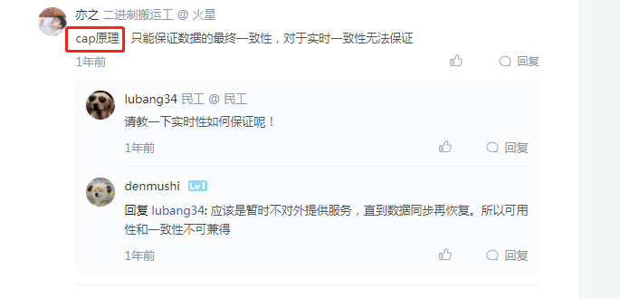

# 缓存

Redis的缓存雪崩、缓存击穿、缓存穿透与缓存预热、缓存降级

## 缓存雪崩
>大量数据同时失效
>随机过期时间

## 缓存击穿
>热点key失效，导致数据库高并发
>热点数据不过期

## 缓存穿透
>数据在缓存中不存在即没有命中，同时在数据库中也不存在
>1，将无效的key存入redis，2，使用布隆过滤器

## 缓存预热

## 缓存降级：
>缓存降级是指缓存失效或缓存服务器挂掉的情况下，不去访问数据库，直接返回默认数据或访问服务的内存数据。降级一般是有损的操作，所以尽量减少降级对于业务的影响程度

## 缓存与数据库一致性问题

>这就是把CAP运用到指导实践中

* [对数据一致性的思考-可以看看](https://developer.aliyun.com/article/712285)

* [缓存与数据库一致性问题-非常好](https://coolshell.cn/articles/17416.html)

### Cache Aside Pattern:先更新数据库，再淘汰缓存
>这是最常用最常用的pattern了。其具体逻辑如下：
>失效：应用程序先从cache取数据，没有得到，则从数据库中取数据，成功后，放到缓存中。
>命中：应用程序从cache中取数据，取到后返回。
>更新：先把数据存到数据库中，成功后，再让缓存失效,即先更新数据库，再淘汰缓存，存在一定时间的不一致，但是保证了最终一致性

>要么通过2PC（两阶段提交协议”——prepare, commit/rollback）或是Paxos协议保证一致性，要么就是拼命的降低并发时脏数据的概率，而Facebook使用了这个降低概率的玩法，因为2PC太慢，而Paxos太复杂。当然，最好还是为缓存设置上过期时间。

### Read/Write Through Pattern：对外只有缓存，由缓存代理来同步数据库
>Cache Aside套路中，我们的应用代码需要维护两个数据存储，一个是缓存（Cache），一个是数据库（Repository）。所以，应用程序比较啰嗦。而Read/Write Through套路是把更新数据库（Repository）的操作由缓存自己代理了，所以，对于应用层来说，就简单很多了。可以理解为，应用认为后端就是一个单一的存储，而存储自己维护自己的Cache。
>Read Through：读缓存，没中，则读数据库，并加载到缓存
>Write Through:如果没有命中缓存，直接更新数据库，然后返回（后面会由Read Through更新缓存）。如果命中了缓存，则更新缓存，然后再由Cache自己更新数据库（这是一个同步操作）

### Write Behind Caching Pattern：Write Back
>一些了解Linux操作系统内核的同学对write back应该非常熟悉，这不就是Linux文件系统的Page Cache的算法吗？是的，你看基础这玩意全都是相通的
>在更新数据的时候，只更新缓存，不更新数据库，而我们的缓存会异步地批量更新数据库。这个设计的好处就是让数据的I/O操作飞快无比（因为直接操作内存嘛 ）
>问题是，数据不是强一致性的，而且可能会丢失