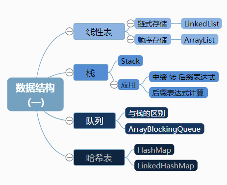
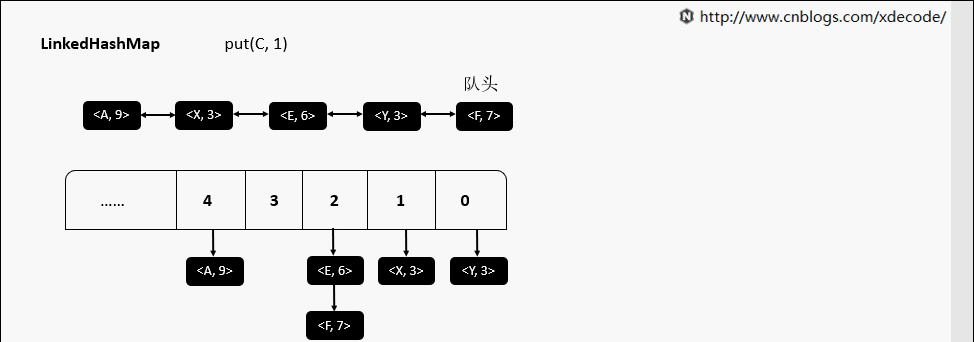

## 常用数据结构

### 
>1,LinkedList:经典的双链表结构, 适用于乱序插入, 删除. 指定序列操作则性能不如ArrayList   
>2,ArrayList:底层就是一个数组, 因此按序查找快, 乱序插入, 删除因为涉及到后面元素移位所以性能慢.    
>3,Stack:经典的数据结构, 底层也是数组, 继承自Vector, 先进后出FILO, 默认new Stack()容量为10, 超出自动扩容
>4,ArrayBlockingQueue:生产消费者中常用的阻塞有界队列, FIFO.
>5,HashMap: 内部通过数组 + 单链表+红黑树     
>6,LinkedHashMap:HashMap子类，再用一个双向链表维持数据有序   

* [常用数据结构动图](https://blog.csdn.net/zzy7075/article/details/81099463)

Collection

    |-----List  有序，可重复(存储顺序和取出顺序一致)

    |--|----LinkedList 底层使用双向链表实现，查询慢，增删快。效率高

    |--|----ArrayList 底层使用数组实现，查询快，增删慢。效率高。

    |  |        每次容量不足时，自增长度的一半，如下源码可知

    |  |          int newCapacity = oldCapacity + (oldCapacity >> 1);

    |--|----Vector 底层使用数组实现，线程安全，查询快，增删慢。效率低。

    |  |        每次容量不足时，默认自增长度的一倍（如果不指定增量的话），如下源码可知

    |  |          int newCapacity = oldCapacity + ((capacityIncrement > 0) ?

    |  |                            capacityIncrement : oldCapacity);

    |-----Set 元素唯一(最多包含一个 null 元素)，只能通过游标来取值，线程不安全

           HashSet比TreeSet高效(尤其是查询、添加),LinkedHashSet比hash插入、删除慢，但是遍历快。

    |--|--HashSet 底层是由HashMap实现的，线程非安全，通过对象的hashCode方法与equals方法来保证插入元素的唯一性，无序(存储顺序和取出顺序不一致) 

    |--|--|--LinkedHashSet 底层数据结构由哈希表和链表组成。哈希表保证元素的唯一性，链表保证元素有序。(存储和取出是一致)

    |--|--TreeSet 基于 TreeMap 的 NavigableSet 实现。非同步，排序，元素唯一。 保持有序的set使用(使用元素的自然顺序对元素进行排序，或者根据创建 set 时提供的 Comparator 进行排序(红黑数维护次序)

Map 是键值对集合,key 不允许重复，value 可以

    |-----HashMap 基于链表和红黑树:hashMap用hash表实现的Map,就是利用对象的hashcode(hashcode()是Object的方法)进行快速散列查找。Null可以做主键，但只能有一个

    |-----TreeMap 基于红黑树

    |-----LinkedHashMap HashMap+LinkedList

    |-----HashTable 线程安全，不允许有null值的存在

java集合框架概括
只有Vector，HashTable是线程安全的

ArrayList，LinkedList，HashSet，TreeSet，HashMap，TreeMap都不是线程安全的。

