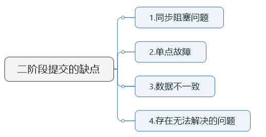
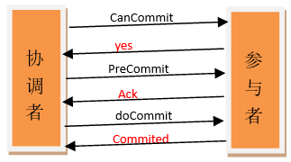

# 分布式事务和一致性

>常规的解决办法就是引入一个“协调者”的组件来统一调度所有分布式节点的执行

* [分布式事务-2PC-3PC-讲的不错](https://zhuanlan.zhihu.com/p/35616810)

## 2PC
>二阶段提交(Two-phaseCommit)是指，在计算机网络以及数据库领域内，为了使基于分布式系统架构下的所有节点在进行事务提交时保持一致性而设计的一种算法(Algorithm)

>1，第一阶段：voting phase 投票阶段：事务协调者给每个参与者发送Prepare消息，每个参与者要么直接返回失败(如权限验证失败)，要么在本地执行事务，写本地的redo和undo日志，但不提交，到达一种“万事俱备，只欠东风”的状态。
>2，第二阶段：commit phase 提交阶段

1、同步阻塞问题。
执行过程中，所有参与节点都是事务阻塞型的。当参与者占有公共资源时，其他第三方节点访问公共资源不得不处于阻塞状态。也就是说从投票阶段到提交阶段完成这段时间，资源是被锁住的。

2、单点故障。由于协调者的重要性，一旦协调者发生故障。参与者会一直阻塞下去。
尤其在第二阶段，协调者发生故障，那么所有的参与者还都处于锁定事务资源的状态中，而无法继续完成事务操作。
【协调者发出Commmit消息之前宕机的情况】
（如果是协调者挂掉，可以重新选举一个协调者，但是无法解决因为协调者宕机导致的参与者处于阻塞状态的问题）

3、数据不一致。在二阶段提交的阶段二中，当协调者向参与者发送commit请求之后，发生了局部网络异常或者在发送commit请求过程中协调者发生了故障，这回导致只有一部分参与者接受到了commit请求。而在这部分参与者接到commit请求之后就会执行commit操作。但是其他部分未接到commit请求的机器则无法执行事务提交。于是整个分布式系统便出现了数据不一致性的现象。

4、二阶段无法解决的问题：------ 极限情况下,对某一事务的不确定性！
【协调者发出Commmit消息之后宕机的情况】
协调者再发出commit消息之后宕机，而唯一接收到这条消息的参与者同时也宕机了。那么即使协调者通过选举协议产生了新的协调者，这条事务的状态也是不确定的，没人知道事务是否被已经提交。

## 3PC-三阶段提交:2PC有问题，提出3PC

>与两阶段提交不同的是，三阶段提交有两个改动点：
>1、引入超时机制。同时在协调者和参与者中都引入超时机制。
>2、在第一阶段和第二阶段中插入一个准备阶段，保证了在最后提交阶段之前各参与节点状态的一致。
>3PC把2PC的投票阶段再次一分为二，这样三阶段提交就有CanCommit、PreCommit、DoCommit三个阶段

>3PC主要解决的单点故障问题，并减少阻塞，因为一旦参与者无法及时收到来自协调者的信息之后，他会默认执行commit。而不会一直持有事务资源并处于阻塞状态

>如果进入PreCommit后，协调者发出的是abort请求，如果只有一个参与者收到并进行了abort操作，而其他对于系统状态未知的参与者会根据3PC选择继续Commit，那么系统的不一致性就存在了。所以无论是2PC还是3PC都存在问题，后面会继续了解传说中唯一的一致性算法Paxos。

>2PC/3PC都是分布式一致性算法的残次版本，Google Chubby的作者Mike Burrows说过这个世界上只有一种一致性算法，那就是Paxos，其它的算法都是残次品。

## Paxos