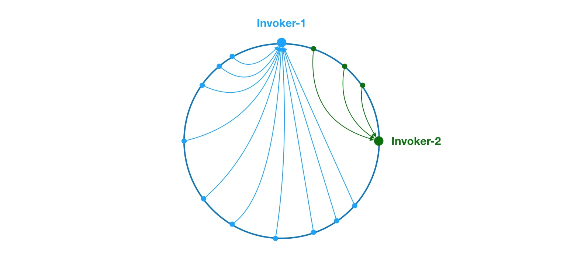

# dubbo负载均衡算法

>1，基于权重随机算法的 RandomLoadBalance
>2，基于最少活跃调用数算法的 LeastActiveLoadBalance
>3，基于 hash 一致性的 ConsistentHashLoadBalance
>4，基于加权轮询算法的 RoundRobinLoadBalance
>5，基于权重最快应答算法的ShortestResponseLoadBalance，类似LeastActiveLoadBalance

* [apache dubbo 负载均衡算法源码介绍](https://dubbo.apache.org/zh/docs/v2.7/dev/source/loadbalance/)

```
public abstract class AbstractLoadBalance implements LoadBalance {

@Override
public <T> Invoker<T> select(List<Invoker<T>> invokers, URL url, Invocation invocation) {
    if (invokers == null || invokers.isEmpty())
        return null;
    // 如果 invokers 列表中仅有一个 Invoker，直接返回即可，无需进行负载均衡
    if (invokers.size() == 1)
        return invokers.get(0);
    
    // 调用 doSelect 方法进行负载均衡，该方法为抽象方法，由子类实现
    return doSelect(invokers, url, invocation);
}

//select 方法的逻辑比较简单，
//首先会检测 invokers 集合的合法性，然后再检测 invokers 集合元素数量。
//如果只包含一个 Invoker，直接返回该 Inovker 即可。
//如果包含多个 Invoker，此时需要通过负载均衡算法选择一个 Invoker。具体的负载均衡算法由子类实现
protected abstract <T> Invoker<T> doSelect(List<Invoker<T>> invokers, URL url, Invocation invocation);

}
```

### 基于权重随机算法的 RandomLoadBalance
>算法举例：A 10 B 20 C 30 D 40，既A[0,10],B(10,30],C,(30,60],D(60,100]  随机得到offset=15，则在B区间

### 基于最少活跃调用数算法的 LeastActiveLoadBalance
>1，活跃调用数越小，表明该服务提供者效率越高，单位时间内可处理更多的请求。此时应优先将请求分配给该服务提供者。
>2，在具体实现中，每个服务提供者对应一个活跃数 active。初始情况下，所有服务提供者活跃数均为0。
>3，每收到一个请求，活跃数加1，完成请求后则将活跃数减1。
>4，在服务运行一段时间后，性能好的服务提供者处理请求的速度更快，因此活跃数下降的也越快，此时这样的服务提供者能够优先获取到新的服务请求、这就是最小活跃数负载均衡算法的基本思想。除了最小活跃数，LeastActiveLoadBalance 在实现上还引入了权重值。
>5，所以准确的来说，LeastActiveLoadBalance 是基于加权最小活跃数算法实现的。
举个例子说明一下，在一个服务提供者集群中，有两个性能优异的服务提供者。某一时刻它们的活跃数相同，此时 Dubbo 会根据它们的权重去分配请求，权重越大，获取到新请求的概率就越大。如果两个服务提供者权重相同，此时随机选择一个即可


### 基于 hash 一致性的 ConsistentHashLoadBalance
>这里相同颜色的节点均属于同一个服务提供者，比如 Invoker1-1，Invoker1-2，……, Invoker1-160。这样做的目的是通过引入虚拟节点，让 Invoker 在圆环上分散开来，避免数据倾斜问题。所谓数据倾斜是指，由于节点不够分散，导致大量请求落到了同一个节点上，而其他节点只会接收到了少量请求的情况





### 基于加权轮询算法的 RoundRobinLoadBalance
>轮询是一种无状态负载均衡算法，实现简单，适用于每台服务器性能相近的场景下。但现实情况下，我们并不能保证每台服务器性能均相近。如果我们将等量的请求分配给性能较差的服务器，这显然是不合理的。因此，这个时候我们需要对轮询过程进行加权，以调控每台服务器的负载。经过加权后，每台服务器能够得到的请求数比例，接近或等于他们的权重比。比如服务器 A、B、C 权重比为 5:2:1。那么在8次请求中，服务器 A 将收到其中的5次请求，服务器 B 会收到其中的2次请求，服务器 C 则收到其中的1次请求


请求编号|currentWeight数组|选择结果|减去权重总和后的currentWeight 数组
---------|----------|---------|---------
1	|[5, 1, 1]|	A	|[-2 (5-7), 1, 1]
2	|[3, 2, 2]	|A	|[-4, 2, 2]
3	|[1, 3, 3]	|B|	[1, -4, 3]
4	|[6, -3, 4]|	A	|[-1, -3, 4]
5	|[4, -2, 5]	|C	|[4, -2, -2]
6	|[9, -1, -1]	|A|	[2, -1, -1]
7	|[7, 0, 0]|	A	|[0, 0, 0]

#### 结合源码和如上示例，给出算法详细过程如下
编号|currentWeight数组|备注
---------|----------|---------
0	|[0, 0, 0]|	 初始currentWeight都为0,每次都加自身weight[5,1,1]，maxCurrent-totalWeight
1	|[5, 1, 1]|	maxCurrent=5，**选择A**
2	|[5-7=-2, 1, 1]|maxCurrent-totalWeight，减去权重总和后的currentWeight 数组
3	|[-2+5=3, 1+1, 1+1]|每次都加自身weight[5,1,1]，maxCurrent=3，**选择A**
4	|[3-7, 2, 2]|maxCurrent-totalWeight，减去权重总和后的currentWeight 数组
5	|[-4+5, 2+1, 2+1]|每次都加自身weight[5,1,1]，maxCurrent=3，**选择B**
6	|[1, 3-7, 3]|maxCurrent-totalWeight，减去权重总和后的currentWeight 数组
7	|[1+5, -4+1, 3+1]|每次都加自身weight[5,1,1]，maxCurrent=6，**选择A**
8	|[6-7, -3, 4]|maxCurrent-totalWeight，减去权重总和后的currentWeight 数组
9	|[-1+5, -3+1, 4+1]|每次都加自身weight[5,1,1]，maxCurrent=5，**选择C**
10	|[4, -2, 5-7]|maxCurrent-totalWeight，减去权重总和后的currentWeight 数组
11	|[4+5, -2+1, -2+1]|每次都加自身weight[5,1,1]，maxCurrent=9，**选择A**
12	|[9-7, -1, -1]|maxCurrent-totalWeight，减去权重总和后的currentWeight 数组
13	|[2+5, -1+1, -1+1]|每次都加自身weight[5,1,1]，maxCurrent=7，**选择A**
14	|[7-7, 0, 0]|减去权重总和后的currentWeight **数组回到初始[0,0,0]，又可以重新一轮**

