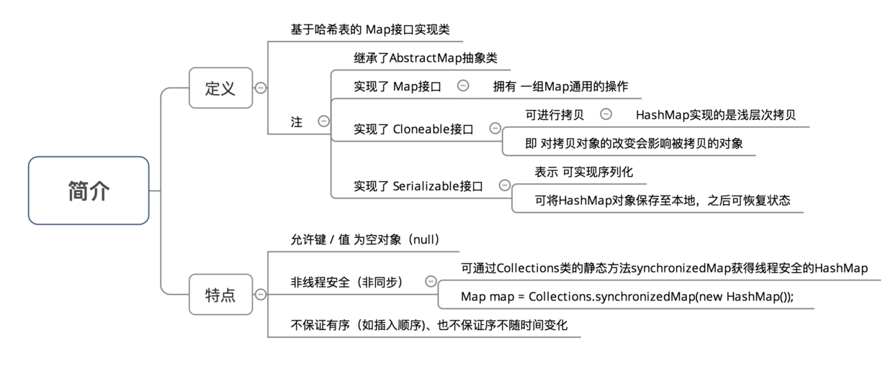
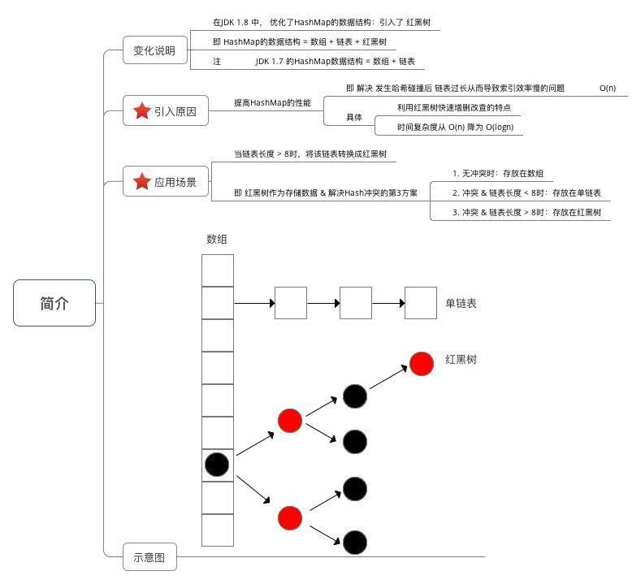
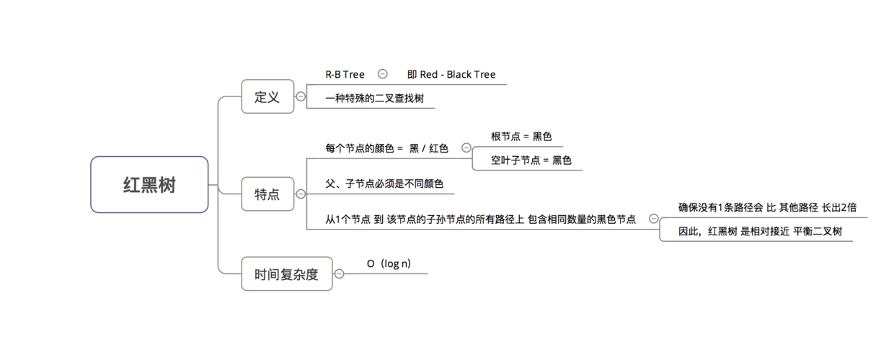
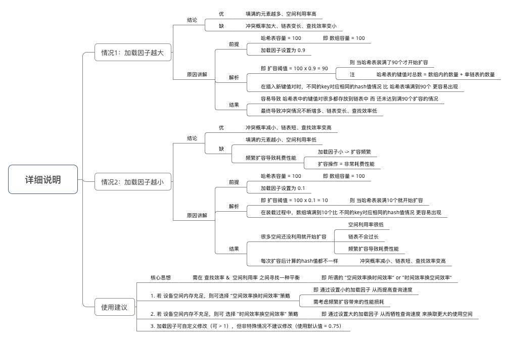

## HashMap

### hash

#### 处理冲突的方法
>1，开放定址法：产生冲突之后去寻找下一个空闲的空间（线性探测法，平方探测）
>2，链表法：散列到同一位置的元素，在这个位置是创建一个链表
>3，再散列：一直hash直到冲突不再发生
>4，建立公共溢出区：将哈希表分为基本表和溢出表两部分，凡是和基本表发生冲突的元素，一律填入溢出表
>5，红黑树

### hashmap特性简介
```
public class HashMap<K,V> extends AbstractMap<K,V> implements Map<K,V>, Cloneable, Serializable

public abstract class AbstractMap<K,V> implements Map<K,V>

public interface Map<K,V>
 ```   



### hashmap数据结构简介


### 红黑树特性简介


### 重要参数
```
//默认容量 = 16 
static final int DEFAULT_INITIAL_CAPACITY = 1 << 4; // aka 16
//最大容量 =  2的30次方
static final int MAXIMUM_CAPACITY = 1 << 30;

int threshold;//size超过多少时需要扩容，默认16

final float loadFactor; // 实际加载因子
static final float DEFAULT_LOAD_FACTOR = 0.75f; // 默认加载因子
/** 
* 与红黑树相关的参数
*/
// 1. 桶的树化阈值：即 链表转成红黑树的阈值，在存储数据时，当链表长度 > 该值时，则将链表转换成红黑树
static final int TREEIFY_THRESHOLD = 8; 
// 2. 桶的链表还原阈值：即 红黑树转为链表的阈值，当在扩容（resize（））时（此时HashMap的数据存储位置会重新计算），在重新计算存储位置后，当原有的红黑树内数量 < 6时，则将 红黑树转换成链表
static final int UNTREEIFY_THRESHOLD = 6;
// 3. 最小树形化容量阈值：即 当哈希表中的容量 > 该值时，才允许树形化链表 （即 将链表 转换成红黑树）
// 否则，若桶内元素太多时，则直接扩容，而不是树形化
// 为了避免进行扩容、树形化选择的冲突，这个值不能小于 4 * TREEIFY_THRESHOLD
static final int MIN_TREEIFY_CAPACITY = 64;

```



### 源码简要解析
```

 public V put(K key, V value) {
        return putVal(hash(key), key, value, false, true);
    }

/**
*1，第一次添加元素，分配空间
*2，桶上为空，没有发生冲突，就直接分配
*3，桶上有冲突，先以链表式存入
*4，当超过树化阈值，则化成红黑树
**/
 final V putVal(int hash, K key, V value, boolean onlyIfAbsent,
                   boolean evict) {
        Node<K,V>[] tab;
        Node<K,V> p;
        int n, i;
        if ((tab = table) == null || (n = tab.length) == 0)
            n = (tab = resize()).length;//添加元素时，才分配空间，默认桶容量16
        if ((p = tab[i = (n - 1) & hash]) == null)
            tab[i] = newNode(hash, key, value, null);
        else {
            Node<K,V> e; K k;
            if (p.hash == hash &&
                ((k = p.key) == key || (key != null && key.equals(k))))
                e = p;
            else if (p instanceof TreeNode)
                e = ((TreeNode<K,V>)p).putTreeVal(this, tab, hash, key, value);
            else {
                for (int binCount = 0; ; ++binCount) {
                    if ((e = p.next) == null) {
                        p.next = newNode(hash, key, value, null);
                        if (binCount >= TREEIFY_THRESHOLD - 1) // -1 for 1st
                            treeifyBin(tab, hash);
                        break;
                    }
                    if (e.hash == hash &&
                        ((k = e.key) == key || (key != null && key.equals(k))))
                        break;
                    p = e;
                }
            }
            if (e != null) { // existing mapping for key
                V oldValue = e.value;
                if (!onlyIfAbsent || oldValue == null)
                    e.value = value;
                afterNodeAccess(e);
                return oldValue;
            }
        }
        ++modCount;
        if (++size > threshold)//有效元素个数，和阈值对比，扩容
            resize();
        afterNodeInsertion(evict);
        return null;
    }
```

### hashmap,linkedhashmap,treemap
>1，HashMap取出的时候是随机的,是最常用的一个Map.根据键的HashCode值存储数据,根据键直接获取它的值，具有很快的访问速度。在Map中插入、删除和定位元素，HashMap 是最好的选择。    
>2，TreeMap取出来的是排序后的键值对。但如果您要按自然顺序或自定义顺序遍历键，那么TreeMap会更好。   
>3，LinkedHashMap 是HashMap的一个子类，如果需要输出的顺序和输入的相同,那么用LinkedHashMap可以实现。    