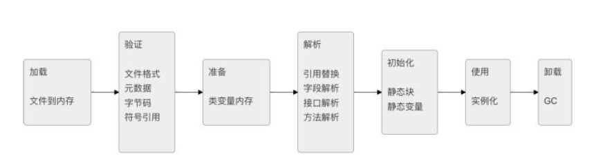

# jvm 类加载

其中验证,准备,解析合称链接
加载通过类的完全限定名,查找此类字节码文件,利用字节码文件创建Class对象.
验证确保Class文件符合当前虚拟机的要求,不会危害到虚拟机自身安全.
准备进行内存分配,为static修饰的类变量分配内存,并设置初始值(0或null).不包含final修饰的静态变量,
因为final变量在编译时分配.
解析将常量池中的符号引用替换为直接引用的过程.直接引用为直接指向目标的指针或者相对偏移量等.
初始化主要完成静态块执行以及静态变量的赋值.先初始化父类,再初始化当前类.只有对类主动使用时才
会初始化.
触发条件包括,创建类的实例时,访问类的静态方法或静态变量的时候,使用Class.forName反射类的时候,或
者某个子类初始化的时候.
Java自带的加载器加载的类,在虚拟机的生命周期中是不会被卸载的,只有用户自定义的加载器加载的类才
可以被卸.