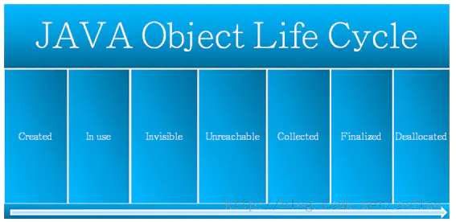
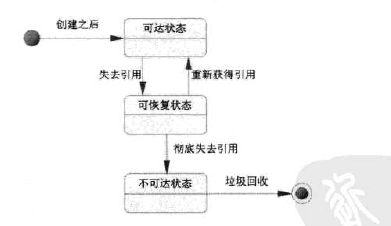
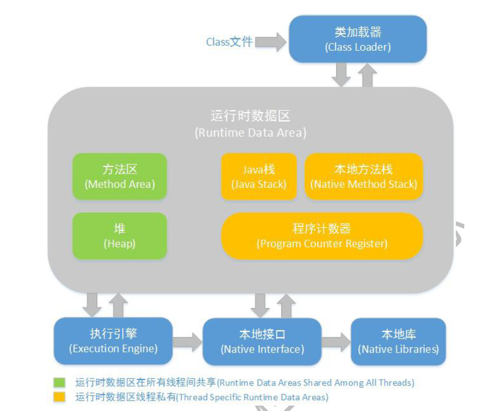
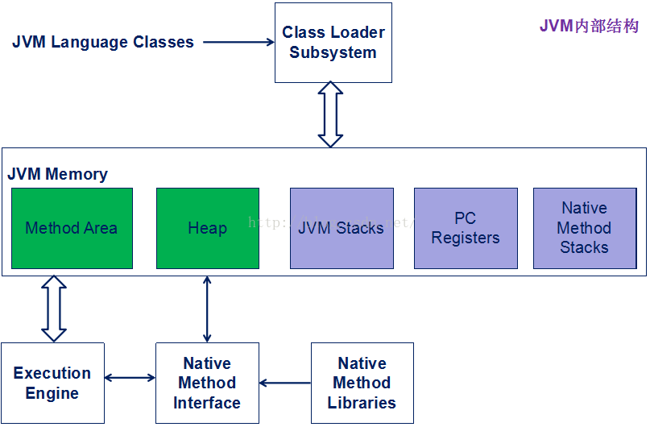
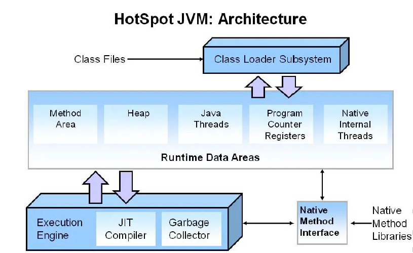
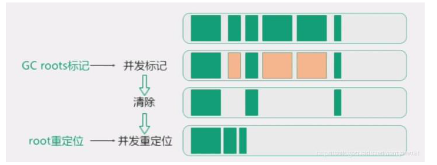

# 内存分配和GC回收

## 对象创建与内存分配
### 1，对象生命周期：created->In use->Invisible->Unreachable->Collected->Finalized->Deallocated
>Java对象由三个部分组成：对象头、实例数据、对齐填充

### 2，创建过程：
>2.1，为对象分配存储空间        
>2.2，开始构造对象           
>2.3，从超类到子类对static成员进行初始化        
>2.4，超类成员变量按顺序初始化，递归条用超类的构造方法      
>2.5，子类成员变量按顺序初始化，子类构造方法调用     

>1.JVM遇到一条新建对象的指令时首先去检查这个指令的参数是否能在常量池中定义到一个类的符号引用。然后加载这个类
>2.为对象分配内存。一种办法“指针碰撞”、一种办法“空闲列表”，最终常用的办法“本地线程缓冲分配(TLAB)”
>3.将除对象头外的对象内存空间初始化为0
>4.对对象头进行必要设置

### 3，垃圾回收与对象可达性
>3，垃圾回收时会依据两个原则来判断对象的可达性：
>3.1，单一路径中，以最弱的引用为准
>3，2，多路径中，以最强的引用为准

## 对象分配与简要GC流程
**对象主要在新生代的Eden区上分配，如果启用了本地线程分配缓冲，将按线程优先在TLAB上分配，少数情况会在老年代上分配，分配规则不是固定的，取决于当前使用哪一种垃圾收集器组合，以及虚拟机和内存的相关参数**

>1，如果Survivor区无法放下，或者超大对象的阈值超过上限，则尝试在老年代中进行分配        
>2，**如果老年代也无法放下，则会触发Full Garbage Collection ，即FGC**       
>3，如果依然无法放下，则抛出OOM     
>4，堆内存出现OOM 的概率是所有内存耗尽异常中最高的    
>5，出错时的堆内信息对解决问题非常有帮助，所以给JVM设置运行参数－XX:+HeapDumpOnOutOfMemoryError，让JVM遇到OOM异常时能输出堆内信息，特别是对相隔数月才出现的OOM 异常尤为重要      
>6，**在不同的JVM实现及不同的回收机制中，堆内存的划分方式是不一样的**

### 判断对象是否可回收
>1，引用计数算法
>2，可达性分析算法：1，对执行时间敏感，这项工作必须在能确保 **一致性的快照**中进行，不可以出现分析过程中对象引用关系还在不断变化的情况，不然无法保证分析结果的准确性，即GC进行时，必须停顿所有java执行线程（stop the world），即使号称不会发生停顿的CMS收集器中，枚举根节点也必须要停顿

### JVM运行时数据区
>1，方法区：线程共享，存储jvm加载的类信息，常亮，静态变量，即时编译后的代码等数据，JVM堆的一个逻辑部分
>2，jvm栈：线程私有，存储局部变量表，操作数栈，动态链接，方法出口等信息
>3，本地方法栈：native方法服务
>4，jvm堆：新生代+老生代
>5，程序计数器：当前线程执行的字节码的行号指示器，线程私有
>6，StackOverflowErr：递归深度大于jvm允许的最大值
>7，OOM：堆内存分配不足
>8，运行时常量池：方法区的一部分，存放各种字面量和符号引用
>9，直接内存

### JVM 内存布局（程序计数器，本地方法栈，虚拟机栈，java堆，元数据区（方法区，运行时常量池））
>直接内存：不是jvm规范中的内存区域，在jdk1.4中更新接入了NIO（New Input/Output），引入了基于通道和缓冲区的I/O方式，可以通过Native函数库有直接分配堆外内存，用过一个存储在java堆中的DirectByteBuffer对象引用操作，在某些场景下能显著提高性能

>1，线程私有区：程序计数器，虚拟机栈，本地方法栈
>2，线程共享区：方法区，堆

>1，**Heap是OOM故障最主要的发源地**，它存储着几乎所有的实例对象，堆由垃圾收集器自动回收，堆区由各子线程共享使用   
>2，在通常情况下，服务器在运行过程中，堆空间不断地扩容与回缩，势必形成不必要的系统压力，所以在线上生产环境中，JVM的Xms和Xmx设置成1样大小，避免在GC后调整堆大小时带来的额外压力  
>3，**新生代＝1个Eden区＋2个Survivor区 （据统计，Eden：Survivor=8：1）**
>4，**绝大部分对象在Eden区生成**
>5，当 **Eden区装填满**的时候，会触发YoungGarbage Collection，即YGC，**垃圾回收的时候，在Eden区实现清除策略**，**没有被引用的对象则直接回收，依然存活的对象会被移送到Survivor区**
>6，JVM中的虚拟机栈是描述Java方法执行的内存区域，它是 **线程私有的**，栈中的元素用于支持虚拟机进行方法调用，每个方法从开始调用到执行完成的过程，就是栈帧从入栈到出栈的过程        
>7，程序计数器：如果执行的是JAVA
方法，计数器记录正在执行的java字节码地址，如果执行的是native方法，则计数器为空。

### 回收算法
a、G1算法
1.9后默认的垃圾回收算法,特点保持高回收率的同时减少停顿.采用每次只清理一部分,而不是清理全部的增
量式清理,以保证停顿时间不会过长
其取消了年轻代与老年代的物理划分,但仍属于分代收集器,算法将堆分为若干个逻辑区域(region),一部分用
作年轻代,一部分用作老年代,还有用来存储巨型对象的分区.
同CMS相同,会遍历所有对象,标记引用情况,清除对象后会对区域进行复制移动,以整合碎片空间.
年轻代回收:
并行复制采用复制算法,并行收集,会StopTheWorld.
老年代回收:
会对年轻代一并回收
初始标记完成堆root对象的标记,会StopTheWorld.
并发标记GC线程和应用线程并发执行.
最终标记完成三色标记周期,会StopTheWorld.
复制/清楚会优先对可回收空间加大的区域进行回收
b、ZGC算法
前面提供的高效垃圾回收算法,针对大堆内存设计,可以处理TB级别的堆,可以做到10ms以下的回收停顿时间.

>着色指针
>读屏障
>并发处理
>基于region
>内存压缩(整理)
>roots标记：标记root对象,会StopTheWorld.
>并发标记：利用读屏障与应用线程一起运行标记,可能会发生StopTheWorld.
>清除会清理标记为不可用的对象.
>roots重定位：是对存活的对象进行移动,以腾出大块内存空间,减少碎片产生.重定位最开始会StopTheWorld,却决于重定位集与对象总活动集的比例.
并发重定位与并发标记类似.