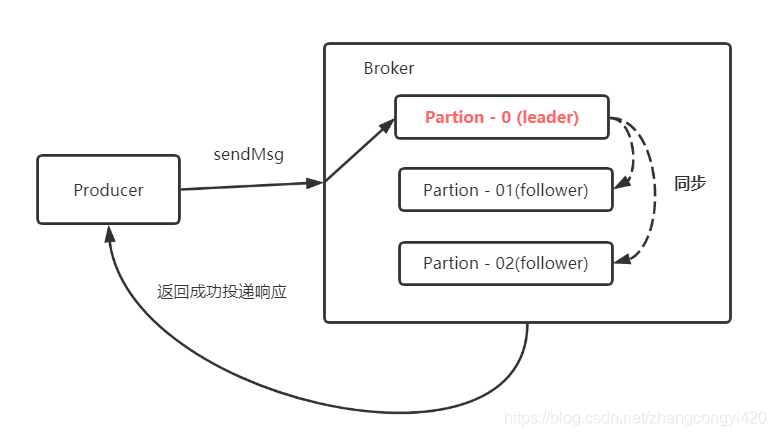
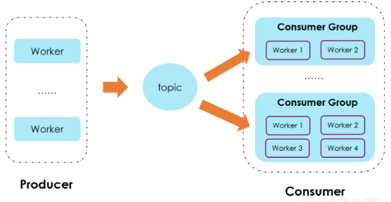

# kafka

* [淘宝 RocketMQ 与 Kafka 对比](https://toutiao.io/posts/sodl0/preview)

>在大数据分布式文件系统里面，95% 的都是主从式的架构，个别是对等式的架构

>消息队列已经逐渐成为企业IT系统内部通信的核心手段。它具有低耦合、可靠投递、广播、流量控制、最终一致性等一系列功能，成为异步RPC的主要手段之一
>消息队列不是万能的。对于需要强事务保证而且延迟敏感的，RPC是优于消息队列的
>所谓消息队列，无外乎两次RPC加一次转储，当然需要消费端最终做消费确认的情况是三次RPC。既然是RPC，就必然牵扯出一系列话题，什么负载均衡啊、服务发现啊、通信协议啊、序列化协议啊

## 消息队列中一些基本的特性是什么
>基于内存or基于磁盘
>持久化问题
>集群容错问题
>主从备份，复制机制
>什么设计思想，即可靠，性能也高
>选举，与脑裂
>CAP，最终一致性问题，
>事务？
>协议的扩展性
>存储
>消息有序？

## 设计和开发消息队列中遇到的常规问题的一般解决思想是什么

### 最终一致性 VS 事务
>1，强一致性，分布式事务，但落地太难且成本太高，后文会具体提到。
>2，最终一致性，主要是用“记录”和“补偿”的方式。在做所有的不确定的事情之前，先把事情记录下来，然后去做不确定的事情，结果可能是：成功、失败或是不确定，“不确定”（例如超时等）可以等价为失败。成功就可以把记录的东西清理掉了，对于失败和不确定，可以依靠定时任务等方式把所有失败的事情重新搞一遍，直到成功为止。 回到刚才的例子，系统在A扣钱成功的情况下，把要给B“通知”这件事记录在库里（为了保证最高的可靠性可以把通知B系统加钱和扣钱成功这两件事维护在一个本地事务里），通知成功则删除这条记录，通知失败或不确定则依靠定时任务补偿性地通知我们，直到我们把状态更新成正确的为止。 整个这个模型依然可以基于RPC来做，但可以抽象成一个统一的模型，基于消息队列来做一个“企业总线”。 具体来说，本地事务维护业务变化和通知消息，一起落地（失败则一起回滚），然后RPC到达broker，在broker成功落地后，RPC返回成功，本地消息可以删除。否则本地消息一直靠定时任务轮询不断重发，这样就保证了消息可靠落地broker。 broker往consumer发送消息的过程类似，一直发送消息，直到consumer发送消费成功确认。 我们先不理会重复消息的问题，通过两次消息落地加补偿，下游是一定可以收到消息的。然后依赖状态机版本号等方式做判重，更新自己的业务，就实现了最终一致性。

## 了解数据从文件到套接字的常见数据传输路径就非常重要：

操作系统从磁盘读取数据到内核空间的 pagecache
应用程序读取内核空间的数据到用户空间的缓冲区
应用程序将数据(用户空间的缓冲区)写回内核空间到套接字缓冲区(内核空间)
操作系统将数据从套接字缓冲区(内核空间)复制到通过网络发送的 NIC 缓冲区

在一个kafka集群中，大多数 consumer 消费时，您将看不到磁盘上的读取活动，因为数据将完全由缓存提供

## comsumer group
>1,如果一个消费组的消费者大于分区数，那么相当于多余的消费者是一种浪费，多余的消费者将无法消费消息。
>2,如果一个消费组的消费者小于分区数，会有对应的消费者分区分配策略。一种是Range（默认），一种是RoundRobin（轮询），当然也可以自定义策略
>3,建议：配置分区数是消费者数的整数倍

* [kafka大概介绍-可以看看](https://www.cnblogs.com/GrimMjx/p/11523067.html)

## partition 分区
>一个主题下面有多个分区，这些分区会存储到不同的服务器上面，或者说，其实就是在不同的主机上建了不同的目录。这些分区主要的信息就存在了 .log 文件里面。跟数据库里面的分区差不多，是为了提高性能。

>Producer(消息发送者)的往消息Server的写入并发数与分区数成正比。
>Consumer(消息消费者)消费某个Topic的并行度与分区数保持一致，假设分区数是20，那么Consumer的消费并行度最大为20。
>每个Topic由固定数量的分区数组成，分区数的多少决定了单台Broker能支持的Topic数量，Topic数量又决定了支持的业务数量

>Kakfka 保证以 Partition 为单位的分区有序

## Replica 副本
>需要注意：Kafka 在 0.8 版本以前是没有副本机制的，所以在面对服务器宕机的突发情况时会丢失数据，所以尽量避免使用这个版本之前的 Kafka

## topic

## Kafka 性能好在什么地方？
>顺序写
>零拷贝

## 写日志

## Q&S
>1，分区增加，在不同broker下的分区数据怎么调整

>2，为什么Kafka不能支持更多的分区数？
>每个分区存储了完整的消息数据，虽然每个分区写入是磁盘顺序写，但是多个分区同时顺序写入在操作系统层面变为了随机写入。
>由于数据分散为多个文件，很难利用IO层面的Group Commit机制，网络传输也会用到类似优化算法

* [ONS(RocketMQ)为什么能够比Kafka支持更多的分区数量？](https://developer.aliyun.com/article/105)

## kafka ack机制
>Kafka的ack机制，指的是producer的消息发送确认机制，这直接影响到Kafka集群的吞吐量和消息可靠性。而吞吐量和可靠性就像硬币的两面，两者不可兼得，只能平衡。

>ack有3个可选值，分别是 0，1，-1。默认是1

>ack=0
>意味着producer不等待broker同步完成的确认，继续发送下一条(批)信息提供了最低的延迟。但是最弱的持久性，当服务器发生故障时，就很可能发生数据丢失。例如leader已经死亡，producer不知情，还会继续发送消息broker接收不到数据就会数据丢失
>ack=1
>ack=1，简单来说就是，producer只要收到一个分区副本成功写入的通知就认为推送消息成功了。这里有一个地方需要注意，这个副本必须是leader副本。只有leader副本成功写入了，producer才会认为消息发送成功。
注意，ack的默认值就是1。这个默认值其实就是吞吐量与可靠性的一个折中方案。生产上我们可以根据实际情况进行调整，比如如果你要追求高吞吐量，那么就要放弃可靠性。
>ack=-1
>producer只有收到分区内所有副本的成功写入的通知才认为推送消息成功了。

## 重复消费
>offset没来得及提交更新
>具体消息加唯一的id用以区分，避免重复消费

原因1：强行kill线程，导致消费后的数据，offset没有提交（消费系统宕机、重启等）。
原因2：设置offset为自动提交，关闭kafka时，如果在close之前，调用 consumer.unsubscribe() 则有可能部分offset没提交，下次重启会重复消费。

解决方案：
spring.kafka.consumer.enable-auto-commit=false
spring.kafka.consumer.auto-offset-reset=latest

原因3:（重复消费最常见的原因）：消费后的数据，当offset还没有提交时，partition就断开连接。比如，通常会遇到消费的数据，处理很耗时，导致超过了Kafka的session timeout时间（0.10.x版本默认是30秒），那么就会re-blance重平衡，此时有一定几率offset没提交，会导致重平衡后重复消费。

原因4：当消费者重新分配partition的时候，可能出现从头开始消费的情况，导致重发问题。

原因5：当消费者消费的速度很慢的时候，可能在一个session周期内还未完成，导致心跳机制检测报告出问题。

原因6：并发很大，可能在规定的时间（session.time.out默认30s）内没有消费完，就会可能导致reblance重平衡，导致一部分offset自动提交失败，然后重平衡后重复消费

* [举例会出现重复消费的bug](https://zhuanlan.zhihu.com/p/112745985)

## 重复生产

>kafka 遵循了一种大部分消息系统共同的传统的设计：producer 将消息推送到 broker，consumer 从broker 拉取消息

### Zookeeper 对于 Kafka 的作用是什么？
>1，Zookeeper 是一个开放源码的、高性能的协调服务，它用于 Kafka 的分布式应用。

>2，Zookeeper 主要用于在集群中不同节点之间进行通信

>3，在 Kafka 中，它被用于提交偏移量，因此如果节点在任何情况下都失败了，它都可以从之前提交的偏移量中获取除此之外，它还执行其他活动，如: leader 检测、分布式同步、配置管理、识别新节点何时离开或连接、集群、节点实时状态等等。