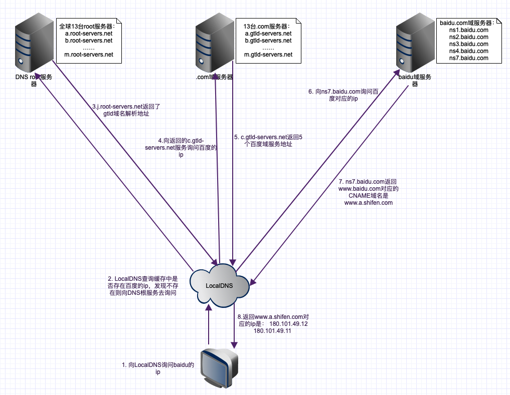

# 负载均衡

## 基于DNS负载均衡
>1，例如，设置，根据不同地区来访问不同的节点
>2，有一个明显的缺点是：当配置修改后，生效不及时

>DNS劫持
>更新不及时

* [DNS&HTTPDNS](https://juejin.cn/post/6844903987796246542)

### HTTPDNS
>HTTPDNS使用HTTP与DNS服务器交互，代替传统的基于UDP的DNS协议，域名解析请求直接发送到HTTPDNS服务端，从而绕过运营商的Local DNS

>由于 HttpDns 是通过 IP 直接请求 HTTP 获取服务器 A 记录地址，不存在向本地运营商询问 domain 解析过程，所以从根本避免了劫持问题

#### 为什么DNS采用UDP协议 ？
>TCP通信过程太复杂并且开销大，一次TCP交换需要9个包： 三个连接包，四个断开包，一个request包，一个响应包。
>UDP通信过程简单，只需要一个查询包和一个响应包

## 硬件负载均衡
> F5 Network Big-IP，也就是我们常说的 F5

## 软件负载均衡
>1，基于第四层传输层来做流量分发的方案称为4层负载均衡，例如 LVS,一般能达到 几十万/秒 的处理量
>2，基于第七层应用层来做流量分发的称为7层负载均衡，例如 Nginx，一般只在 几万/秒

## 负载均衡算法
轮询策略

负载度策略

响应策略

哈希策略