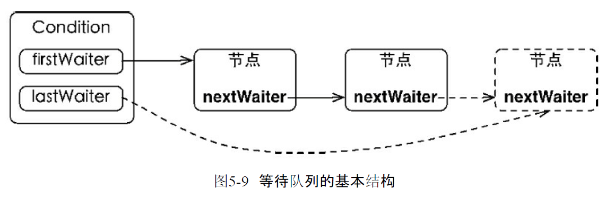
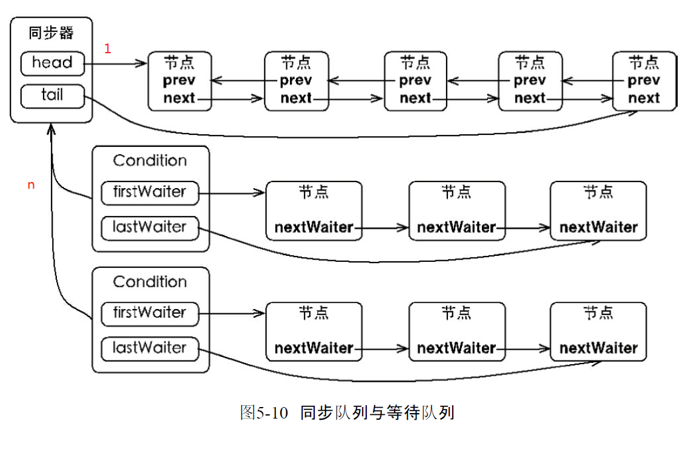
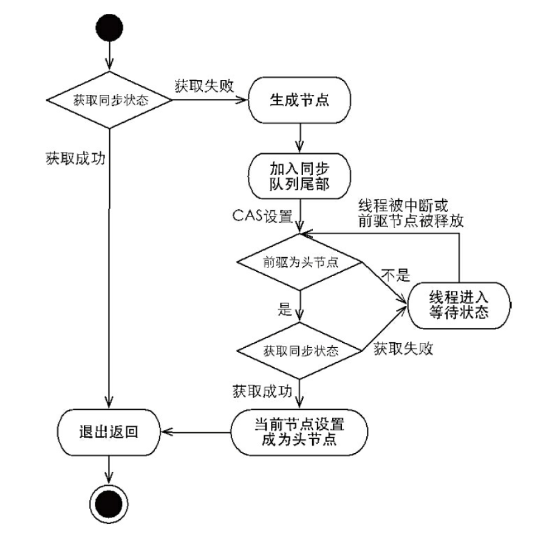
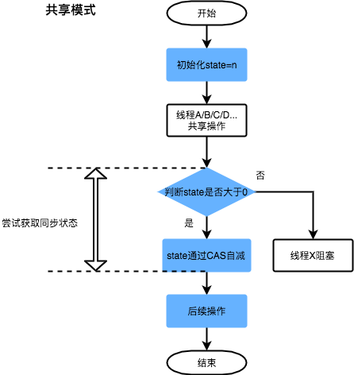

# lock & AQS & Condition

* [lock&await&signal-不错](https://juejin.cn/post/6844903665128439815#heading-6)

>1，void await() throws InterruptedException 当前线程进入等待状态，直到被通知（signal）或者被中断时，当前线程进入运行状态，从await()返回
>2，void signal() 唤醒一个等待在Condition上的线程


```
public final void await() throws InterruptedException {
    // 1.如果当前线程被中断，则抛出中断异常
    if (Thread.interrupted())
        throw new InterruptedException();
    // 2.将节点加入到Condition队列中去，这里如果lastWaiter是cancel状态，那么会把它踢出Condition队列。
    Node node = addConditionWaiter();
    // 3.调用tryRelease，释放当前线程的锁
    long savedState = fullyRelease(node);
    int interruptMode = 0;
    // 4.为什么会有在AQS的等待队列的判断？
    // 解答：signal操作会将Node从Condition队列中拿出并且放入到等待队列中去，在不在AQS等待队列就看signal是否执行了
    // 如果不在AQS等待队列中，就park当前线程，如果在，就退出循环，这个时候如果被中断，那么就退出循环
    while (!isOnSyncQueue(node)) {
        LockSupport.park(this);
        if ((interruptMode = checkInterruptWhileWaiting(node)) != 0)
            break;
    }
    // 5.这个时候线程已经被signal()或者signalAll()操作给唤醒了，退出了4中的while循环
    // 自旋等待尝试再次获取锁，调用acquireQueued方法
    if (acquireQueued(node, savedState) && interruptMode != THROW_IE)
        interruptMode = REINTERRUPT;
    if (node.nextWaiter != null)
        unlinkCancelledWaiters();
    if (interruptMode != 0)
        reportInterruptAfterWait(interruptMode);
}

```
>1，将当前线程加入Condition锁队列。特别说明的是，这里不同于AQS的队列，这里进入的是Condition的FIFO队列。 
>2，释放锁。这里可以看到将锁释放了，否则别的线程就无法拿到锁而发生死锁。 
>3，自旋(while)挂起，直到被唤醒（signal把他重新放回到AQS的等待队列）或者超时或者CACELLED等。 
>4，获取锁(acquireQueued)。并将自己从Condition的FIFO队列中释放，表明自己不再需要锁（我已经拿到锁了）。
>5,如果从队列（同步队列和等待队列）的角度看await()方法，当调用await()方法时，相当于同
步队列的首节点（获取了锁的节点）移动到Condition的等待队列中

```
public final void signal() {
            if (!isHeldExclusively())
              //如果同步状态不是被当前线程独占，直接抛出异常。从这里也能看出来，Condition只能配合独占类同步组件使用。
                throw new IllegalMonitorStateException(); 
            Node first = firstWaiter;
            if (first != null)
                //通知等待队列队首的节点。
                doSignal(first); 
        }

private void doSignal(Node first) {
            do {
                if ( (firstWaiter = first.nextWaiter) == null)
                    lastWaiter = null;
                first.nextWaiter = null;
            } while (!transferForSignal(first) &&   //transferForSignal方法尝试唤醒当前节点，如果唤醒失败，则继续尝试唤醒当前节点的后继节点。
                     (first = firstWaiter) != null);
        }

    final boolean transferForSignal(Node node) {
        //如果当前节点状态为CONDITION，则将状态改为0准备加入同步队列；如果当前状态不为CONDITION，说明该节点等待已被中断，则该方法返回false，doSignal()方法会继续尝试唤醒当前节点的后继节点
        if (!compareAndSetWaitStatus(node, Node.CONDITION, 0))
            return false;

        /*
         * Splice onto queue and try to set waitStatus of predecessor to
         * indicate that thread is (probably) waiting. If cancelled or
         * attempt to set waitStatus fails, wake up to resync (in which
         * case the waitStatus can be transiently and harmlessly wrong).
         */
        Node p = enq(node);  //将节点加入同步队列，返回的p是节点在同步队列中的先驱节点
        int ws = p.waitStatus;
        //如果先驱节点的状态为CANCELLED(>0) 或设置先驱节点的状态为SIGNAL失败，那么就立即唤醒当前节点对应的线程，线程被唤醒后会执行acquireQueued方法，该方法会重新尝试将节点的先驱状态设为SIGNAL并再次park线程；如果当前设置前驱节点状态为SIGNAL成功，那么就不需要马上唤醒线程了，当它的前驱节点成为同步队列的首节点且释放同步状态后，会自动唤醒它。
        //其实笔者认为这里不加这个判断条件应该也是可以的。只是对于CAS修改前驱节点状态为SIGNAL成功这种情况来说，如果不加这个判断条件，提前唤醒了线程，等进入acquireQueued方法了节点发现自己的前驱不是首节点，还要再阻塞，等到其前驱节点成为首节点并释放锁时再唤醒一次；而如果加了这个条件，线程被唤醒的时候它的前驱节点肯定是首节点了，线程就有机会直接获取同步状态从而避免二次阻塞，节省了硬件资源。
        if (ws > 0 || !compareAndSetWaitStatus(p, ws, Node.SIGNAL))
            LockSupport.unpark(node.thread);
        return true;
    }

```
>signal就是唤醒Condition队列中的第一个非CANCELLED节点线程，而signalAll就是唤醒所有非CANCELLED节点线程，本质是将节点从Condition队列中取出来一个还是所有节点放到AQS的等待队列。尽管所有Node可能都被唤醒，但是要知道的是仍然只有一个线程能够拿到锁，其它没有拿到锁的线程仍然需要自旋等待，就上上面提到的第4步(acquireQueued)


>1，线程1调用reentrantLock.lock时，尝试获取锁。如果成功，则返回，从AQS的队列中移除线程；否则阻塞，保持在AQS的等待队列中。
>2，线程1调用await方法被调用时，对应操作是被加入到Condition的等待队列中，等待signal信号；同时释放锁。
>3，锁被释放后，会唤醒AQS队列中的头结点，所以线程2会获取到锁。
>4，线程2调用signal方法，这个时候Condition的等待队列中只有线程1一个节点，于是它被取出来，并被加入到AQS的等待队列中。注意，这个时候，线程1 并没有被唤醒，只是被加入AQS等待队列。
>5，signal方法执行完毕，线程2调用unLock()方法，释放锁。这个时候因为AQS中只有线程1，于是，线程1被唤醒，线程1恢复执行。所以：**发送signal信号只是将Condition队列中的线程加到AQS的等待队列中。只有到发送signal信号的线程调用reentrantLock.unlock()释放锁后，这些线程才会被唤醒**

### ConditionObject implements Condition:Condition的等待队列
>1.signal将firstWaiter（waitStatus=CONDITION）的Node节点转换成init=0，加入AQS等待队列
```
 public class ConditionObject implements Condition, java.io.Serializable {
        /** First node of condition queue. */
        private transient Node firstWaiter;
        /** Last node of condition queue. */
        private transient Node lastWaiter;

 }
```

```
class TaskQueue {
    private final Lock lock = new ReentrantLock();
    private final Condition condition = lock.newCondition();
    private Queue<String> queue = new LinkedList<>();

    public void addTask(String s) {
        lock.lock();
        try {
            queue.add(s);
            condition.signalAll();
        } finally {
            lock.unlock();
        }
    }

    public String getTask() {
        lock.lock();
        try {
            while (queue.isEmpty()) {
                condition.await();
            }
            return queue.remove();
        } finally {
            lock.unlock();
        }
    }
}
```

## AQS

### Node:实现FIFO双向链表

```
 static final class Node {
    volatile int waitStatus;//CANCELLED=1,SIGNAL=-1,CONDITION=-2,PROPAGATE=-3
    volatile Node prev;
    volatile Node next;
    volatile Thread thread;
    Node nextWaiter;//Link to next node waiting on condition, or the special value SHARED.
 }
```



### 获取锁
>总的来说，一个线程获取锁失败了，被放入等待队列，acquireQueued会把放入队列中的线程不断自旋去获取锁，直到获取成功或者不再需要获取（中断）
```
 public final void acquire(int arg) {//final不允许这个方法被子类覆盖
        if (!tryAcquire(arg) &&
            acquireQueued(addWaiter(Node.EXCLUSIVE), arg))//表示节点处于独占模式
            selfInterrupt();
        //为了防止因死循环导致CPU资源被浪费，我们会判断前置节点的状态来决定是否要将当前线程挂起
    }

final boolean acquireQueued(final Node node, int arg) {
        boolean failed = true;//节点入队后，自旋尝试获取同步状态
        try {
            boolean interrupted = false;
            for (;;) {//自旋起点
                final Node p = node.predecessor();
                //新节点的前驱节点是队列的头结点且尝试获取同步状态
                if (p == head && tryAcquire(arg)) {
                    setHead(node);//成功则当前节点设置为头结点
                    p.next = null; // help GC
                    failed = false;
                    return interrupted;
                }
                if (shouldParkAfterFailedAcquire(p, node) &&
                    parkAndCheckInterrupt())
                    interrupted = true;//当前线程休眠
            }
        } finally {
            if (failed)
                cancelAcquire(node);
        }
    }
```



### 锁释放之后，去唤醒头结点的后继节点
>lock.unlock->sync.unlock->aqs.release->sync.tryRelease->aqs.unparkSuccessor
```
 public final boolean release(int arg) {
        if (tryRelease(arg)) {
            Node h = head;
            if (h != null && h.waitStatus != 0)
                unparkSuccessor(h);//唤醒头结点的后继节点
            return true;
        }
        return false;
    }
```

>**总结：在获取同步状态时，同步器维护一个同步队列（FIFI,node 双向链表），获取状态失败的线程都会被加入到队列中并在队列中进行自旋；移出队列（或停止自旋）的条件是前驱节点为头节点且成功获取了同步状态。在释放同步状态时，同步器调用tryRelease(int arg)方法释放同步状态，然后唤醒头节点的后继节点**

* [AQS-讲解不错](https://tech.meituan.com/2019/12/05/aqs-theory-and-apply.html)


")



## ReentrantReadWriteLock：悲观的可重入读写锁

## StampedLock:乐观读写锁

```
public class Point {
    private final StampedLock stampedLock = new StampedLock();

    private double x;
    private double y;

    public void move(double deltaX, double deltaY) {
        long stamp = stampedLock.writeLock(); // 获取写锁
        try {
            x += deltaX;
            y += deltaY;
        } finally {
            stampedLock.unlockWrite(stamp); // 释放写锁
        }
    }

    public double distanceFromOrigin() {
        long stamp = stampedLock.tryOptimisticRead(); // 获得一个乐观读锁
        // 注意下面两行代码不是原子操作
        // 假设x,y = (100,200)
        double currentX = x;
        // 此处已读取到x=100，但x,y可能被写线程修改为(300,400)
        double currentY = y;
        // 此处已读取到y，如果没有写入，读取是正确的(100,200)
        // 如果有写入，读取是错误的(100,400)
        if (!stampedLock.validate(stamp)) { // 检查乐观读锁后是否有其他写锁发生
            stamp = stampedLock.readLock(); // 获取一个悲观读锁
            try {
                currentX = x;
                currentY = y;
            } finally {
                stampedLock.unlockRead(stamp); // 释放悲观读锁
            }
        }
        return Math.sqrt(currentX * currentX + currentY * currentY);
    }
}
```


