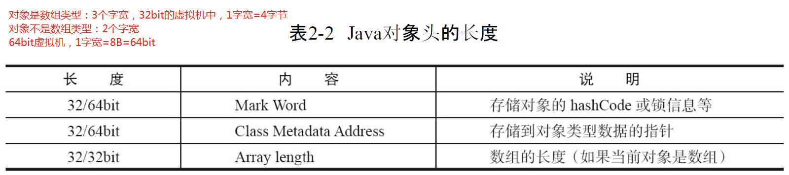
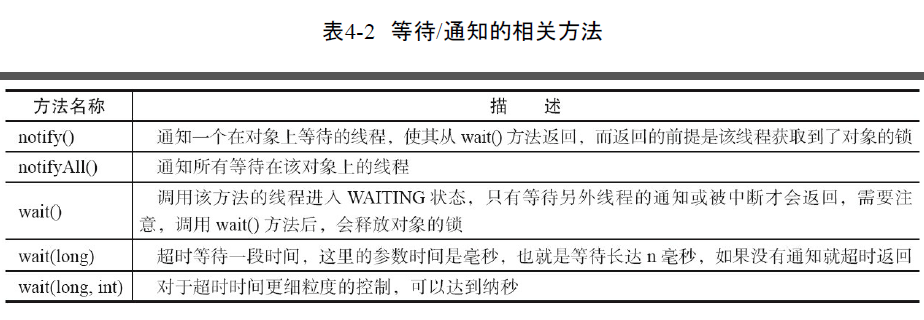
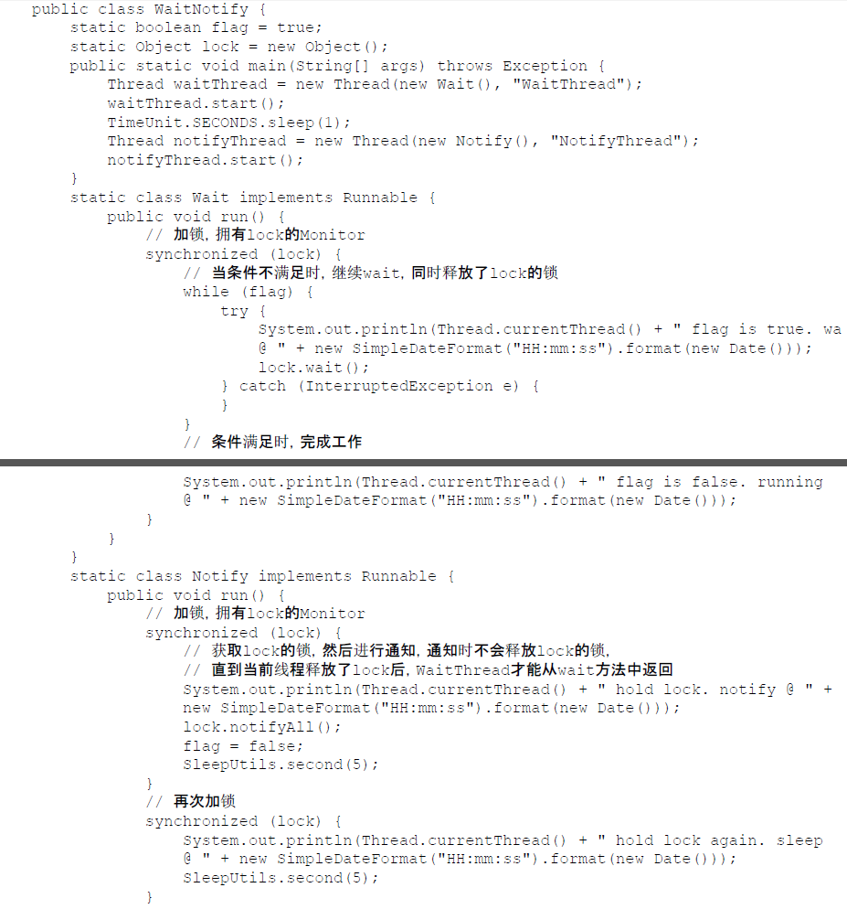
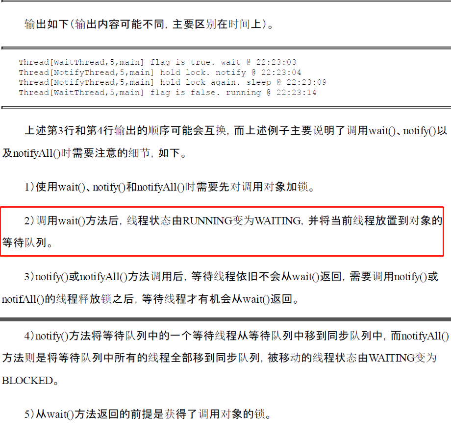
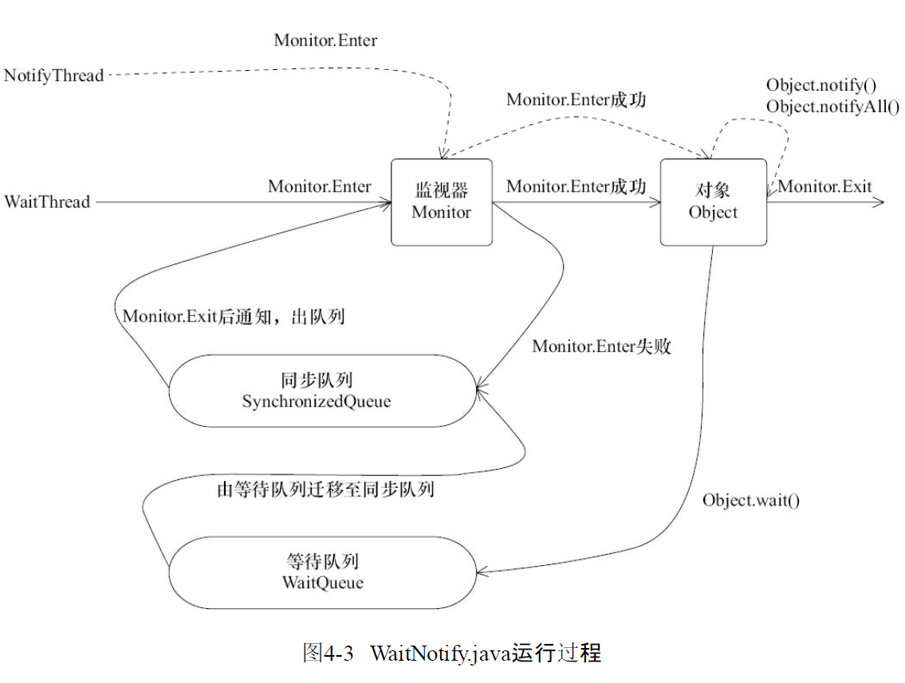

# lock & synchronized


## 区别
>1，用法：1）synchronized：类，方法，代码块。lock：需要显示指定起始位置和终止位置，一般使用ReentrantLock类做为锁
>2，性能：synchronized是托管给JVM执行的，而lock是java写的控制锁的代码。Lock用的是乐观锁方式，乐观锁实现的机制就是CAS操作，其中比较重要的获得锁的一个方法是compareAndSetState。这里其实就是调用的CPU提供的特殊指令。synchronized原始采用的是CPU悲观锁机制，即线程获得的是独占锁


>1，**Synchronized经过编译，会在同步块的前后分别形成monitorenter和monitorexit这个两个字节码指令**。
>2，在执行monitorenter指令时，首先要尝试获取对象锁。如果这个对象没被锁定，或者当前线程已经拥有了那个对象锁，把锁的计算器加1，相应的，在执行monitorexit指令时会将锁计算器就减1，当计算器为0时，锁就被释放了。如果获取对象锁失败，那当前线程就要阻塞，直到对象锁被另一个线程释放为止。

>3，**对于同步块的实现使用了monitorenter和monitorexit指令，而同步方法则是依靠方法修饰符上的ACC_SYNCHRONIZED来完成的**。无论采用哪种方式，其本质是对一个对象的监视器（monitor）进行获取，而这个获取过程是排他的，也就是同一时刻只能有一个线程获取到由synchronized所保护对象的监视器。
>4，**任意一个对象都拥有自己的监视器**，当这个对象由同步块或者这个对象的同步方法调用时，执行方法的线程必须先获取到该对象的监视器才能进入同步块或者同步方法，而没有获取到监视器（执行该方法）的线程将会被阻塞在同步块和同步方法的入口处，进入BLOCKED状态

 

## synchronized 用的锁是对象头里的：悲观锁
>1，普通方法，锁是当前实例对象
>2，静态方法，锁是当前类的Class对象
>3，同步方法块，锁是synchronized(xx) 这个xx对象


>修饰方法的时候在 flag 上标记 ACCSYNCHRONIZED，在运行时常量池中通过 ACCSYNCHRONIZED 标志来区分，这样 JVM 就知道这个方法是被 synchronized 标记的，于是在进入方法的时候就会进行执行争锁的操作，一样只有拿到锁才能继续执行
>Synchronized 修饰代码块时，此时编译得到的字节码会有 monitorenter 和 monitorexit 指令
* [synchronized jvm源码讲解](https://xie.infoq.cn/article/d9479ba8900bd7645c035d006?utm_source=home_write_related&utm_medium=article)





## 锁
>1，偏向锁：经研究发现，锁竞争更多的同线程中，使用偏向锁，这样同线程中就不需要CAS进行加锁解锁
>2，轻量级锁：
>3，重量级锁


## 等待/通知机制


### 等待范式
``` 
synchronized(对象) {
    while(条件不满足) {
        对象.wait();
    }
    对应的处理逻辑
}
```
### 通知范式
```
synchronized(对象) {
    改变条件
    对象.notifyAll();//notify
}
```






### 源码

>InterpreterRuntime:: monitorenter方法
```
IRT_ENTRY_NO_ASYNC(void, InterpreterRuntime::monitorenter(JavaThread* thread, BasicObjectLock* elem))
#ifdef ASSERT
  thread->last_frame().interpreter_frame_verify_monitor(elem);
#endif
  if (PrintBiasedLockingStatistics) {
    Atomic::inc(BiasedLocking::slow_path_entry_count_addr());
  }
  Handle h_obj(thread, elem->obj());
  assert(Universe::heap()->is_in_reserved_or_null(h_obj()),
         "must be NULL or an object");
  if (UseBiasedLocking) {
    // Retry fast entry if bias is revoked to avoid unnecessary inflation
    ObjectSynchronizer::fast_enter(h_obj, elem->lock(), true, CHECK);
  } else {
    ObjectSynchronizer::slow_enter(h_obj, elem->lock(), CHECK);
  }
  assert(Universe::heap()->is_in_reserved_or_null(elem->obj()),
         "must be NULL or an object");
#ifdef ASSERT
  thread->last_frame().interpreter_frame_verify_monitor(elem);
#endif
IRT_END

void ObjectSynchronizer::fast_enter(Handle obj, BasicLock* lock, bool attempt_rebias, TRAPS) {
 if (UseBiasedLocking) {
    if (!SafepointSynchronize::is_at_safepoint()) {
      BiasedLocking::Condition cond = BiasedLocking::revoke_and_rebias(obj, attempt_rebias, THREAD);
      if (cond == BiasedLocking::BIAS_REVOKED_AND_REBIASED) {
        return;
      }
    } else {
      assert(!attempt_rebias, "can not rebias toward VM thread");
      BiasedLocking::revoke_at_safepoint(obj);
    }
    assert(!obj->mark()->has_bias_pattern(), "biases should be revoked by now");
 }

 slow_enter (obj, lock, THREAD) ;
}

void ObjectSynchronizer::slow_enter(Handle obj, BasicLock* lock, TRAPS) {
  markOop mark = obj->mark();
  assert(!mark->has_bias_pattern(), "should not see bias pattern here");

  if (mark->is_neutral()) {
    // Anticipate successful CAS -- the ST of the displaced mark must
    // be visible <= the ST performed by the CAS.
    lock->set_displaced_header(mark);
    if (mark == (markOop) Atomic::cmpxchg_ptr(lock, obj()->mark_addr(), mark)) {
      TEVENT (slow_enter: release stacklock) ;
      return ;
    }
    // Fall through to inflate() ...
  } else
  if (mark->has_locker() && THREAD->is_lock_owned((address)mark->locker())) {
    assert(lock != mark->locker(), "must not re-lock the same lock");
    assert(lock != (BasicLock*)obj->mark(), "don't relock with same BasicLock");
    lock->set_displaced_header(NULL);
    return;
  }

#if 0
  // The following optimization isn't particularly useful.
  if (mark->has_monitor() && mark->monitor()->is_entered(THREAD)) {
    lock->set_displaced_header (NULL) ;
    return ;
  }
#endif

  // The object header will never be displaced to this lock,
  // so it does not matter what the value is, except that it
  // must be non-zero to avoid looking like a re-entrant lock,
  // and must not look locked either.
  lock->set_displaced_header(markOopDesc::unused_mark());
  ObjectSynchronizer::inflate(THREAD, obj())->enter(THREAD);//nflate方法：膨胀为重量级锁
}

```

>无锁 - 偏向锁 - 轻量级锁 （自旋锁，自适应自旋）- 重量级锁