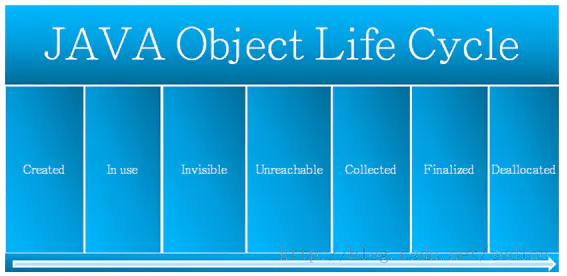
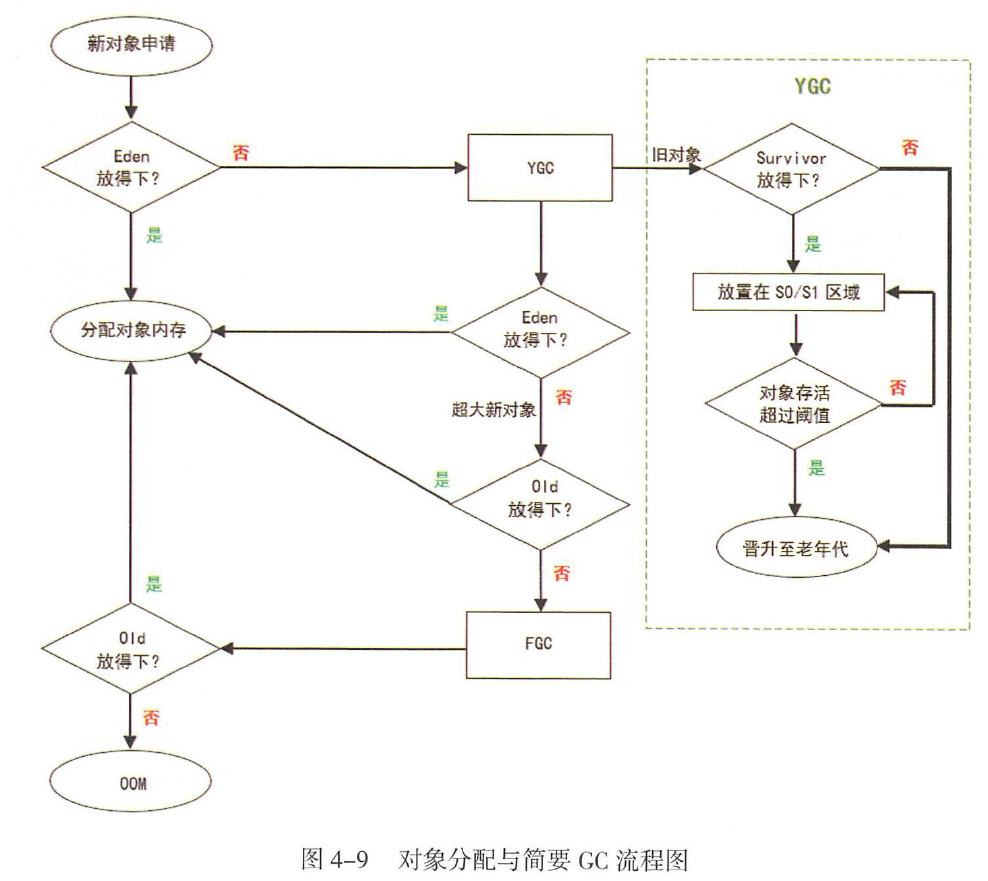
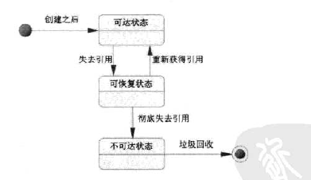
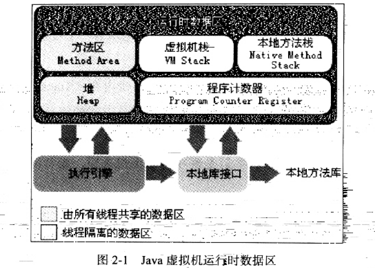
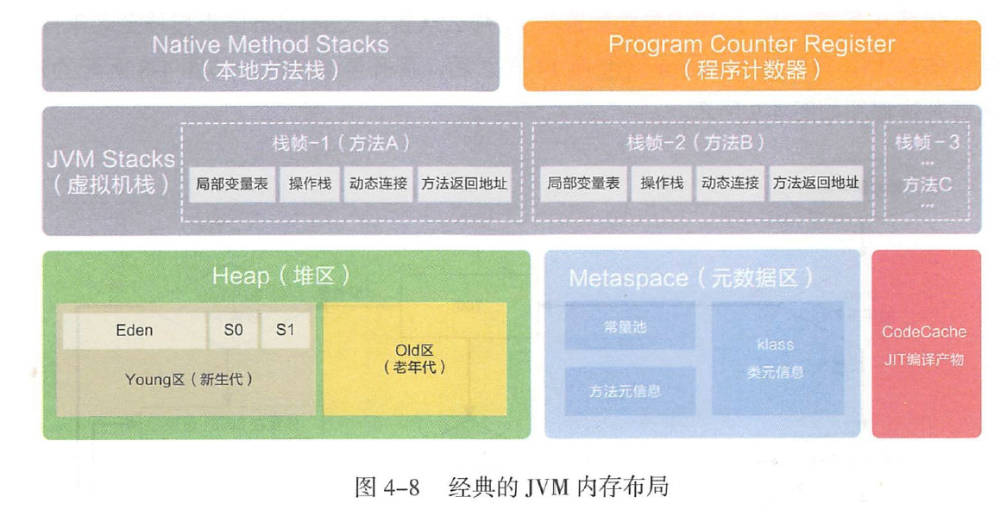

# 内存分配和GC回收

## 对象分配与简要GC流程
**对象主要在新生代的Eden区上分配，如果启用了本地线程分配缓冲，将按线程优先在TLAB上分配，少数情况会在老年代上分配，分配规则不是固定的，取决于当前使用哪一种垃圾收集器组合，以及虚拟机和内存的相关参数**
>1，对象生命周期：created->In use->Invisible->Unreachable->Collected->Finalized->Deallocated

>2，创建过程：
>2.1，为对象分配存储空间        
>2.2，开始构造对象           
>2.3，从超类到子类对static成员进行初始化        
>2.4，超类成员变量按顺序初始化，递归条用超类的构造方法      
>2.5，子类成员变量按顺序初始化，子类构造方法调用     

>3，垃圾回收时会依据两个原则来判断对象的可达性：
>3.1，单一路径中，以最弱的引用为准
>3，2，多路径中，以最强的引用为准

>1，如果Survivor区无法放下，或者超大对象的阈值超过上限，则尝试在老年代中进行分配        
>2，**如果老年代也无法放下，则会触发Full Garbage Collection ，即FGC**       
>3，如果依然无法放下，则抛出OOM     
>4，堆内存出现OOM 的概率是所有内存耗尽异常中最高的    
>5，出错时的堆内信息对解决问题非常有帮助，所以给JVM设置运行参数－XX:+HeapDumpOnOutOfMemoryError，让JVM遇到OOM异常时能输出堆内信息，特别是对相隔数月才出现的OOM 异常尤为重要      
>6，**在不同的JVM实现及不同的回收机制中，堆内存的划分方式是不一样的**

### 判断对象是否可回收
>1，引用计数算法
>2，可达性分析算法：1，对执行时间敏感，这项工作必须在能确保 **一致性的快照**中进行，不可以出现分析过程中对象引用关系还在不断变化的情况，不然无法保证分析结果的准确性，即GC进行时，必须停顿所有java执行线程（stop the world），即使号称不会发生停顿的CMS收集器中，枚举根节点也必须要停顿

### JVM运行时数据区
>1，方法区：线程共享，存储jvm加载的类信息，常亮，静态变量，即时编译后的代码等数据，JVM堆的一个逻辑部分
>2，jvm栈：线程私有，存储局部变量表，操作数栈，动态链接，方法出口等信息
>3，本地方法栈：native方法服务
>4，jvm堆：新生代+老生代
>5，程序计数器：当前线程执行的字节码的行号指示器，线程私有
>6，StackOverflowErr：递归深度大于jvm允许的最大值
>7，OOM：堆内存分配不足
>8，运行时常量池：方法区的一部分，存放各种字面量和符号引用
>9，直接内存

### JVM 内存布局（程序计数器，本地方法栈，虚拟机栈，java堆，元数据区（方法区，运行时常量池））
>直接内存：不是jvm规范中的内存区域，在jdk1.4中更新接入了NIO（New Input/Output），引入了基于通道和缓冲区的I/O方式，可以通过Native函数库有直接分配堆外内存，用过一个存储在java堆中的DirectByteBuffer对象引用操作，在某些场景下能显著提高性能

>1，**Heap是OOM故障最主要的发源地**，它存储着几乎所有的实例对象，堆由垃圾收集器自动回收，堆区由各子线程共享使用   
>2，在通常情况下，服务器在运行过程中，堆空间不断地扩容与回缩，势必形成不必要的系统压力，所以在线上生产环境中，JVM的Xms和Xmx设置成1样大小，避免在GC后调整堆大小时带来的额外压力  
>3，**新生代＝1个Eden区＋2个Survivor区 （据统计，Eden：Survivor=8：1）**
>4，**绝大部分对象在Eden区生成**
>5，当 **Eden区装填满**的时候，会触发YoungGarbage Collection，即YGC，**垃圾回收的时候，在Eden区实现清除策略**，**没有被引用的对象则直接回收，依然存活的对象会被移送到Survivor区**
>6，JVM中的虚拟机栈是描述Java方法执行的内存区域，它是 **线程私有的**，栈中的元素用于支持虚拟机进行方法调用，每个方法从开始调用到执行完成的过程，就是栈帧从入栈到出栈的过程        

