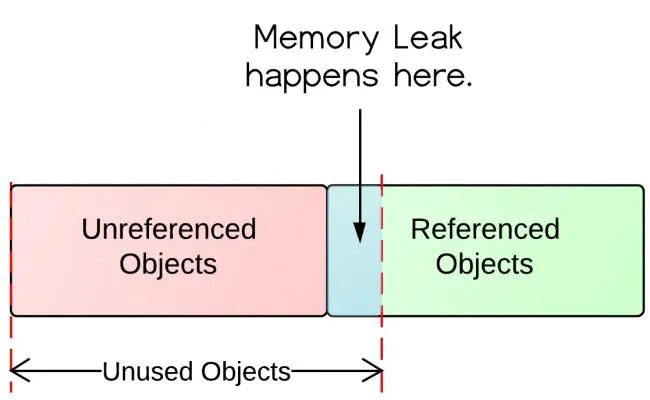

# 内存泄漏

## 内存泄漏的概念
>内存泄漏：对象已经没有被应用程序使用，但是垃圾回收器没办法移除它们，因为还在被引用着

## Java内存泄漏引起的原因
>1，内存泄漏是指无用对象（不再使用的对象）持续占有内存或无用对象的内存得不到及时释放，从而造成内存空间的浪费称为内存泄漏。内存泄露有时不严重且不易察觉，这样开发者就不知道存在内存泄露，但有时也会很严重，会提示你Out of memory。

>2，Java内存泄漏的根本原因是什么呢？长生命周期的对象持有短生命周期对象的引用就很可能发生内存泄漏，尽管短生命周期对象已经不再需要，但是因为长生命周期持有它的引用而导致不能被回收，这就是Java中内存泄漏的发生场景。

### 堆与栈
>1，局部变量的基本数据类型和引用存储于栈中，引用的对象实体存储于堆中。—— 因为它们属于方法中的变量，生命周期随方法而结束。
>2，成员变量全部存储于堆中（包括基本数据类型，引用和引用的对象实体）—— 因为它们属于类，类对象终究是要被new出来使用的

### 如何防止内存泄漏的发生

>1，如果程序允许，尽早将不用的引用对象赋为null

## 工具
>1，ptimizeit Profiler、JProbe Profiler、JinSight、Purify