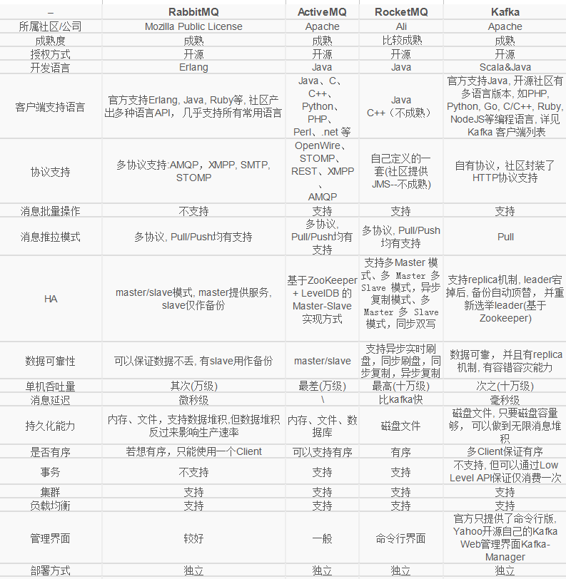
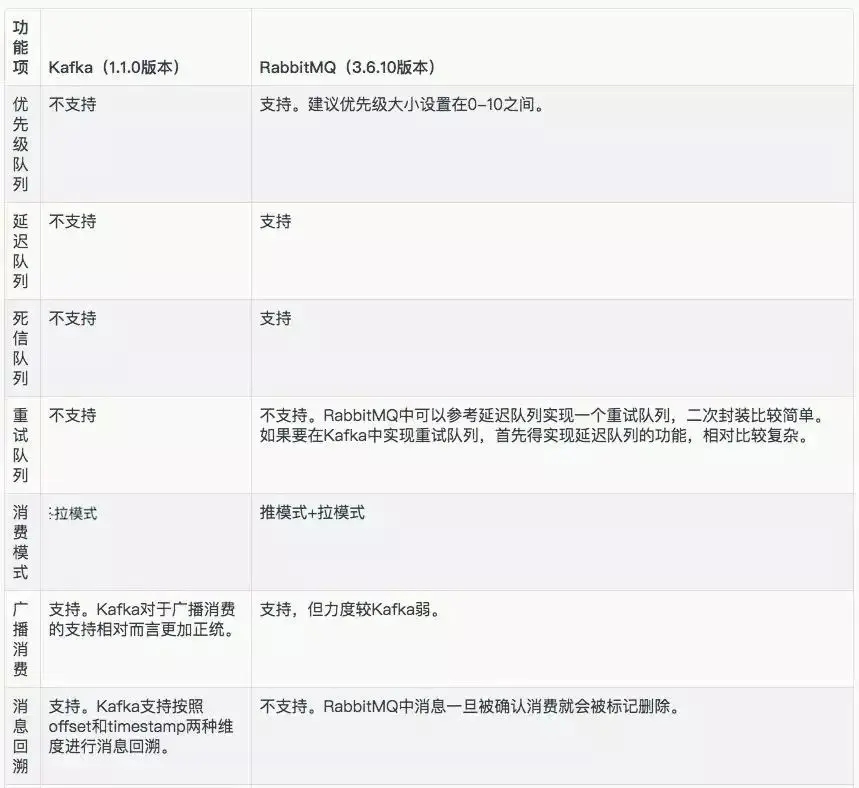
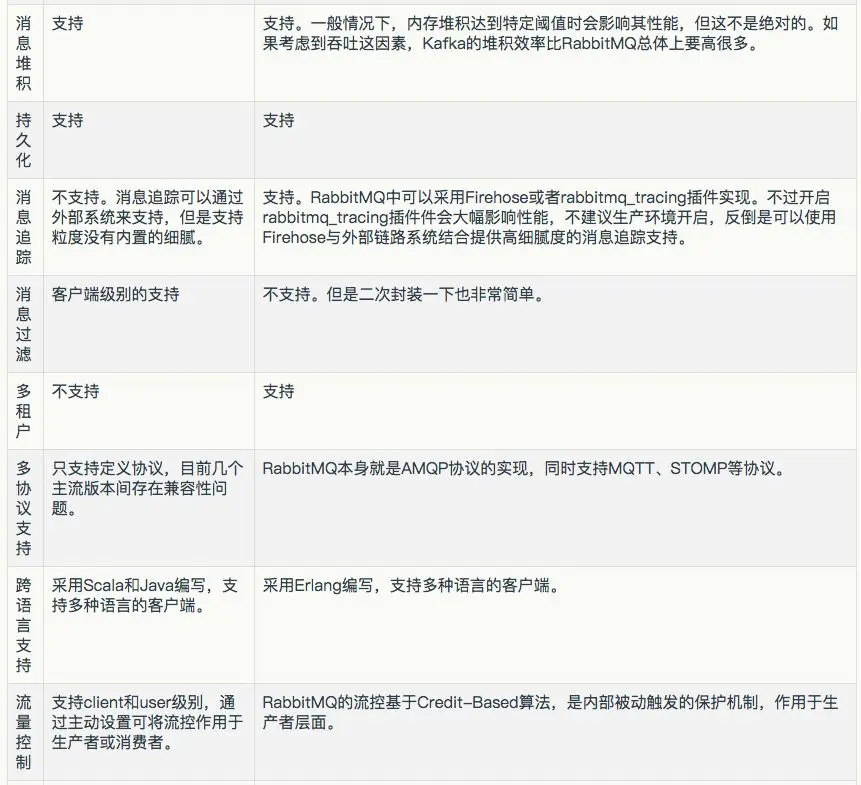

# 消息队列-中间件

* [消息中间件对比](https://juejin.cn/post/6844903626171760653)

## 常用消息中间件对比

## kafka VS rabbitMQ
>重要的是，比较的维度，其实就是思考的方向。
>就好比CAP理论，初看，好像只是知道，等真正理解的时候，就可以指导在具体实践中，怎么判断业务了

## kafka 几个重要概念
>1，Broker：Kafka集群包含一个或多个服务器，这种服务器被称为broker
>2，Topic：每条发布到Kafka集群的消息都有一个类别，这个类别被称为Topic。
>3，Partition：Parition是物理上的概念，每个Topic包含一个或多个Partition.
>4，Producer：负责发布消息到Kafka broker
>5，Consumer：消息消费者，向Kafka broker读取消息的客户端。
>6，Consumer Group：每个Consumer属于一个特定的Consumer Group（可为每个Consumer指定group name，若不指定group name则属于默认的group）。

### 优点：
>1，客户端语言丰富，支持java、.net、php、ruby、python、go等多种语言；
>2，性能卓越，单机写入TPS约在百万条/秒，消息大小10个字节；
>3，提供完全分布式架构, 并有replica机制, 拥有较高的可用性和可靠性, 理论上支持消息无限堆积；
>4，支持批量操作；
>5，消费者采用Pull方式获取消息, 消息有序, 通过控制能够保证所有消息被消费且仅被消费一次;
>6，有优秀的第三方Kafka Web管理界面Kafka-Manager；
>7，在日志领域比较成熟，被多家公司和多个开源项目使用；

### 缺点：
>1，Kafka单机超过64个队列/分区，Load会发生明显的飙高现象，队列越多，load越高，发送消息响应时间变长
>2，使用短轮询方式，实时性取决于轮询间隔时间；
>3，消费失败不支持重试；
>4，支持消息顺序，但是一台代理宕机后，就会产生消息乱序；
>5，社区更新较慢；

## 选型维度

* [消息中间件选型](https://cloud.tencent.com/developer/article/1198320)

### 功能维度
>1，优先级队列
>2，延迟队列
>3，死信队列
>4，重试队列

