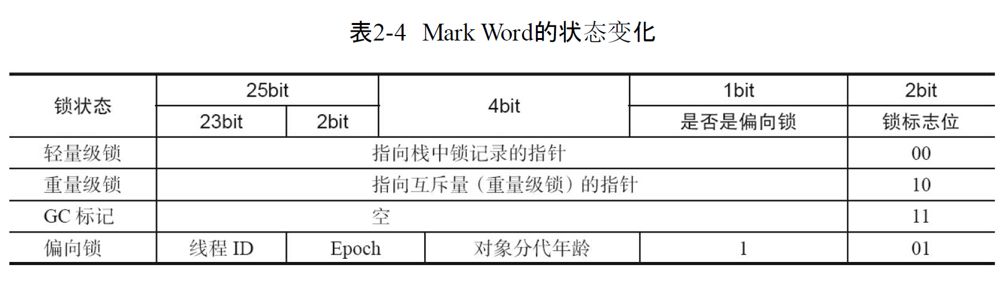
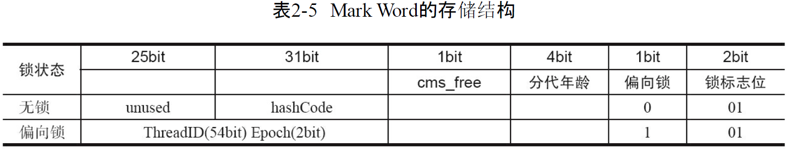

# object o=new object()占多少字节

## 对象头
>对象头又分为MarkWord和Class Pointer两部分。

### MarkWord
>包含一系列的标记位，比如轻量级锁的标记位，偏向锁标记位,gc记录信息，hashcode等等，在32位系统占4字节，在64位系统中占8字节。

### ClassPointer
>用来指向对象对应的Class对象（其对应的元数据对象）的内存地址。在32位系统占4字节，在64位系统中占8字节。

### Length:只在数组对象中存在，用来记录数组的长度，占用4字节

### Interface data
Interface data:对象实际数据，对象实际数据包括了对象的所有成员变量，其大小由各个成员变量的大小决定。(这里不包括静态成员变量，因为其是在方法区维护的)

### Padding
>Padding:Java对象占用空间是8字节对齐的，即所有Java对象占用bytes数必须是8的倍数,是因为当我们从磁盘中取一个数据时，不会说我想取一个字节就是一个字节，都是按照一块儿一块儿来取的，这一块大小是8个字节，所以为了完整，padding的作用就是补充字节，保证对象是8字节的整数倍。

### Object o = new Object()到底占用多少个字节？
>1，在开启指针压缩的情况下，markword占用8字节，classpoint占用4字节，Interface data无数据，总共是12字节，由于对象需要为8的整数倍，Padding会补充4个字节，总共占用16字节的存储空间。

>2，在没有指针的情况下，markword占用8字节，classpoint占用8字节，Interface data无数据，总共是16字节。

