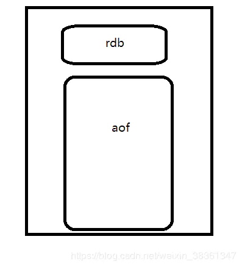
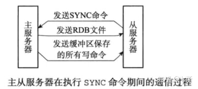
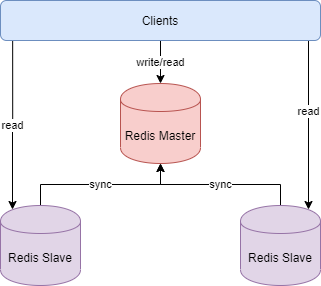
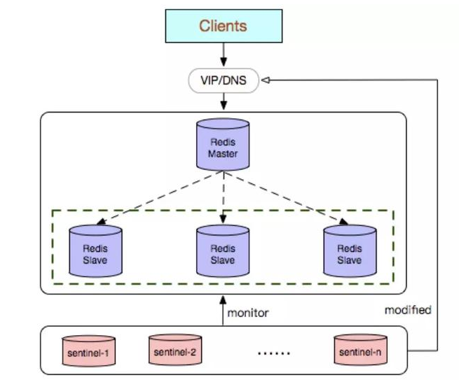
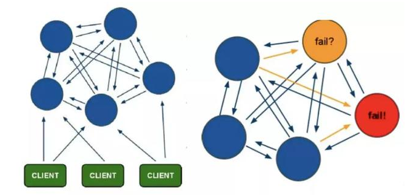
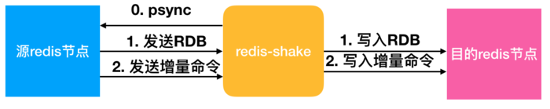

# redis

* [redis 阿里建议使用规范](https://www.infoq.cn/article/K7dB5AFKI9mr5Ugbs_px)
* [redis数据结构描述-不错](https://i6448038.github.io/2019/12/01/redis-data-struct/)

## Redis的内存淘汰策略：六种

>Redis的内存淘汰策略是指在Redis的用于缓存的内存不足时，怎么处理需要新写入且需要申请额外空间的数据。

>1，noeviction：当内存不足以容纳新写入数据时，新写入操作会报错。
>2，allkeys-lru：当内存不足以容纳新写入数据时，在键空间中，移除最近最少使用的key。
>3，allkeys-random：当内存不足以容纳新写入数据时，在键空间中，随机移除某个key。
>4，volatile-lru：当内存不足以容纳新写入数据时，在设置了过期时间的键空间中，移除最近最少使用的key。
>5，volatile-random：当内存不足以容纳新写入数据时，在设置了过期时间的键空间中，随机移除某个key。
>6，volatile-ttl：当内存不足以容纳新写入数据时，在设置了过期时间的键空间中，有更早过期时间的key优先移除。


## Redis的过期策略：三种

>1，定时过期：每个设置过期时间的key都需要创建一个定时器，到过期时间就会立即清除。该策略可以立即清除过期的数据，对内存很友好；但是会占用大量的CPU资源去处理过期的数据，从而影响缓存的响应时间和吞吐量。
>2，惰性过期：只有当访问一个key时，才会判断该key是否已过期，过期则清除。该策略可以最大化地节省CPU资源，却对内存非常不友好。极端情况可能出现大量的过期key没有再次被访问，从而不会被清除，占用大量内存。
>3，定期过期：每隔一定的时间，会扫描一定数量的数据库的expires字典中一定数量的key，并清除其中已过期的key。该策略是前两者的一个折中方案。通过调整定时扫描的时间间隔和每次扫描的限定耗时，可以在不同情况下使得CPU和内存资源达到最优的平衡效果。
(expires字典会保存所有设置了过期时间的key的过期时间数据，其中，key是指向键空间中的某个键的指针，value是该键的毫秒精度的UNIX时间戳表示的过期时间。键空间是指该Redis集群中保存的所有键。)

## 持久化
>持久化存储，指的是将内存的缓存永久存在磁盘中。也就是说我们的AOF和RDB持久化存储方式

### RDB持久化：Redis DataBase，快照方式
>1，持久化key之前，会检查是否过期，过期的key不进入RDB文件。
>2，数据载入数据库之前，会对key先进行过期检查，如果过期，不导入数据库
>3，将某一个时刻的内存快照（Snapshot），以二进制的方式写入磁盘的过程
>4，一种是手动触发，一种是自动触发

### AOF持久化： Append Only File，文件追加方式

>以独立日志的方式记录每次写命令， 重启时再重新执行AOF文件中的命令达到恢复数据的目的。AOF的主要作用 是解决了数据持久化的实时性，目前已经是Redis持久化的主流方式
>AOF的工作流程操作：命令写入 （append）、文件同步（sync）、文件重写（rewrite）、重启加载 （load）

>1，当key过期后，还没有被删除，此时进行执行持久化操作（该key是不会进入aof文件的，因为没有发生修改命令）。

>2，当key过期后，在发生删除操作时，程序会向aof文件追加一条del命令（在将来的以aof文件恢复数据的时候该过期的键就会被删掉）。

>3，因为AOF方式，向存储文件追加的是Redis的操作命令，而不是具体的数据，然而RDB确是存储的安全的二进制内容。
重写时，会先判断key是否过期，已过期的key不会重写到aof文件。

>4，即使在重写时，不验证是否过期，然而追加了del命令，测试无效的key同样会被删除。判断的情况是为了防止没有加入del命令的key

持久化配置 | 优缺点 
---------|----------
 always | 每条 Redis 操作命令都会写入磁盘，最多丢失一条数据，但会使得Redis的性能降低，但数据几乎是全的，基本不会存在丢失数据问题。 
 everysec | 每秒钟写入一次磁盘，最多丢失一秒的数据，对存取数据和性能折中，可以满足大部分使用场景。 
 no | 不设置写入磁盘的规则，根据当前操作系统来决定何时写入磁盘，一般不采用这种设置。 


>手动触发
>AOF 重写流程：AOF 是存放每条写命令的，所以会不断变大，达到一定的时候，AOF做rewrite操作，会重新生成一个新的AOF文件


### 混合持久化方式

>Redis 4.0 之后新增的方式，混合持久化是结合了 RDB 和 AOF 的优点，在写入的时候，先把当前的数据以 RDB 的形式写入文件的开头，再将后续的操作命令以 AOF 的格式存入文件，这样既能保证 Redis 重启时的速度，又能减低数据丢失的风险。
>AOF 重写时会把 Redis 的持久化数据，以 RDB 的格式写入到 AOF 文件的开头，之后的数据再以 AOF 的格式化追加的文件的末尾，如下图所示。



持久化方式 | 优点 | 缺点
---------|----------|---------
 RDB | RDB是一个紧凑压缩的二进制文件，代表Redis在某个时间点上的数据 快照。非常适用于备份，全量复制等场景。与 AOF 格式的文件相比，RDB 文件可以更快的重启。RDB 对灾难恢复非常有用，它是一个紧凑的文件，可以更快的传输到远程服务器进行 Redis 服务恢复 |RDB方式数据没办法做到实时持久化/秒级持久化，RDB只能保存某个时间间隔的数据，如果在这个期间Redis故障了，就会丢失一段时间的数据。RDB方式数据没办法做到实时持久化/秒级持久化。因为bgsave每次运 行都要执行fork操作创建子进程，属于重量级操作，频繁执行成本过高。
 AOF | 意外情况下，丢失数据不多,具有一定实时性 | 对于相同的数据集来说，AOF 文件要大于 RDB 文件，从理论上说，RDB 比 AOF 更健壮
 混合 | 混合持久化结合了 RDB 和 AOF 持久化的优点，开头为 RDB 的格式，使得 Redis 可以更快的启动，同时结合 AOF 的优点，有减低了大量数据丢失的风险 | AOF 文件中添加了 RDB 格式的内容，会使得 AOF 文件的可读性会很差，不容易阅读； 如果开启混合持久化，就必须使用Redis 4.0 以及之后版本


## Redis为什么采用跳表而不是红黑树
>1，在做范围查找的时候，平衡树比skiplist操作要复杂。

### 跳表结构  vs 红黑树结构

## 有的key在删除时，可能导致内存没有及时释放
>当键被删除时，Redis并不总是释放(返回)内存到操作系统

### Hash 删除: hscan + hdel
```
public void delBigHash(String host, int port, String password, String bigHashKey) {
    Jedis jedis = new Jedis(host, port);
    if (password != null && !"".equals(password)) {
        jedis.auth(password);
    }
    ScanParams scanParams = new ScanParams().count(100);
    String cursor = "0";
    do {
        ScanResult<Entry<String, String>> scanResult = jedis.hscan(bigHashKey, cursor, scanParams);
        List<Entry<String, String>> entryList = scanResult.getResult();
        if (entryList != null && !entryList.isEmpty()) {
            for (Entry<String, String> entry : entryList) {
                jedis.hdel(bigHashKey, entry.getKey());
            }
        }
        cursor = scanResult.getStringCursor();
    } while (!"0".equals(cursor));
    
    //删除bigkey
    jedis.del(bigHashKey);
}

```

### List 删除: ltrim
```
public void delBigList(String host, int port, String password, String bigListKey) {
    Jedis jedis = new Jedis(host, port);
    if (password != null && !"".equals(password)) {
        jedis.auth(password);
    }
    long llen = jedis.llen(bigListKey);
    int counter = 0;
    int left = 100;
    while (counter < llen) {
        //每次从左侧截掉100个
        jedis.ltrim(bigListKey, left, llen);
        counter += left;
    }
    //最终删除key
    jedis.del(bigListKey);
}

```


### Set 删除: sscan + srem
```
public void delBigSet(String host, int port, String password, String bigSetKey) {
    Jedis jedis = new Jedis(host, port);
    if (password != null && !"".equals(password)) {
        jedis.auth(password);
    }
    ScanParams scanParams = new ScanParams().count(100);
    String cursor = "0";
    do {
        ScanResult<String> scanResult = jedis.sscan(bigSetKey, cursor, scanParams);
        List<String> memberList = scanResult.getResult();
        if (memberList != null && !memberList.isEmpty()) {
            for (String member : memberList) {
                jedis.srem(bigSetKey, member);
            }
        }
        cursor = scanResult.getStringCursor();
    } while (!"0".equals(cursor));
    
    //删除bigkey
    jedis.del(bigSetKey);
}

```

### SortedSet 删除: zscan + zrem
```
public void delBigZset(String host, int port, String password, String bigZsetKey) {
    Jedis jedis = new Jedis(host, port);
    if (password != null && !"".equals(password)) {
        jedis.auth(password);
    }
    ScanParams scanParams = new ScanParams().count(100);
    String cursor = "0";
    do {
        ScanResult<Tuple> scanResult = jedis.zscan(bigZsetKey, cursor, scanParams);
        List<Tuple> tupleList = scanResult.getResult();
        if (tupleList != null && !tupleList.isEmpty()) {
            for (Tuple tuple : tupleList) {
                jedis.zrem(bigZsetKey, tuple.getElement());
            }
        }
        cursor = scanResult.getStringCursor();
    } while (!"0".equals(cursor));
    
    //删除bigkey
    jedis.del(bigZsetKey);
}

```

## 主从同步

>主从同步分为 2 个步骤：同步和命令传播
>1，同步：将从服务器的数据库状态更新成主服务器当前的数据库状态。同步RDB
>2，命令传播：当主服务器数据库状态被修改后，导致主从服务器数据库状态不一致，此时需要让主从数据同步到一致的过程。同步aof操作



## 集群机制

### 主从模式:读写分离



>主从模式难以在线扩容的缺点，Redis的容量受限于单机配置，是因为master 一个单机负责读写，slave负责读

### sentinel哨兵机制

>哨兵模式解决了主从复制不能自动故障转移，达不到高可用的问题，但还是存在难以在线扩容，Redis容量受限于单机配置的问题



### 选举
>1，sentinel之间选举出头领sentinel
>2，由刚下线的master下的slave，挑选一个slave为master

#### sentinel选举成头领sentinel：拉票机制
>1，所有监控客观下线Master的Sentinel都有可能成为领头Sentinel。
>2，每次进行领头Sentinel选举之后，不论是否选举成功，所有Sentinel的配置纪元（configuration epoch）的值都会自动增加一次。
>3，在一个配置纪元里面，所有Sentinel都有一次将某个Sentinel设置为局部领头Sentinel的机会，并且局部领头Sentinel一旦设置，在这个配置纪元里面将不能再更改。
>4，监视Master客观下线的所有在线Sentinel都有要求其它Sentinel将自己设置为局部领头Sentinel的机会。
>5，当一个Sentinel（源Sentinel）向另一个Sentinel（目标Sentinel）发送SENTINEL is-master-down-by-addr命令，并且命令中的runid参数不是“.”符号而是当前Sentinel的运行ID时，这表示当前Sentinel要求目标Sentinel将自己设置为领头Sentinel。
>6，**Sentinel设置局部领头Sentinel的规则是先到先得。即最先向目标Sentinel发送设置要求的Sentinel将会成为局部领头Sentinel，之后接受到的请求都会被拒绝。**
>7，目标Sentinel接收到SENTINEL is-master-down-by-addr命令后，将向源Sentinel返回一条命令回复，回复中的leader_runid参数和leader_epoch参数分别记录了目标Sentinel的局部领头Sentinel的运行ID和配置纪元。
>8，源Sentinel在接收到目标Sentinel返回的命令回复之后，会检查回复中leader_epoch参数的值和自己的配置纪元是否相同，如果相同的话，那么源Sentinel继续取出回复中的leader_runid参数，如果leader_runid参数的值和源Sentinel的运行ID一直，那么表示目标Sentinel将源Sentinel设置成了局部领头Sentinel。
>9，如果有某个Sentinel被半数以上的Sentinel设置成了局部领头Sentinel，那么这个Sentinel称为领头Sentinel。
>10，领头Sentinel的产生需要半数以上的Sentinel支持，并且每个Sentinel在每个配置纪元里面只能设置一次局部Sentinel，所以在一个配置纪元里面，只会出现一个领头Sentinel。
>11，如果在给定时限内，没有一个Sentinel被选举为领头Sentinel，那么各个Sentinel将在一段时间之后再次进行选举，知道选出领头Sentinel为止。

#### 故障转移

>1，在已下线的Master主机下面挑选一个Slave将其转换为主服务器。
>2，让其余所有Slave服务器复制新的Master服务器。
>3，让已下线的Master服务器变成新的Master服务器的Slave。当已下线的服务器在此上线后将复新的Master的数据。

#### slave选举成master
>领头Sentinel会在所有Slave中选出新的Master，发送SLAVEOF no one命令，将这个服务器确定为主服务器。
>领头Sentinel会将已下线Master的所有从服务器报错在一个列表中，按照规则进行挑选。

>1，删除列表中所有处于下线或者短线状态的Slave。
>2，删除列表中所有最近5s内没有回复过领头Sentinel的INFO命令的Slave。
>3，删除所有与下线Master连接断开超过down-after-milliseconds * 10毫秒的Slave。
>4，领头Sentinel将根据Slave优先级，对列表中剩余的Slave进行排序，并选出其中优先级最高的Slave。如果有多个具有相同优先级的Slave，那么领头Sentinel将按照Slave复制偏移量，选出其中偏移量最大的Slave。如果有多个优先级最高，偏移量最大的Slave，那么根据运行ID最小原则选出新的Master。

>确定新的Master之后，领头Sentinel会以每秒一次的频率向新的Master发送SLAVEOF no one命令，当得到确切的回复role由slave变为master之后，当前服务器顺利升级为Master服务器。

### cluster模式

>Cluster模式实现了Redis的分布式存储，即每台节点存储不同的内容，来解决在线扩容的问题
>能够实现自动故障转移，节点之间通过gossip协议交换状态信息，用投票机制完成slave到master的角色转换
>无中心架构，数据按照slot分布在多个节点
>集群中的每个节点都是平等的关系，每个节点都保存各自的数据和整个集群的状态。每个节点都和其他所有节点连接，而且这些连接保持活跃，这样就保证了我们只需要连接集群中的任意一个节点，就可以获取到其他节点的数据


#### Cluster模式的具体工作机制：

>1，在Redis的每个节点上，都有一个插槽（slot），取值范围为0-16383
当我们存取key的时候，Redis会根据CRC16的算法得出一个结果，然后把结果对16384求余数，这样每个key都会对应一个编号在0-16383之间的哈希槽，通过这个值，去找到对应的插槽所对应的节点，然后直接自动跳转到这个对应的节点上进行存取操作
>2，为了保证高可用，Cluster模式也引入主从复制模式，一个主节点对应一个或者多个从节点，当主节点宕机的时候，就会启用从节点
>3，当其它主节点ping一个主节点A时，如果半数以上的主节点与A通信超时，那么认为主节点A宕机了。如果主节点A和它的从节点都宕机了，那么该集群就无法再提供服务了
>4，Cluster模式集群节点最小配置6个节点(3主3从，因为需要半数以上)，其中主节点提供读写操作，**从节点作为备用节点，不提供请求，只作为故障转移使用**



## redis数据结构图

* [redis结构图-不错](https://mp.weixin.qq.com/s/gQnuynv6XPD_aeIBQBeI2Q)

## 跳表skiplist
>跳跃表在 Redis 的唯一作用， 就是实现有序集数据类型

```
typedef struct zskiplist {

    // 头节点，尾节点
    struct zskiplistNode *header, *tail;

    // 节点数量
    unsigned long length;

    // 目前表内节点的最大层数
    int level;

} zskiplist;

typedef struct zskiplistNode {

    // member 对象
    robj *obj;

    // 分值
    double score;

    // 后退指针
    struct zskiplistNode *backward;

    // 层
    struct zskiplistLevel {

        // 前进指针
        struct zskiplistNode *forward;

        // 这个层跨越的节点数量
        unsigned int span;

    } level[];

} zskiplistNode;
```
```
redis> ZADD s 6 x 10 y 15 z
(integer) 3

redis> ZRANGE s 0 -1 WITHSCORES
1) "x"
2) "6"
3) "y"
4) "10"
5) "z"
6) "15"
```


## 迁移

### rdb方案
```
# 链接redis
$ redis-cli -u 127.0.0.1 -p 6379 -a 你的密码 
# 执行持久化
$ 127.0.0.1:6379> bgsave
# 查看文件位置
$ 127.0.0.1:6379> config get dir   //复制 redis数据目录/dump.rdb 到另一台redis的数据目录下，启动即可

aof:再同步增量数据
# 设置appendonly yes
$ 127.0.0.1:6379> config set appendonly yes //redis的数据目录 看到 appendonly.aof 文件

# 目标redis
$ redis-cli -h aliyun_redis_instance_ip -p 6379 -a password --pipe < appendonly.aof
```

### 工具
>redis-dump
>redis-shark




## 运维命令


```

redis-cli -a redis134ok --bigkeys

redis-cli -a redis134ok --stat

redis-cli -a redis134ok --scan --pattern '*my*'  用scan来查找key、并过滤

redis-benchmark-h localhost -p 6379 -c 100 -n 100000　　#100个并发连接，100000个请求，检测host为localhost 端口为6379的redis服务器性能

info

slowlog get
```


## 热点数据缓存击穿的一般处理方式
```
public String get(key) {
    String value = redis.get(key);
    if (value == null) { //代表缓存值过期
        //设置3min的超时，防止del操作失败的时候，下次缓存过期一直不能load db
        if (redis.setnx(key_mutex, 1, 3 * 60) == 1) {  //代表设置成功
            value = db.get(key);
                    redis.set(key, value, expire_secs);
                    redis.del(key_mutex);
            } else {  //这个时候代表同时候的其他线程已经load db并回设到缓存了，这时候重试获取缓存值即可
                    sleep(50);
                    get(key);  //重试
            }
        } else {
            return value;      
        }
}
```


## Redis 和数据库双写一致性问题
>1，一致性问题还可以再分为最终一致性和强一致性。数据库和缓存双写，就必然会存在不一致的问题。前提是如果对数据有强一致性要求，不能放缓存。我们所做的一切，只能保证最终一致性。
>2，另外，我们所做的方案从根本上来说，只能降低不一致发生的概率。因此，有强一致性要求的数据，不能放缓存。首先，采取正确更新策略，先更新数据库，再删缓存。其次，因为可能存在删除缓存失败的问题，提供一个补偿措施即可，例如利用消息队列

## 禁止危险命令   
>1，修改客户端源代码，禁止掉一些危险的命令(shutdown, flushall, monitor, keys *)，当然还是可以通过redis-cli来完成
>2，添加command-rename配置，将一些危险的命令(flushall, monitor, keys * , flushdb)做rename，如果有需要的话，找到redis的运维人员处理
```
rename-command FLUSHALL "随机数"  
rename-command FLUSHDB "随机数"  
rename-command KEYS "随机数"
```


## 子进程内存消耗
>子进程内存消耗主要指执行 AOF 重写 或者进行 RDB 保存时 Redis 创建的子进程内存消耗。Redis 执行 fork 操作产生的子进程内存占用量表现为与父进程相同，理论上需要一倍的物理内存来完成相应的操作。但是 Linux 具有 **写时复制技术 (copy-on-write)，父子进程会共享相同的物理内存页，当父进程处理写请求时会对需要修改的页复制出一份副本完成写操作，而子进程依然读取 fork 时整个父进程的内存快照**。


>如上图所示，fork 时只拷贝 page table，也就是页表。只有等到某一页发生修改时，才真正进行页的复制。
但是 Linux Kernel 在 2.6.38 内存增加了 Transparent Huge Pages (THP) 机制，简单理解，它就是让页大小变大，本来一页为 4KB，开启 THP 机制后，一页大小为 2MB。它虽然可以加快 fork 速度( 要拷贝的页的数量减少 )，但是会导致 copy-on-write 复制内存页的单位从 4KB 增大为 2MB，如果父进程有大量写命令，会加重内存拷贝量，都是修改一个页的内容，但是页单位变大了，从而造成过度内存消耗


* [redis](https://juejin.cn/post/6844903967298682893)