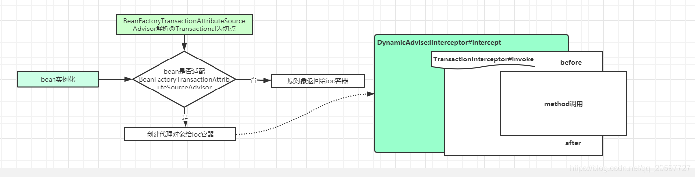

# Springboot @Transactional注解


* [springboot事务详解-不错](https://juejin.cn/post/6844904003218718733#heading-3)

## 使用原则---小心事务没生效

>1，原则一：public方法才能生效，因为spring是默认通过动态代理实现的AOP，private方法无法代理
>2，原则二：必须通过代理过的类从外部调用目标方法才能生效，这个要理解了动态代理，就理解了为什么
>3，原则三：rollbackFor是默认RuntimeException（非受检异常）或error的时候，才回滚，要主动设置，例如rollbackFor=Exception.class，不然受检异常是不会回滚的
>4，原则四：异常要抛出，能传播到事务处理


### 原则二的几种方式
>1，常用的一种，从contoller层调用目标方法
```
XXServiceImpl{
    @Transactional(rollbackFor=Exception.class)
    public void targetFunc1(){
        ...
    }

    
}
1，controller{
    @Autowired
    private XXService xxService;

    public void func(){
        ...
        xxService.targetFunc();
    }
}

```
>2，在serverImpl内Autowired自身，或通过getBean，获取代理增强的对象
```
XXServiceImpl{
    @Transactional(rollbackFor=Exception.class)
    public void targetFunc1(){
        ...
    }
    @Autowired
    private XXService self;
     public void targetFunc2(){
        ...
        self.targetFunc1();//用代理注入的类，还有一种通过getBean的方式获取
    }
}

```
### 原则三的初步代码证明

```
@Target({ElementType.TYPE, ElementType.METHOD})
@Retention(RetentionPolicy.RUNTIME)
@Inherited
@Documented
public @interface Transactional {
...

	/**
	 * Defines zero (0) or more exception {@link Class classes}, which must be
	 * subclasses of {@link Throwable}, indicating which exception types must cause
	 * a transaction rollback.
	 * <p>By default, a transaction will be rolling back on {@link RuntimeException}
	 * and {@link Error} but not on checked exceptions (business exceptions). See
	 * {@link org.springframework.transaction.interceptor.DefaultTransactionAttribute#rollbackOn(Throwable)}
	 * for a detailed explanation.
	 * <p>This is the preferred way to construct a rollback rule (in contrast to
	 * {@link #rollbackForClassName}), matching the exception class and its subclasses.
	 * <p>Similar to {@link org.springframework.transaction.interceptor.RollbackRuleAttribute#RollbackRuleAttribute(Class clazz)}.
	 * @see #rollbackForClassName
	 * @see org.springframework.transaction.interceptor.DefaultTransactionAttribute#rollbackOn(Throwable)
	 */
	Class<? extends Throwable>[] rollbackFor() default {};
...
}
```

### obj instanceof Class
>instanceof：obj 为一个对象，Class 表示一个类或者一个接口，当 obj 为 Class 的对象，或者是其直接或间接子类，或者是其接口的实现类，结果result 都返回 true，否则返回false
```伪代码：
boolean result;
if (obj == null) {
  result = false;
} else {
  try {
      T temp = (T) obj; // checkcast
      result = true;
  } catch (ClassCastException e) {
      result = false;
  }
}
```
* [instanceof 官方算法](https://docs.oracle.com/javase/specs/jvms/se8/html/jvms-6.html#jvms-6.5.instanceof)

## spring @Transactional事务实现基本源码：TransactionInterceptor–最终事务管理者，如果有@Transactional注解的方法都会调用这个地方
```
public class TransactionInterceptor extends TransactionAspectSupport implements MethodInterceptor, Serializable {
...

@Override
	@Nullable
	public Object invoke(MethodInvocation invocation) throws Throwable {
		// Work out the target class: may be {@code null}.
		// The TransactionAttributeSource should be passed the target class
		// as well as the method, which may be from an interface.
		Class<?> targetClass = (invocation.getThis() != null ? AopUtils.getTargetClass(invocation.getThis()) : null);

		// Adapt to TransactionAspectSupport's invokeWithinTransaction...
		return invokeWithinTransaction(invocation.getMethod(), targetClass, new CoroutinesInvocationCallback() {
			@Override
			@Nullable
			public Object proceedWithInvocation() throws Throwable {
                //这里应该就是通过动态代理封装的目标方法
				return invocation.proceed();
			}
			@Override
			public Object getTarget() {
				return invocation.getThis();
			}
			@Override
			public Object[] getArguments() {
				return invocation.getArguments();
			}
		});  //继承了TransactionAspectSupport调用如下TransactionAspectSupport.invokeWithinTransaction
	}
...
}


public abstract class TransactionAspectSupport implements BeanFactoryAware, InitializingBean {
...
	@Nullable
	protected Object invokeWithinTransaction(Method method, @Nullable Class<?> targetClass,
			final InvocationCallback invocation) throws Throwable {
            ...
            //instanceof：obj 为一个对象，Class 表示一个类或者一个接口，当 obj 为 Class 的对象，或者是其直接或间接子类，或者是其接口的实现类，结果result 都返回 true，否则返回false
            	if (txAttr == null || !(ptm instanceof CallbackPreferringPlatformTransactionManager)) {
			// Standard transaction demarcation with getTransaction and commit/rollback calls.
			TransactionInfo txInfo = createTransactionIfNecessary(ptm, txAttr, joinpointIdentification);

			Object retVal;
			try {
				// This is an around advice: Invoke the next interceptor in the chain.
				// This will normally result in a target object being invoked.
                //方法调用，参照TransactionInterceptor.invoke里invokeWithinTransaction的参数CoroutinesInvocationCallback
				retVal = invocation.proceedWithInvocation();
			}
			catch (Throwable ex) {
				// target invocation exception
                //根据事务属性和指定异常，回滚或提交
				completeTransactionAfterThrowing(txInfo, ex);
				throw ex;
			}
			finally {
				cleanupTransactionInfo(txInfo);
			}

			if (retVal != null && vavrPresent && VavrDelegate.isVavrTry(retVal)) {
				// Set rollback-only in case of Vavr failure matching our rollback rules...
				TransactionStatus status = txInfo.getTransactionStatus();
				if (status != null && txAttr != null) {
					retVal = VavrDelegate.evaluateTryFailure(retVal, txAttr, status);
				}
			}

			commitTransactionAfterReturning(txInfo);
			return retVal;
		}

		else {
			Object result;
			final ThrowableHolder throwableHolder = new ThrowableHolder();

			// It's a CallbackPreferringPlatformTransactionManager: pass a TransactionCallback in.
			try {
				result = ((CallbackPreferringPlatformTransactionManager) ptm).execute(txAttr, status -> {
					TransactionInfo txInfo = prepareTransactionInfo(ptm, txAttr, joinpointIdentification, status);
					try {
                        //方法调用，参照TransactionInterceptor.invoke里invokeWithinTransaction的参数CoroutinesInvocationCallback
						Object retVal = invocation.proceedWithInvocation();
						if (retVal != null && vavrPresent && VavrDelegate.isVavrTry(retVal)) {
							// Set rollback-only in case of Vavr failure matching our rollback rules...
							retVal = VavrDelegate.evaluateTryFailure(retVal, txAttr, status);
						}
						return retVal;
					}
					catch (Throwable ex) {
						if (txAttr.rollbackOn(ex)) {
							// A RuntimeException: will lead to a rollback.
							if (ex instanceof RuntimeException) {
								throw (RuntimeException) ex;
							}
							else {
								throw new ThrowableHolderException(ex);
							}
						}
						else {
							// A normal return value: will lead to a commit.
							throwableHolder.throwable = ex;
							return null;
						}
					}
					finally {
						cleanupTransactionInfo(txInfo);
					}
				});//status->{...}，就是后面的TransactionCallback：this.callback.doInTransaction(status) 
			}
			catch (ThrowableHolderException ex) {
				throw ex.getCause();
			}
			catch (TransactionSystemException ex2) {
				if (throwableHolder.throwable != null) {
					logger.error("Application exception overridden by commit exception", throwableHolder.throwable);
					ex2.initApplicationException(throwableHolder.throwable);
				}
				throw ex2;
			}
			catch (Throwable ex2) {
				if (throwableHolder.throwable != null) {
					logger.error("Application exception overridden by commit exception", throwableHolder.throwable);
				}
				throw ex2;
			}

			// Check result state: It might indicate a Throwable to rethrow.
			if (throwableHolder.throwable != null) {
				throw throwableHolder.throwable;
			}
			return result;
		}
           
         ...
    }
...
}
@FunctionalInterface
public interface TransactionCallback<T> {

	/**
	 * Gets called by {@link TransactionTemplate#execute} within a transactional context.
	 * Does not need to care about transactions itself, although it can retrieve and
	 * influence the status of the current transaction via the given status object,
	 * e.g. setting rollback-only.
	 * <p>Allows for returning a result object created within the transaction, i.e. a
	 * domain object or a collection of domain objects. A RuntimeException thrown by the
	 * callback is treated as application exception that enforces a rollback. Any such
	 * exception will be propagated to the caller of the template, unless there is a
	 * problem rolling back, in which case a TransactionException will be thrown.
	 * @param status associated transaction status
	 * @return a result object, or {@code null}
	 * @see TransactionTemplate#execute
	 * @see CallbackPreferringPlatformTransactionManager#execute
	 */
	@Nullable
	T doInTransaction(TransactionStatus status);

}

public class WebSphereUowTransactionManager extends JtaTransactionManager
		implements CallbackPreferringPlatformTransactionManager {
            ...
@Override
	@Nullable
	public <T> T execute(@Nullable TransactionDefinition definition, TransactionCallback<T> callback) throws TransactionException {
        ...
        	action = new UOWActionAdapter<>(def, callback, actualTransaction, !joinTx, newSynch, debug);
		uowManager.runUnderUOW(uowType, joinTx, action);
        ...

    }
}

public class MockUOWManager implements UOWManager {
...
@Override
	public void runUnderUOW(int type, boolean join, UOWAction action) throws UOWActionException, UOWException {
		this.type = type;
		this.joined = join;
		try {
			this.status = UOW_STATUS_ACTIVE;
			action.run();   //如下封装的UOWActionAdapter.run调用
			this.status = (this.rollbackOnly ? UOW_STATUS_ROLLEDBACK : UOW_STATUS_COMMITTED);
		}
		catch (Error | RuntimeException ex) {
			this.status = UOW_STATUS_ROLLEDBACK;
			throw ex;
		}
		catch (Exception ex) {
			this.status = UOW_STATUS_ROLLEDBACK;
			throw new UOWActionException(ex);
		}
	}
...
}
//执行了封装成callback的目标方法，当遇到异常，则回滚
private class UOWActionAdapter<T> implements UOWAction, SmartTransactionObject {
...
    	@Override
		public void run() {
			UOWManager uowManager = obtainUOWManager();
			DefaultTransactionStatus status = prepareTransactionStatus(
					this.definition, (this.actualTransaction ? this : null),
					this.newTransaction, this.newSynchronization, this.debug, null);
			try {
				this.result = this.callback.doInTransaction(status);//封装的callback目标方法
				triggerBeforeCommit(status);
			}
			catch (Throwable ex) {
				this.exception = ex;
				if (status.isDebug()) {
					logger.debug("Rolling back on application exception from transaction callback", ex);
				}
				uowManager.setRollbackOnly(); //报错就回滚
			}
			finally {
				if (status.isLocalRollbackOnly()) {
					if (status.isDebug()) {
						logger.debug("Transaction callback has explicitly requested rollback");
					}
					uowManager.setRollbackOnly();
				}
				triggerBeforeCompletion(status);
				if (status.isNewSynchronization()) {
					List<TransactionSynchronization> synchronizations = TransactionSynchronizationManager.getSynchronizations();
					TransactionSynchronizationManager.clear();
					if (!synchronizations.isEmpty()) {
						uowManager.registerInterposedSynchronization(new JtaAfterCompletionSynchronization(synchronizations));
					}
				}
			}
		}
...
}
```

## mapper.sqlMethod 会动态代理，调用SqlSessionTemplate 中的invoke ，SqlSession sqlSession = SqlSessionUtils.getSqlSession 则是通过NameThreadLocal中获取sqlSession，同一个事务中sqlSession，以及org.mybatis.spring.SqlSessionHolder 是同一个，就算是service1中调用了service2，其中，org.apache.ibatis.session.defaults.DefaultSqlSessionFactory应该是全局唯一的
```
public class SqlSessionTemplate implements SqlSession, DisposableBean {
  private final SqlSessionFactory sqlSessionFactory;
  private final ExecutorType executorType;
  private final SqlSession sqlSessionProxy;
  private final PersistenceExceptionTranslator exceptionTranslator;

private class SqlSessionInterceptor implements InvocationHandler {
    private SqlSessionInterceptor() {
    }

    public Object invoke(Object proxy, Method method, Object[] args) throws Throwable {
      SqlSession sqlSession = SqlSessionUtils.getSqlSession(SqlSessionTemplate.this.sqlSessionFactory, SqlSessionTemplate.this.executorType, SqlSessionTemplate.this.exceptionTranslator);

      Object unwrapped;
      try {
        Object result = method.invoke(sqlSession, args);
        if (!SqlSessionUtils.isSqlSessionTransactional(sqlSession, SqlSessionTemplate.this.sqlSessionFactory)) {
          sqlSession.commit(true);
        }

        unwrapped = result;
      } catch (Throwable var11) {
        unwrapped = ExceptionUtil.unwrapThrowable(var11);
        if (SqlSessionTemplate.this.exceptionTranslator != null && unwrapped instanceof PersistenceException) {
          SqlSessionUtils.closeSqlSession(sqlSession, SqlSessionTemplate.this.sqlSessionFactory);
          sqlSession = null;
          Throwable translated = SqlSessionTemplate.this.exceptionTranslator.translateExceptionIfPossible((PersistenceException)unwrapped);
          if (translated != null) {
            unwrapped = translated;
          }
        }

        throw (Throwable)unwrapped;
      } finally {
        if (sqlSession != null) {
          SqlSessionUtils.closeSqlSession(sqlSession, SqlSessionTemplate.this.sqlSessionFactory);
        }

      }

      return unwrapped;
    }
  }

}
```
## SqlSessionHolder 会注册保存到NameThreadLocal，通过sqlSessionHolder来执行sqlSession

```
private static void registerSessionHolder(SqlSessionFactory sessionFactory, ExecutorType executorType, PersistenceExceptionTranslator exceptionTranslator, SqlSession session) {
    if (TransactionSynchronizationManager.isSynchronizationActive()) {
      Environment environment = sessionFactory.getConfiguration().getEnvironment();
      if (environment.getTransactionFactory() instanceof SpringManagedTransactionFactory) {
        LOGGER.debug(() -> {
          return "Registering transaction synchronization for SqlSession [" + session + "]";
        });
        SqlSessionHolder holder = new SqlSessionHolder(session, executorType, exceptionTranslator);
        TransactionSynchronizationManager.bindResource(sessionFactory, holder);
        TransactionSynchronizationManager.registerSynchronization(new SqlSessionUtils.SqlSessionSynchronization(holder, sessionFactory));
        holder.setSynchronizedWithTransaction(true);
        holder.requested();
      } else {
        if (TransactionSynchronizationManager.getResource(environment.getDataSource()) != null) {
          throw new TransientDataAccessResourceException("SqlSessionFactory must be using a SpringManagedTransactionFactory in order to use Spring transaction synchronization");
        }

        LOGGER.debug(() -> {
          return "SqlSession [" + session + "] was not registered for synchronization because DataSource is not transactional";
        });
      }
    } else {
      LOGGER.debug(() -> {
        return "SqlSession [" + session + "] was not registered for synchronization because synchronization is not active";
      });
    }

  }
```



