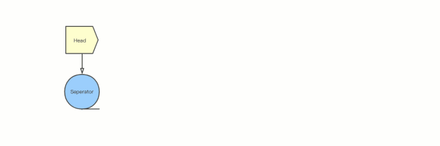
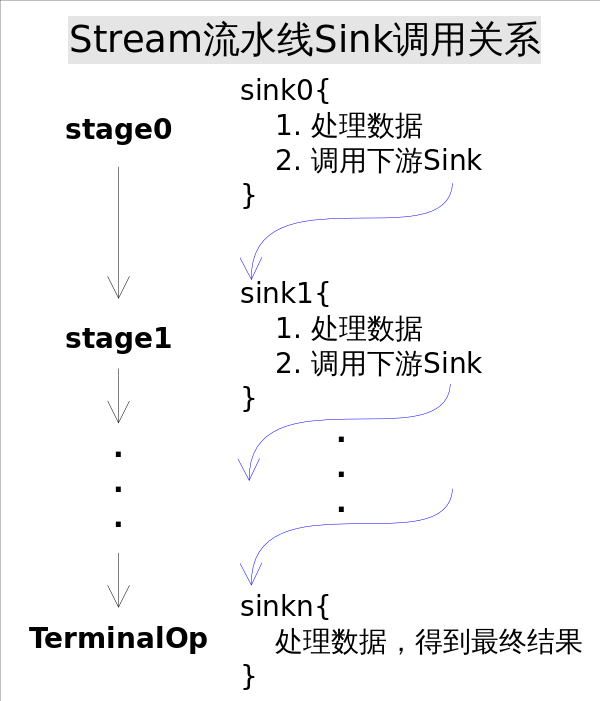

# stream

## stream 是干嘛的？

Stream 常用的流操作包括：

中间操作（Intermediate Operations）
无状态（Stateless）操作：每个数据的处理是独立的，不会影响或依赖之前的数据。如
filter()、flatMap()、flatMapToDouble()、flatMapToInt()、flatMapToLong()、map()、mapToDouble()、mapToInt()、mapToLong()、peek()、unordered() 等
有状态（Stateful）操作：处理时会记录状态，比如处理了几个。后面元素的处理会依赖前面记录的状态，或者拿到所有元素才能继续下去。如
distinct()、sorted()、sorted(comparator)、limit()、skip() 等
终止操作（Terminal Operations）
非短路操作：处理完所有数据才能得到结果。如
collect()、count()、forEach()、forEachOrdered()、max()、min()、reduce()、toArray()等。
短路（short-circuiting）操作：拿到符合预期的结果就会停下来，不一定会处理完所有数据。如
anyMatch()、allMatch()、noneMatch()、findFirst()、findAny() 

Stream操作分类 |  | |
---------|----------|---------
 中间操作(Intermediate operations) | 无状态(Stateless) | unordered() filter() map() mapToInt() mapToLong() mapToDouble() flatMap() flatMapToInt() flatMapToLong() flatMapToDouble() peek()
中间操作(Intermediate operations) | 有状态(Stateful) |distinct() sorted() sorted() limit() skip()
结束操作(Terminal operations)| 非短路操作 | forEach() forEachOrdered() toArray() reduce() collect() max() min() count()
结束操作(Terminal operations)| 短路操作(short-circuiting) | anyMatch() allMatch() noneMatch() findFirst() findAny()

大部分情况下stream是容器调用Collection.stream()方法得到的，但stream和collections有以下不同：

无存储。stream不是一种数据结构，它只是某种数据源的一个视图，数据源可以是一个数组，Java容器或I/O channel等。
为函数式编程而生。对stream的任何修改都不会修改背后的数据源，比如对stream执行过滤操作并不会删除被过滤的元素，而是会产生一个不包含被过滤元素的新stream。
惰式执行。stream上的操作并不会立即执行，只有等到用户真正需要结果的时候才会执行。
可消费性。stream只能被“消费”一次，一旦遍历过就会失效，就像容器的迭代器那样，想要再次遍历必须重新生成。
对stream的操作分为为两类，中间操作(intermediate operations)和结束操作(terminal operations)，二者特点是：

中间操作总是会惰式执行，调用中间操作只会生成一个标记了该操作的新stream，仅此而已。
结束操作会触发实际计算，计算发生时会把所有中间操作积攒的操作以pipeline的方式执行，这样可以减少迭代次数。计算完成之后stream就会失效。

这样做实现起来非常简单直观，但有两个明显的弊端：

迭代次数多。迭代次数跟函数调用的次数相等。
频繁产生中间结果。每次函数调用都产生一次中间结果，存储开销无法接受。
这些弊端使得效率底下，根本无法接受

我们大致能够想到，应该采用某种方式记录用户每一步的操作，当用户调用结束操作时将之前记录的操作叠加到一起在一次迭代中全部执行掉。沿着这个思路，有几个问题需要解决：

用户的操作如何记录？
操作如何叠加？
叠加之后的操作如何执行？
执行后的结果（如果有）在哪里？

现在可以粗略地看到，这些中间操作（不管是无状态的 filter()，还是有状态的sorted() 和 limit() 都只是返回了一个包含上一节点引用的中间节点。有点像 HashMap 中的反向单向链表。就这样把一个个中间操作拼接到了控制数据流入的 Head 后面，但是并没有开始做任何数据处理的动作

## 为什么要引入 stream
* [stream讲解-很不错](https://zhuanlan.zhihu.com/p/47478339)
* [stream讲解-很不错](https://objcoding.com/2019/03/04/lambda/#streams-apii)