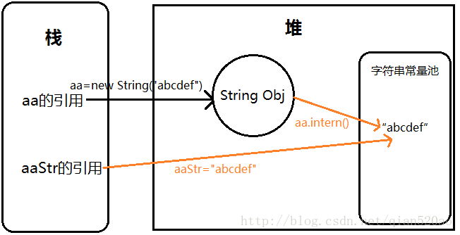
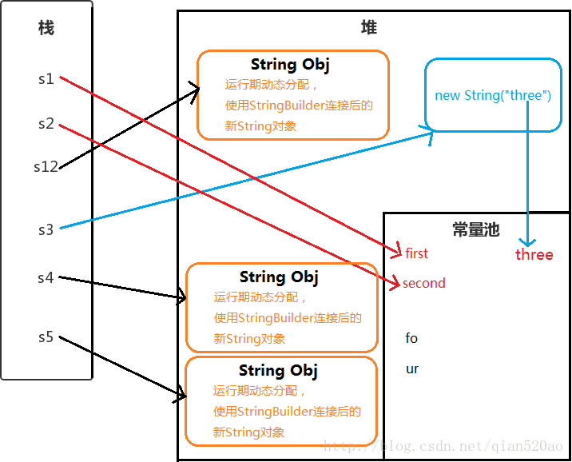

# 谈谈String

## String对象堆栈布局结构 





## String 类
```
public final class String
    implements java.io.Serializable, Comparable<String>, CharSequence {
 /** The value is used for character storage. */
    private final char value[];
    private int hash;
    }
```

## String、StringBuffer和StringBuilder的区别
### 1，可变性
>1，为了线程安全和JVM缓存速度，String 对象是不可变的（被final修饰）。>2，StringBuilder 与 StringBuffer 都继承自 AbstractStringBuilder 类，在 AbstractStringBuilder 中也是使用字符数组保存字符串char[]value 但是没有用 final 关键字修饰，所以这两种对象都是可变的

### 2，线程安全：
>1，String 中的对象是不可变的，也就可以理解为常量，线程安全
>2，StringBuffer 对方法加了同步锁或者对调用的方法加了同步锁，所以是线程安全的。StringBuilder 并没有对方法进行加同步锁，所以是非线程安全的 