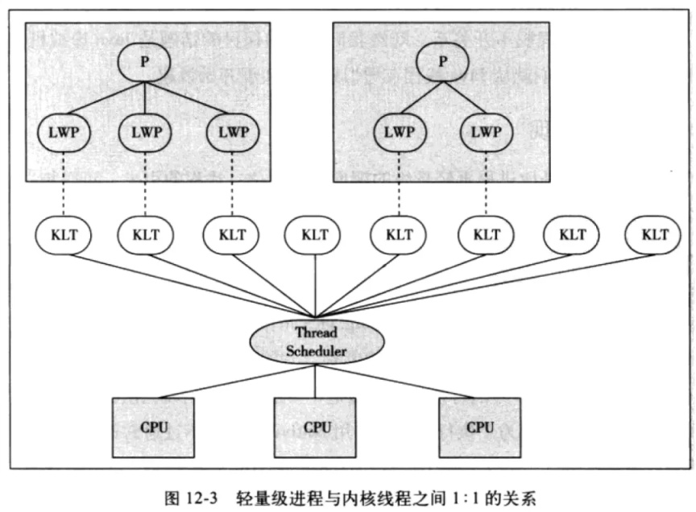
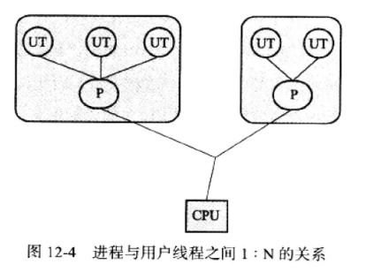
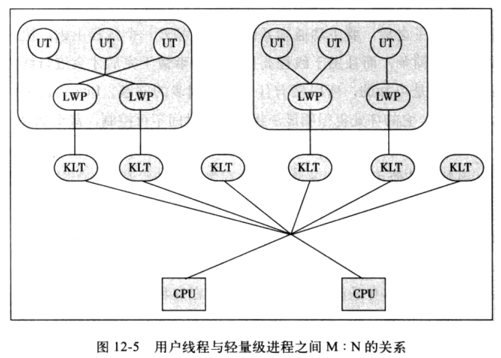
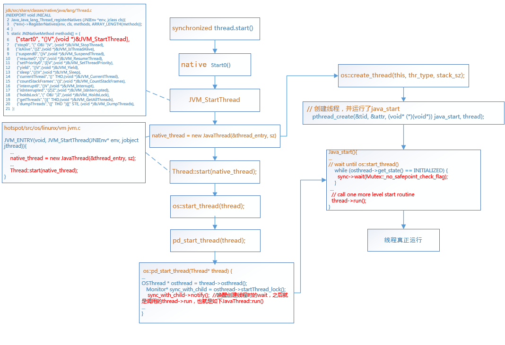

# 线程模型与java线程源码分析

## 主要内容目录
>1，操作系统的线程模型和java的线程模型        
>2，线程的状态转换      
>3，java thread start线程启动的JDK源码【重要】         
>4，java thread join和exit源码        

## 线程模型

### Java线程
>1，Java线程在JDK1.2之前，是**基于用户线程实现**的。而在JDK1.2中，线程模型替换为**基于操作系统原生线程模型来实现**。     
>2，而在目前的JDK版本中，操作系统支持怎样的线程模型，在很大程度上决定了Java虚拟机的线程是怎样映射的，这点在不同的平台上没法达成一致。    
>3，对于Sun JDK来说，它的Windows版本和Linux版本都是使用**一对一的线程模型实现的，一条Java线程映射到一条轻量级进程之中**。«深入理解 JAVA虚拟机»第二版      

### 操作系统实现线程有三种方式：
>1，内核线程实现      
>2，用户线程实现       
>3，用户线程加轻量级进程混合实现      







### 概念介绍 
>1，内核线程 KLT：内核级线程（Kemel-Level Threads, KLT 也有叫做内核支持的线程），直接由操作系统内核支持，线程创建、销毁、切换开销较大        
>2，用户线程 UT：用户线程(User Thread,UT)，建立在用户空间，系统内核不能感知用户线程的存在，线程创建、销毁、切换开销小        
>3，轻量级进程 LWP：（LWP，Light weight process）用户级线程和内核级线程之间的中间层，是由操作系统提供给用户的操作内核线程的接口的实现              
>4，进程 P：（Process）用户进程           


### JDK线程模型

**对于 Sun JDK 来说，它的 Windows 版与 Linux 版都是使用一对一的线程模型实现的，一条 Java 线程就映射到一条轻量级进程之中，因为 Windows 和 Linux 系统提供的线程模型就是一对一的。在 Solaris 平台中，由于操作系统的线程特性可以同时支持一对一（通过 Bound Threads 或 Alternate Libthread 实现）及多对多（通过 LWP/Thread Based Synchronization 实现）的线程模型，因此在 Solaris 版的 JDK 中也对应提供了两个平台专有的虚拟机参数：-XX：+UseLWPSynchronization（默认值）和-XX：+UseBoundThreads 来明确指定虚拟机使用哪种线程模型。**

## 线程的六种状态转换


## java线程与jdk源码实现

### thread start的源码解析 

* [java线程 jvm原理-重要](https://zhuanlan.zhihu.com/p/53078395)
  
### java线程启动逻辑
>thread.start->start0->JVM_StartThread->new JavaThread(&thread_entry, sz);//绑定java_start;再调用 Thread::start->os::start_thread(thread);->thread.run->target.run

### 解析java Thread的JDK实现源码流程图



### java Thread的JDK实现的相关源码
>jdk/src/share/classes/native/java/lang/Thread.c
```
JNIEXPORT void JNICALL
 2  Java_Java_lang_Thread_registerNatives (JNIEnv *env, jclass cls){ //registerNatives
 3    (*env)->RegisterNatives(env, cls, methods, ARRAY_LENGTH(methods));
 4  }
 5  static JNINativeMethod methods[] = {
 6     {"start0", "()V",(void *)&JVM_StartThread}, //start0 方法
 7     {"stop0", "(" OBJ ")V", (void *)&JVM_StopThread},
 8      {"isAlive","()Z",(void *)&JVM_IsThreadAlive},
 9      {"suspend0","()V",(void *)&JVM_SuspendThread},
10      {"resume0","()V",(void *)&JVM_ResumeThread},
11      {"setPriority0","(I)V",(void *)&JVM_SetThreadPriority},
12      {"yield", "()V",(void *)&JVM_Yield},
13      {"sleep","(J)V",(void *)&JVM_Sleep},
14      {"currentThread","()" THD,(void *)&JVM_CurrentThread},
15      {"countStackFrames","()I",(void *)&JVM_CountStackFrames},
16      {"interrupt0","()V",(void *)&JVM_Interrupt},
17      {"isInterrupted","(Z)Z",(void *)&JVM_IsInterrupted},
18      {"holdsLock","(" OBJ ")Z",(void *)&JVM_HoldsLock},
19      {"getThreads","()[" THD,(void *)&JVM_GetAllThreads},
20      {"dumpThreads","([" THD ")[[" STE, (void *)&JVM_DumpThreads},
21  };
```

> hotspot/src/os/linunx/vm jvm.c
```
JVM_ENTRY(void, JVM_StartThread(JNIEnv* env, jobject jthread)){
    ...
    native_thread = new JavaThread(&thread_entry, sz);
    ...
    Thread::start(native_thread);
}
```

>hotspot/src/os/linunx/vm/runtime/thread.cpp :new JavaThread(&thread_entry, sz);

```
JavaThread::JavaThread(ThreadFunction entry_point, size_t stack_sz) :
  Thread()
#if INCLUDE_ALL_GCS
  , _satb_mark_queue(&_satb_mark_queue_set),
  _dirty_card_queue(&_dirty_card_queue_set)
#endif // INCLUDE_ALL_GCS
{
  if (TraceThreadEvents) {
    tty->print_cr("creating thread %p", this);
  }
  initialize();
  _jni_attach_state = _not_attaching_via_jni;
  set_entry_point(entry_point);
  // Create the native thread itself.
  // %note runtime_23
  os::ThreadType thr_type = os::java_thread;
  thr_type = entry_point == &compiler_thread_entry ? os::compiler_thread :
                                                     os::java_thread;
  os::create_thread(this, thr_type, stack_sz);//这个是创建线程
  // The _osthread may be NULL here because we ran out of memory (too many threads active).
  // We need to throw and OutOfMemoryError - however we cannot do this here because the caller
  // may hold a lock and all locks must be unlocked before throwing the exception (throwing
  // the exception consists of creating the exception object & initializing it, initialization
  // will leave the VM via a JavaCall and then all locks must be unlocked).
  //
  // The thread is still suspended when we reach here. Thread must be explicit started
  // by creator! Furthermore, the thread must also explicitly be added to the Threads list
  // by calling Threads:add. The reason why this is not done here, is because the thread
  // object must be fully initialized (take a look at JVM_Start)
}
```

>hotspot/src/linux/vm/os_linux.cpp:os :: create_thread，实际就是调用平台创建线程的方法pthread_create来创建线程。

```
  enum ThreadType {
    vm_thread,
    cgc_thread,        // Concurrent GC thread
    pgc_thread,        // Parallel GC thread
    java_thread,
    compiler_thread,
    watcher_thread,
    os_thread
  };
  
bool os::create_thread(Thread* thread, ThreadType thr_type, size_t stack_size) {
  assert(thread->osthread() == NULL, "caller responsible");

  // Allocate the OSThread object
  OSThread* osthread = new OSThread(NULL, NULL);
  if (osthread == NULL) {
    return false;
  }

  // set the correct thread state
  osthread->set_thread_type(thr_type);

  // Initial state is ALLOCATED but not INITIALIZED
  osthread->set_state(ALLOCATED);

  thread->set_osthread(osthread);

  // init thread attributes
  pthread_attr_t attr;
  pthread_attr_init(&attr);
  pthread_attr_setdetachstate(&attr, PTHREAD_CREATE_DETACHED);

  // stack size
  if (os::Linux::supports_variable_stack_size()) {
    // calculate stack size if it's not specified by caller
    if (stack_size == 0) {
      stack_size = os::Linux::default_stack_size(thr_type);

      switch (thr_type) {
      case os::java_thread:
        // Java threads use ThreadStackSize which default value can be
        // changed with the flag -Xss
        assert (JavaThread::stack_size_at_create() > 0, "this should be set");
        stack_size = JavaThread::stack_size_at_create();
        break;
      case os::compiler_thread:
        if (CompilerThreadStackSize > 0) {
          stack_size = (size_t)(CompilerThreadStackSize * K);
          break;
        } // else fall through:
          // use VMThreadStackSize if CompilerThreadStackSize is not defined
      case os::vm_thread:
      case os::pgc_thread:
      case os::cgc_thread:
      case os::watcher_thread:
        if (VMThreadStackSize > 0) stack_size = (size_t)(VMThreadStackSize * K);//VMThreadStackSize=512 or 1024 or 2048,也就是说，VM线程栈空间初始大小大约1MB
        break;
      }
    }

    stack_size = MAX2(stack_size, os::Linux::min_stack_allowed);
    pthread_attr_setstacksize(&attr, stack_size);
  } else {
    // let pthread_create() pick the default value.
  }

  // glibc guard page
  pthread_attr_setguardsize(&attr, os::Linux::default_guard_size(thr_type));

  ThreadState state;

  {
    // Serialize thread creation if we are running with fixed stack LinuxThreads
    bool lock = os::Linux::is_LinuxThreads() && !os::Linux::is_floating_stack();
    if (lock) {
      os::Linux::createThread_lock()->lock_without_safepoint_check();
    }

    pthread_t tid;

    // 创建线程，并绑定了java_start
    int ret = pthread_create(&tid, &attr, (void* (*)(void*)) java_start, thread);//创建线程

    pthread_attr_destroy(&attr);

    if (ret != 0) {
      if (PrintMiscellaneous && (Verbose || WizardMode)) {
        perror("pthread_create()");
      }
      // Need to clean up stuff we've allocated so far
      thread->set_osthread(NULL);
      delete osthread;
      if (lock) os::Linux::createThread_lock()->unlock();
      return false;
    }

    // Store pthread info into the OSThread
    osthread->set_pthread_id(tid);

    // Wait until child thread is either initialized or aborted
    {
      Monitor* sync_with_child = osthread->startThread_lock();
      MutexLockerEx ml(sync_with_child, Mutex::_no_safepoint_check_flag);
      while ((state = osthread->get_state()) == ALLOCATED) {
        sync_with_child->wait(Mutex::_no_safepoint_check_flag);
      }
    }

    if (lock) {
      os::Linux::createThread_lock()->unlock();
    }
  }

  // Aborted due to thread limit being reached
  if (state == ZOMBIE) {
      thread->set_osthread(NULL);
      delete osthread;
      return false;
  }

  // The thread is returned suspended (in state INITIALIZED),
  // and is started higher up in the call chain
  assert(state == INITIALIZED, "race condition");
  return true;
}

```

>创建线程时，绑定执行java_start,用来执行thread->run
```
static void *java_start(Thread *thread) {
  // Try to randomize the cache line index of hot stack frames.
  // This helps when threads of the same stack traces evict each other's
  // cache lines. The threads can be either from the same JVM instance, or
  // from different JVM instances. The benefit is especially true for
  // processors with hyperthreading technology.
  static int counter = 0;
  int pid = os::current_process_id();
  alloca(((pid ^ counter++) & 7) * 128);

  ThreadLocalStorage::set_thread(thread);

  OSThread* osthread = thread->osthread();
  Monitor* sync = osthread->startThread_lock();

  // non floating stack LinuxThreads needs extra check, see above
  if (!_thread_safety_check(thread)) {
    // notify parent thread
    MutexLockerEx ml(sync, Mutex::_no_safepoint_check_flag);
    osthread->set_state(ZOMBIE);
    sync->notify_all();
    return NULL;
  }

  // thread_id is kernel thread id (similar to Solaris LWP id)
  osthread->set_thread_id(os::Linux::gettid());

  if (UseNUMA) {
    int lgrp_id = os::numa_get_group_id();
    if (lgrp_id != -1) {
      thread->set_lgrp_id(lgrp_id);
    }
  }
  // initialize signal mask for this thread
  os::Linux::hotspot_sigmask(thread);

  // initialize floating point control register
  os::Linux::init_thread_fpu_state();

  // handshaking with parent thread
  {
    MutexLockerEx ml(sync, Mutex::_no_safepoint_check_flag);

    // notify parent thread
    osthread->set_state(INITIALIZED);
    sync->notify_all();

    // wait until os::start_thread()
    while (osthread->get_state() == INITIALIZED) {
      sync->wait(Mutex::_no_safepoint_check_flag);
    }
  }

  // call one more level start routine
  thread->run();

  return 0;
}
```
>线程执行：
```
void Thread::start(Thread* thread) {
  trace("start", thread);
  // Start is different from resume in that its safety is guaranteed by context or
  // being called from a Java method synchronized on the Thread object.
  if (!DisableStartThread) {
    if (thread->is_Java_thread()) {
      // Initialize the thread state to RUNNABLE before starting this thread.
      // Can not set it after the thread started because we do not know the
      // exact thread state at that time. It could be in MONITOR_WAIT or
      // in SLEEPING or some other state.
      java_lang_Thread::set_thread_status(((JavaThread*)thread)->threadObj(),
                                          java_lang_Thread::RUNNABLE);
    }
    os::start_thread(thread);
  }
}
```
>hospot/src/share/vm/runtime/os.cpp  os :: start_thread（thread）最终会调用Thread.cpp文件中的JavaThread :: run（）方法
```
void os::start_thread(Thread* thread) {
  // guard suspend/resume
  MutexLockerEx ml(thread->SR_lock(), Mutex::_no_safepoint_check_flag);
  OSThread* osthread = thread->osthread();
  osthread->set_state(RUNNABLE);
  pd_start_thread(thread);
}

void os::pd_start_thread(Thread* thread) {
  OSThread * osthread = thread->osthread();
  assert(osthread->get_state() != INITIALIZED, "just checking");
  Monitor* sync_with_child = osthread->startThread_lock();
  MutexLockerEx ml(sync_with_child, Mutex::_no_safepoint_check_flag);
  sync_with_child->notify();  //唤醒创建线程时的wait，之后就是调用的thread->run，也就是如下JavaThread::run()
}

void JavaThread::run() {
  // initialize thread-local alloc buffer related fields
  this->initialize_tlab();

  // used to test validitity of stack trace backs
  this->record_base_of_stack_pointer();

  // Record real stack base and size.
  this->record_stack_base_and_size();

  // Initialize thread local storage; set before calling MutexLocker
  this->initialize_thread_local_storage();

  this->create_stack_guard_pages();

  this->cache_global_variables();

  // Thread is now sufficient initialized to be handled by the safepoint code as being
  // in the VM. Change thread state from _thread_new to _thread_in_vm
  ThreadStateTransition::transition_and_fence(this, _thread_new, _thread_in_vm);

  assert(JavaThread::current() == this, "sanity check");
  assert(!Thread::current()->owns_locks(), "sanity check");

  DTRACE_THREAD_PROBE(start, this);

  // This operation might block. We call that after all safepoint checks for a new thread has
  // been completed.
  this->set_active_handles(JNIHandleBlock::allocate_block());

  if (JvmtiExport::should_post_thread_life()) {
    JvmtiExport::post_thread_start(this);
  }

  EventThreadStart event;
  if (event.should_commit()) {
     event.set_javalangthread(java_lang_Thread::thread_id(this->threadObj()));
     event.commit();
  }

  // We call another function to do the rest so we are sure that the stack addresses used
  // from there will be lower than the stack base just computed
  thread_main_inner();

  // Note, thread is no longer valid at this point!
}

void JavaThread::thread_main_inner() {
  assert(JavaThread::current() == this, "sanity check");
  assert(this->threadObj() != NULL, "just checking");

  // Execute thread entry point unless this thread has a pending exception
  // or has been stopped before starting.
  // Note: Due to JVM_StopThread we can have pending exceptions already!
  if (!this->has_pending_exception() &&
      !java_lang_Thread::is_stillborn(this->threadObj())) {
    {
      ResourceMark rm(this);
      this->set_native_thread_name(this->get_thread_name());
    }
    HandleMark hm(this);
    this->entry_point()(this, this);//核心，在创建native_thread = newJavaThread（ ＆thread_entry，SZ）; 的时候传递了一个thread_entry函数，查看thread_entry，可能看到是配置的run方法
  }

  DTRACE_THREAD_PROBE(stop, this);

  this->exit(false);
  delete this;
}
```


### thread join和exit 
* [thread join-重要-讲解的不错](https://juejin.cn/post/6844903941247860749)


>在main主线程中调用threadA.join()方法，因为join() 方法是一个synchronized方法，所以主线程会首先持有thread线程对象的锁。接下来在join()方法里面调用wait()方法，主线程会释放thread线程对象的锁，进入等待状态。最后，threadA线程执行结束，JVM会调用lock.notify_all(thread);唤醒持有threadA这个对象锁的线程，也就是主线程，所以主线程会继续往下执行


```
    public final void join() throws InterruptedException {
        join(0);
    }

    public final synchronized void join(long millis)
    throws InterruptedException {
        long base = System.currentTimeMillis();
        long now = 0;

        if (millis < 0) {
            throw new IllegalArgumentException("timeout value is negative");
        }

        if (millis == 0) {
            while (isAlive()) {
                wait(0);//wait()方法是Object类中的方法，也就是说执行wait()方法之后主线 程会释放threadA对象的锁，进入等待状态，直到被再次唤醒。 大家都知道，有了wait()，必然有notify()，什么时候才会notify呢？在jvm源码里,如下
            }
        } else {
            while (isAlive()) {
                long delay = millis - now;
                if (delay <= 0) {
                    break;
                }
                wait(delay);
                now = System.currentTimeMillis() - base;
            }
        }
    }


//一个c++函数：
void JavaThread::exit(bool destroy_vm, ExitType exit_type) ；
//里面有一个贼不起眼的一行代码
ensure_join(this);

static void ensure_join(JavaThread* thread) {
  Handle threadObj(thread, thread->threadObj());

  ObjectLocker lock(threadObj, thread);

  thread->clear_pending_exception();

  java_lang_Thread::set_thread_status(threadObj(), java_lang_Thread::TERMINATED);

  java_lang_Thread::set_thread(threadObj(), NULL);

  //hreadA线程对象被notifyall了，那么主线程也就能继续跑下去了
  lock.notify_all(thread);

  thread->clear_pending_exception();
}

```