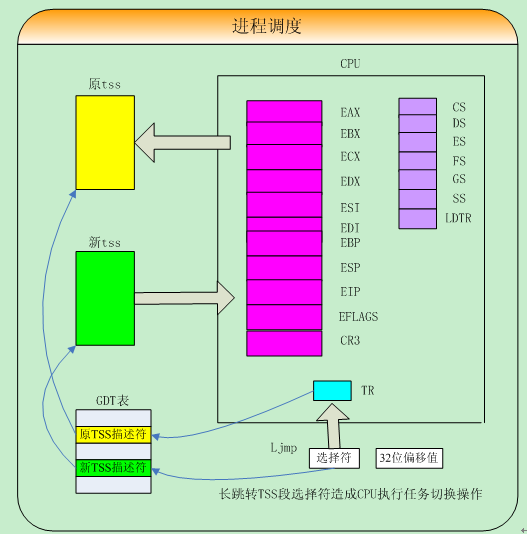

# 操作系统

>Linux内存管理中，段变换：将一个由段选择符和段内偏移构成的逻辑地址转换为一个线性地址。页变换：将线性地址转换为对应的物理地址

>1、 全局描述符表（Global descriptor table---GDT）
>2、 局部描述符表（Local descriptor table---LDT）

>Offset = 2^12=4K， table =2^10, directory = 2^10，所以线性地址空间为2^10*2^10*4k=4G。

## 进程
>由于0.11内核把每个进程的最大可用的虚拟内存空间定义为64M，因此每个进程的逻辑地址可以用任务号*64M，就可以转换到线性空间的地址。

## linux 0.11源码目录结构

