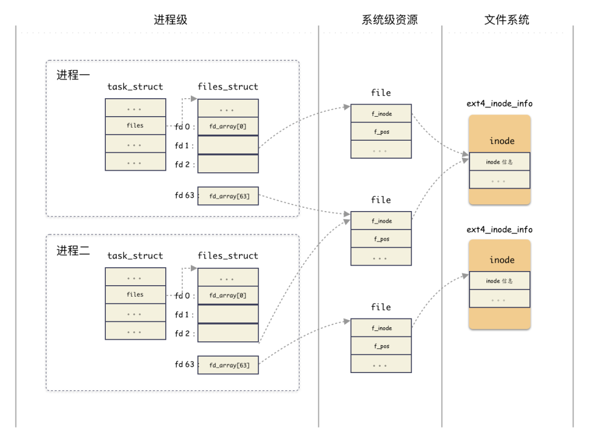

#  fd 文件描述符
>其实质是task_struct.files的数组下标索引

* [fd-linux内核本质](https://mp.weixin.qq.com/s/DyYe3OcrgO90yfKrxNt0eQ)




>1,进程结构 task_struct ：表征进程实体，每一个进程都和一个 task_struct 结构体对应，其中 task_struct.files 指向一个管理打开文件的结构体 fiels_struct ；
>2,文件表项管理结构 files_struct ：用于管理进程打开的 open 文件列表，内部以数组的方式实现（静态数组和动态数组结合）。返回给用户的 fd 就是这个数组的编号索引而已，索引元素为 file 结构；
>files_struct 只从属于某进程；
>3,文件 file 结构：表征一个打开的文件，内部包含关键的字段有：当前文件偏移，inode 结构地址；
>4,该结构虽然由进程触发创建，但是 file  结构可以在进程间共享；
vfs inode 结构体：文件 file 结构指向 的是 vfs 的 inode ，这个是操作系统抽象出来的一层，用于屏蔽后端各种各样的文件系统的 inode 差异；
>inode 这个具体进程无关，是文件系统级别的资源；
>5,ext4 inode 结构体（指代具体文件系统 inode ）：后端文件系统的 inode 结构，不同文件系统自定义的结构体，ext2 有 ext2_inode_info，ext4 有ext4_inode_info，minix 有 minix_inode_info，这些结构里都是内嵌了一个 vfs inode 结构体，原理相同；
>6，每个进程对有它自己的 file，其中包含了当前文件偏移，当多个进程写同一个文件的时候，由于一个文件 IO 最终只会是落到全局的一个 inode 上，这种并发场景则可能产生用户不可预期的结果；
>7，file 结构体可以为进程间共享，属于系统级资源，同一个文件可能对应多个 file 结构体，file 内部有个 inode 指针，指向文件系统的 inode；

## task_struc 进程抽象封装

```
struct task_struct {
    // ...
    /* Open file information: */
    struct files_struct     *files;
    // ...
}
```

## files_struct
```
/*
 * Open file table structure
 */
struct files_struct {
    // 读相关字段
    atomic_t count;
    bool resize_in_progress;
    wait_queue_head_t resize_wait;

    // 打开的文件管理结构
    struct fdtable __rcu *fdt;
    struct fdtable fdtab;

    // 写相关字段
    unsigned int next_fd;
    unsigned long close_on_exec_init[1];
    unsigned long open_fds_init[1];
    unsigned long full_fds_bits_init[1];
    struct file * fd_array[NR_OPEN_DEFAULT];
};
```


## file

```
struct file {
    // ...
    struct path                     f_path;
    struct inode                    *f_inode;
    const struct file_operations    *f_op;

    atomic_long_t                    f_count;
    unsigned int                     f_flags;
    fmode_t                          f_mode;
    struct mutex                     f_pos_lock;
    loff_t                           f_pos;
    struct fown_struct               f_owner;
    // ...
}
```

## VFS inode
```
struct inode {
    // 文件相关的基本信息（权限，模式，uid，gid等）
    umode_t             i_mode;
    unsigned short      i_opflags;
    kuid_t              i_uid;
    kgid_t              i_gid;
    unsigned int        i_flags;
    // 回调函数
    const struct inode_operations   *i_op;
    struct super_block              *i_sb;
    struct address_space            *i_mapping;
    // 文件大小，atime，ctime，mtime等
    loff_t              i_size;
    struct timespec64   i_atime;
    struct timespec64   i_mtime;
    struct timespec64   i_ctime;
    // 回调函数
    const struct file_operations    *i_fop;
    struct address_space            i_data;
    // 指向后端具体文件系统的特殊数据
    void    *i_private;     /* fs or device private pointer */
};
```

### 具体文件系统inode和VFS inode的关系：举例ext4文件系统
>vfs inode 出生就和 ext4_inode_info 结构体分配在一起的，直接通过 vfs inode 结构体的地址强转类型就能得到 ext4_inode_info 结构体。
>举个例子，现已知 inode 地址和 vfs_inode 字段的内偏移如下：

```
inode 的地址为 0xa89be0；
ext4_inode_info 里有个内嵌字段 vfs_inode，类型为 struct inode ，该字段在结构体内偏移为 64 字节；
则可以得到：
ext4_inode_info 的地址为：

(struct ext4_inode_info *)(0xa89be0 - 64)
```

```
struct ext4_inode_info {
    // ext4 inode 特色字段
    // ...
    
    // 重要！！！
    struct inode    vfs_inode;  
};
```