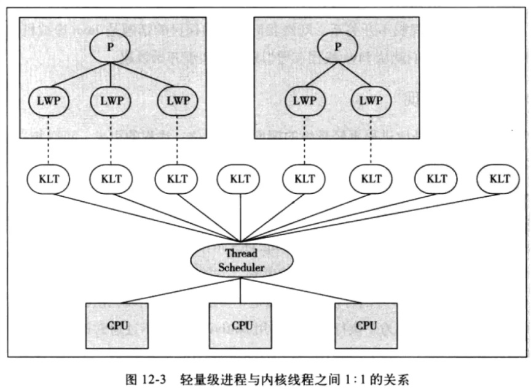
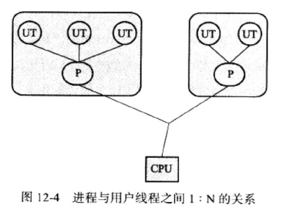
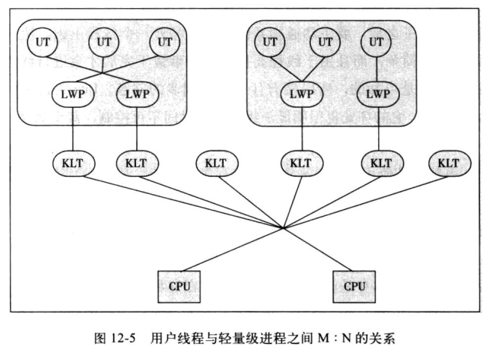

使用内核线程（1:1 模型）
使用用户线程（1:N 模型）
使用用户线程 + 轻量级进程（LWP）（N:M 模型）

* [操作系统-讲解不错](https://xie.infoq.cn/article/fb6b454992ba2888cc17d2e6f)

内核线程 KLT：内核级线程（Kemel-Level Threads, KLT 也有叫做内核支持的线程），直接由操作系统内核支持，线程创建、销毁、切换开销较大

用户线程 UT：用户线程(User Thread,UT)，建立在用户空间，系统内核不能感知用户线程的存在，线程创建、销毁、切换开销小

轻量级进程 LWP：（LWP，Light weight process）用户级线程和内核级线程之间的中间层，是由操作系统提供给用户的操作内核线程的接口的实现 。

进程 P：（Process）用户进程

## JDK线程模型

**对于 Sun JDK 来说，它的 Windows 版与 Linux 版都是使用一对一的线程模型实现的，一条 Java 线程就映射到一条轻量级进程之中，因为 Windows 和 Linux 系统提供的线程模型就是一对一的。在 Solaris 平台中，由于操作系统的线程特性可以同时支持一对一（通过 Bound Threads 或 Alternate Libthread 实现）及多对多（通过 LWP/Thread Based Synchronization 实现）的线程模型，因此在 Solaris 版的 JDK 中也对应提供了两个平台专有的虚拟机参数：-XX：+UseLWPSynchronization（默认值）和-XX：+UseBoundThreads 来明确指定虚拟机使用哪种线程模型。**

>LinuxThreads和NPTL都是采用一对一的线程模型，NGPT采用的是多对多的线程模型