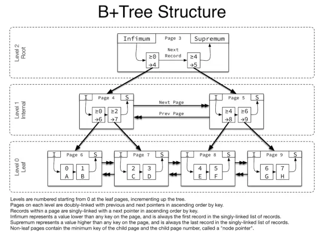

# B+tree

* [Innodb原理---好文](https://mp.weixin.qq.com/s/1ggNsA6Xpz6bWnVZ6-F8qw)

>1，B+Tree中的B是指balance，意为平衡。需要注意的是，B+树索引并不能找到一个给定键值的具体行，它找到的只是被查找数据行所在的页，接着数据库会把页读入到内存，再在内存中进行查找，最后得到要查找的数据   

>2，MySQL巧妙利用了磁盘预读原理，将一个节点的大小设为等于一个页，这样每个节点只需要一次I/O就可以完全载入。为了达到这个目的，每次新建节点时，直接申请一个页的空间，这样就保证一个节点物理上也存储在一个页里，加之计算机存储分配都是按页对齐的，就实现了读取一个节点只需一次I/O。假设B+Tree的高度为h，一次检索最多需要h-1I/O（根节点常驻内存），复杂度$O(h) = O(\log_{M}N)$。实际应用场景中，M通常较大，常常超过100，因此树的高度一般都比较小，通常不超过3。

## B+Tree 查询

>如上图，是一颗b+树，关于b+树的定义可以参见B+树，这里只说一些重点，浅蓝色的块我们称之为一个磁盘块，可以看到每个磁盘块包含几个数据项（深蓝色所示）和指针（黄色所示），如磁盘块1包含数据项17和35，包含指针P1、P2、P3，P1表示小于17的磁盘块，P2表示在17和35之间的磁盘块，P3表示大于35的磁盘块。真实的数据存在于叶子节点即3、5、9、10、13、15、28、29、36、60、75、79、90、99。非叶子节点只不存储真实的数据，只存储指引搜索方向的数据项，如17、35并不真实存在于数据表中。

>1，数据是存在叶子节点中的；
>2，数据节点之间是有指针指向的。这样也有利于范围查找
>3，**MyISAM和MySQL是采用的B+Tree**。目前大多数数据库系统及文件系统都采用 B-Tree 或其变种 B+Tree 作为索引结构
>4，系统从 **磁盘读取数据到内存时是以磁盘块（block）为基本单位**的，**InnoDB存储引擎使用页**作为数据读取单位，**页是其磁盘管理的最小单位，默认page大小是 16k**。系统的一个磁盘块的存储空间往往没有这么大，因此 InnoDB 每次申请磁盘空间时都会是若干地址连续磁盘块来达到页的大小 16KB。
>5，在查询数据时如果一个页中的每条数据都能助于定位数据记录的位置，这将会减少磁盘 I/O 的次数，提高查询效率

### b+树的查找过程
>如图所示，如果要查找数据项29，那么首先会把磁盘块1由磁盘加载到内存，此时发生一次IO，在内存中用二分查找确定29在17和35之间，锁定磁盘块1的P2指针，内存时间因为非常短（相比磁盘的IO）可以忽略不计，通过磁盘块1的P2指针的磁盘地址把磁盘块3由磁盘加载到内存，发生第二次IO，29在26和30之间，锁定磁盘块3的P2指针，通过指针加载磁盘块8到内存，发生第三次IO，同时内存中做二分查找找到29，结束查询，总计三次IO。真实的情况是，3层的b+树可以表示上百万的数据，如果上百万的数据查找只需要三次IO，性能提高将是巨大的，如果没有索引，每个数据项都要发生一次IO，那么总共需要百万次的IO，显然成本非常非常高。

### b+树性质
>1.通过上面的分析，我们知道IO次数取决于b+数的高度h，**假设当前数据表的数据为N，每个磁盘块的数据项的数量是m，则有h=㏒(m+1)N，当数据量N一定的情况下，m越大，h越小；而m = 磁盘块的大小 / 数据项的大小，磁盘块的大小也就是一个数据页的大小，是固定的**，如果数据项占的空间越小，数据项的数量越多，树的高度越低。这就是为什么每个数据项，即索引字段要尽量的小，比如int占4字节，要比bigint8字节少一半。这也是为什么b+树要求把真实的数据放到叶子节点而不是内层节点，一旦放到内层节点，磁盘块的数据项会大幅度下降，导致树增高。当数据项等于1时将会退化成线性表。

>2.当b+树的数据项是复合的数据结构，比如(name,age,sex)的时候，b+数是按照从左到右的顺序来建立搜索树的，比如当(张三,20,F)这样的数据来检索的时候，b+树会优先比较name来确定下一步的所搜方向，如果name相同再依次比较age和sex，最后得到检索的数据；但当(20,F)这样的没有name的数据来的时候，b+树就不知道下一步该查哪个节点，因为建立搜索树的时候name就是第一个比较因子，必须要先根据name来搜索才能知道下一步去哪里查询。比如当(张三,F)这样的数据来检索时，b+树可以用name来指定搜索方向，但下一个字段age的缺失，所以只能把名字等于张三的数据都找到，然后再匹配性别是F的数据了， 这个是非常重要的性质，即索引的最左匹配特性。