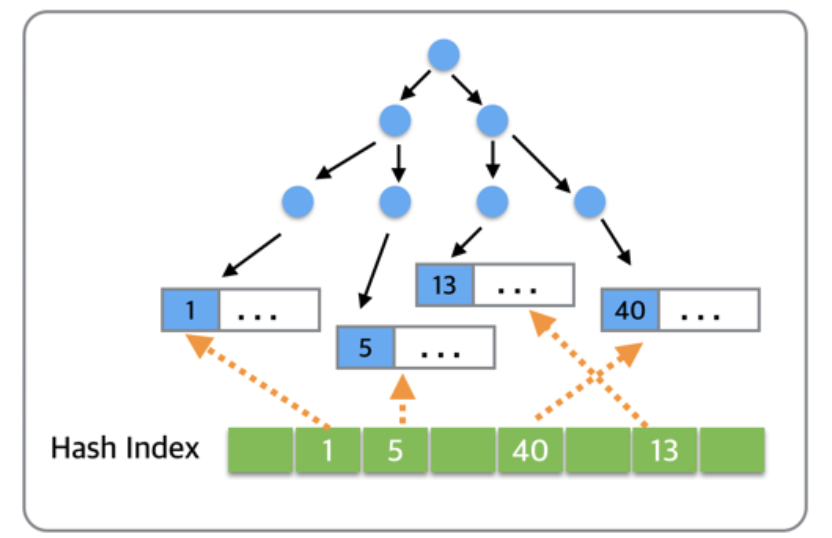

# 自适应hash索引

>维护索引叶页面中所有记录的索引键值(或键值前缀)到索引叶页面位置的Hash映射关系,
能够根据索引键值(前缀)快速定位到叶页面满足条件记录的Offset，减少了B+树Search Path的代价，将B+树从Root页面至Leaf页面的路径定位，优化为Hash Index的快速查询。
Adaptive Hash Index是针对B+树Search Path的优化，因此所有会涉及到Search Path的操作，均可使用此Hash索引进行优化.

## 索引下推
>可以在索引遍历过程中，对索引中包含的字段先做判断，过滤掉不符合条件的记录，减少回表字数。如果没有索引下推优化（或称ICP优化），当进行索引查询时，首先根据索引来查找记录，然后再根据where条件来过滤记录；在支持ICP优化后，MySQL会在取出索引的同时，判断是否可以进行where条件过滤再进行索引查询，也就是说提前执行where的部分过滤操作，在某些场景下，可以大大减少回表次数，从而提升整体性能

