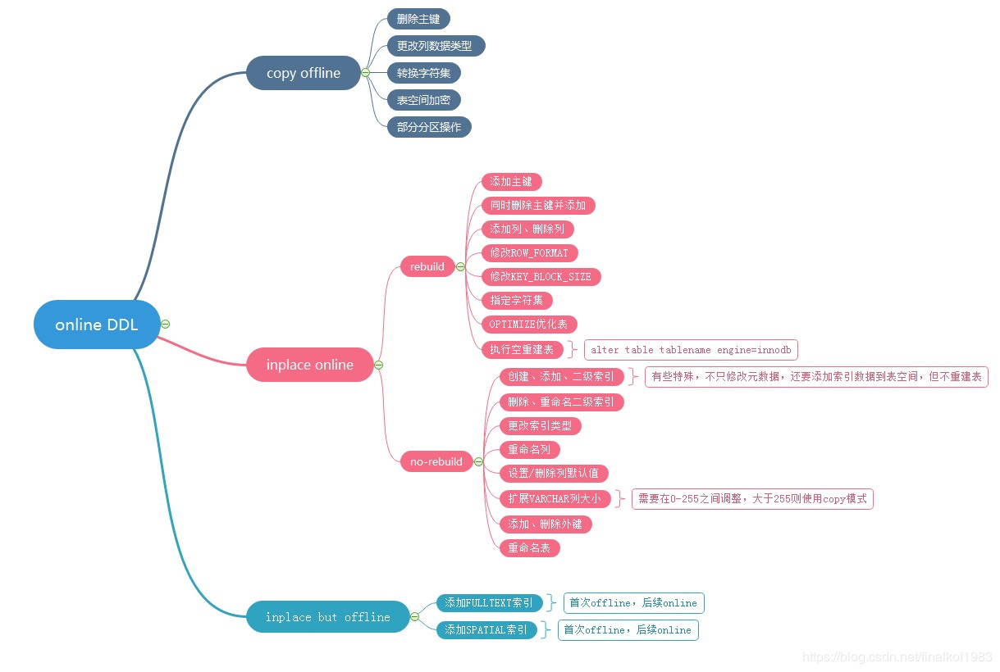
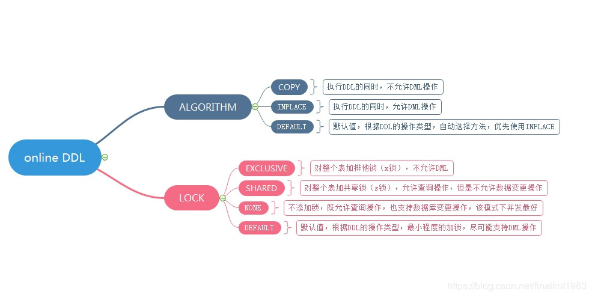

# 大表处理

## 加字段
>1，临时表，new-table like old-table add column，insert newtable select * from oldtable
>2，pt-online-schema-change 工具，可以在线修改表结构，可以不锁表
>3，拓展varchar为json，不增加新字段，增加json key
>4，MySQL 8.0支持快速加列，Instant Add Column。腾讯游戏DBA团队贡献。只适用于 InnoDB 表。快速加列采用的是 instant 算法，使得添加列时不再需要 rebuild 整个表，只需要在表的 metadata 中记录新增列的基本信息即可。在 alter 语句后增加 ALGORITHM=INSTANT 即代表使用 instant 算法
>5，pt-osc （Online Schema Change）或gh-ost添加

* [MySQL OSC(在线更改表结构)原理](https://www.cnblogs.com/chinesern/p/7677379.html)


```
alter table test add name varchar(10)，ALGORITHM=INPLACE ,LOCK=NONE;

#Locking Options for Online DDL
LOCK=DEFAULT
LOCK=NONE
LOCK=SHARED
LOCK=EXCLUSIVE

#Performance of In-Place versus Table-Copying DDL Operations
ALGORITHM=DEFAULT
ALGORITHM=INPLACE
ALGORITHM=COPY
```

### Prepare阶段
>1.创建临时frm文件
>2.持有EXCLUSIVE-MDL锁，禁止读写
>3.根据ALTER类型，确定执行方式(copy,online-rebuild,online-norebuild)
>4.更新数据字典的内存对象
>5.分配row_log对象记录增量
>6.生成临时ibd文件

### ddl执行阶段
>1.降级EXCLUSIVE-MDL锁，允许读写
>2.扫描原表的聚簇索引每条记录
>3.遍历新表的聚簇索引和二级索引,逐一处理
>4.根据记录构造对应的索引项
>5.将构造索引项插入sort_buffer块
>6.将sort_buffer块插入新的索引
>7.处理ddl执行过程中产生的增量(仅rebuild类型需要)

### commit阶段
>1.升级到EXCLUSIVE-MDL锁，禁止读写
>2.应用最后row_log中产的日志
>3.更新innodb的数据字典表
>4.提交事务(刷事务的redo日志)
>5.修改统计信息
>6.rename临时idb文件，frm文件
>7.变更完成



