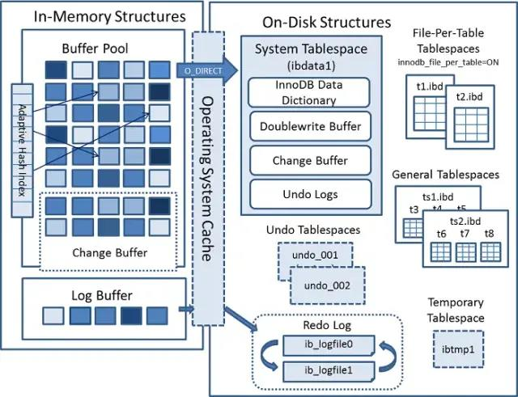
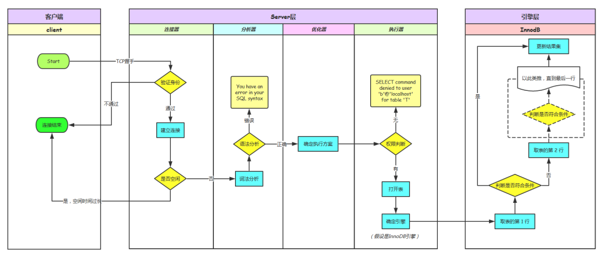
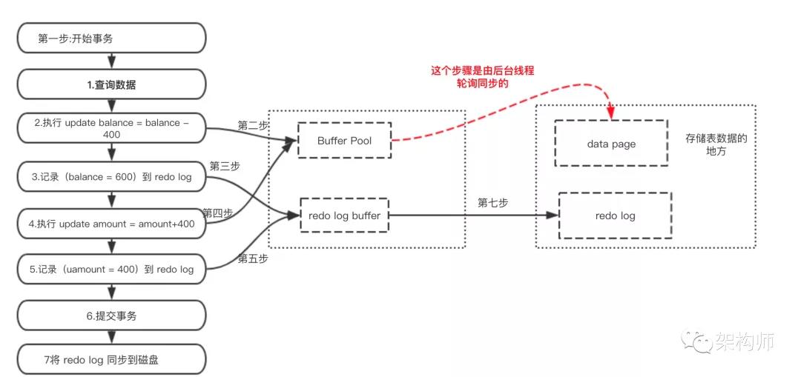
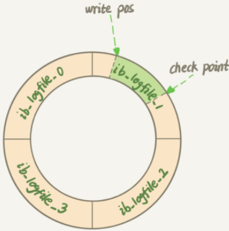
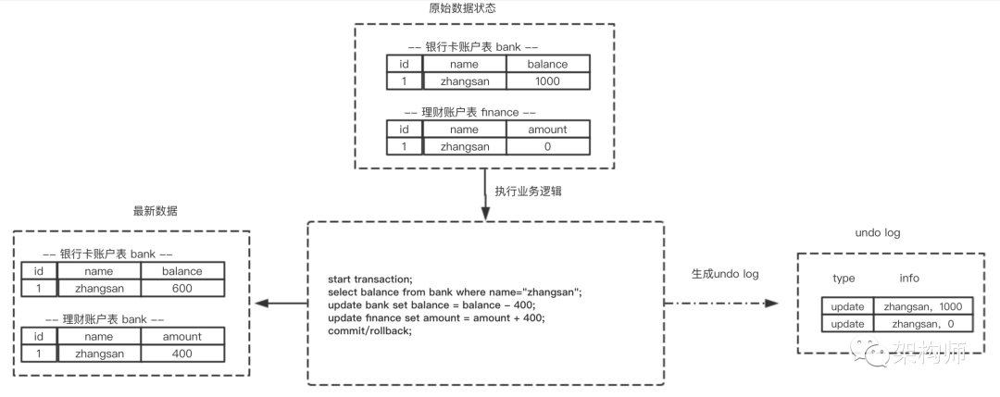
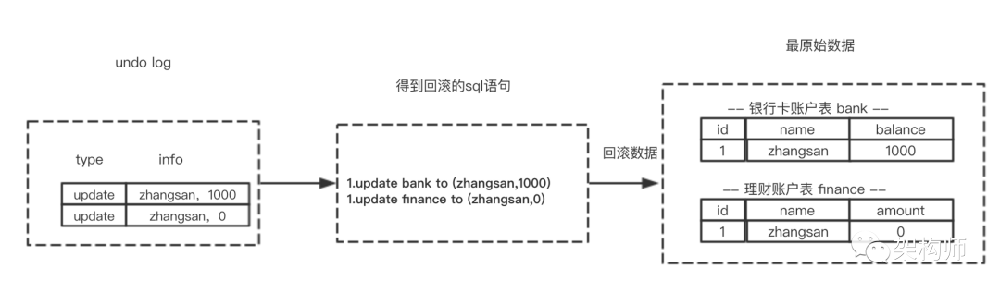
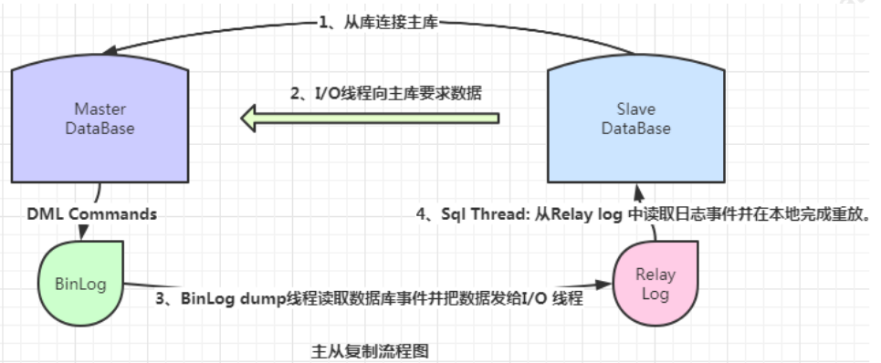
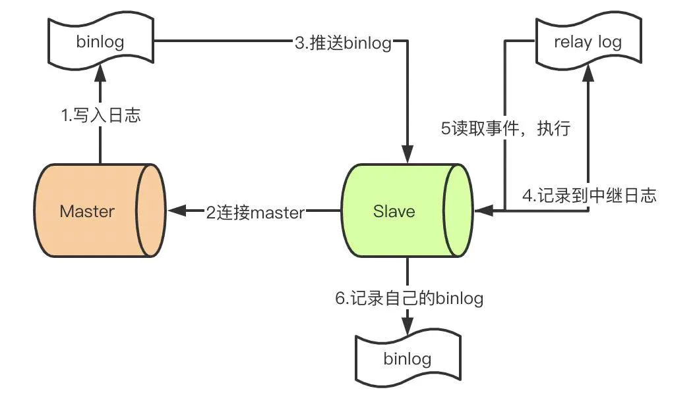
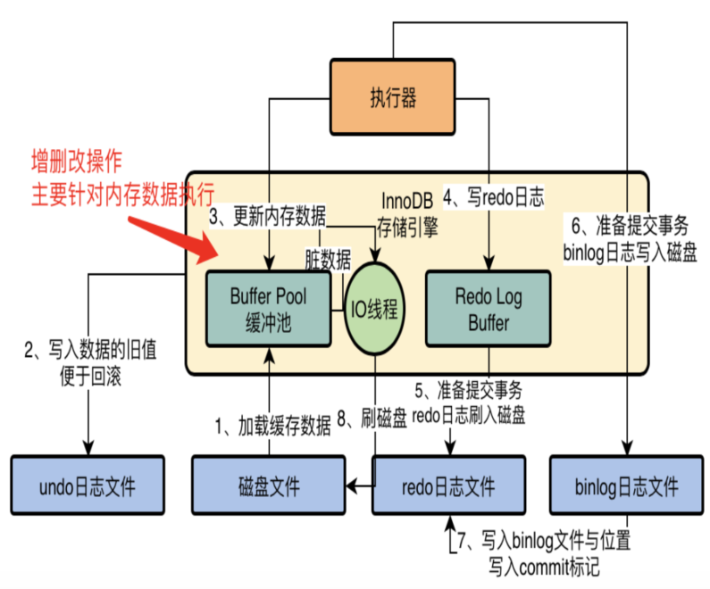
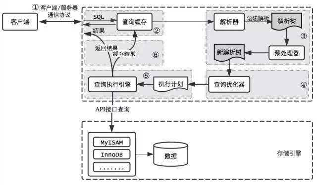

# innodb

## InnoDB 的架构分为两块：内存结构和磁盘结构

## MySQL大体上可分为Server层和存储引擎层两部分

## BinLog、RedoLog、UndoLog

* [mysql好文](https://mp.weixin.qq.com/s/JDXGOseJoDwYxMTd7RGnrA)
  
### BinLog

>BinLog是记录所有数据库表结构变更（例如create、alter table）以及表数据修改(insert、update、delete)的二进制日志，主从数据库同步用到的都是BinLog文件。BinLog日志文件有三种模式。

#### STATEMENT 模式
>1，内容：binlog 只会记录可能引起数据变更的 sql 语句
>2，优势：该模式下，因为没有记录实际的数据，所以日志量和 IO 都消耗很低，性能是最优的
>3，劣势：但有些操作并不是确定的，比如 uuid() 函数会随机产生唯一标识，当依赖 binlog 回放时，该操作生成的数据与原数据必然是不同的，此时可能造成无法预料的后果。

#### ROW 模式
>1，内容：在该模式下，binlog 会记录每次操作的源数据与修改后的目标数据，StreamSets就要求该模式。
>2，优势：可以绝对精准的还原，从而保证了数据的安全与可靠，并且复制和数据恢复过程可以是并发进行的
>3，劣势：缺点在于 binlog 体积会非常大，同时，对于修改记录多、字段长度大的操作来说，记录时性能消耗会很严重。阅读的时候也需要特殊指令来进行读取数据。

#### MIXED 模式
>1，内容：是对上述STATEMENT 跟 ROW  两种模式的混合使用。
>2，细节：对于绝大部分操作，都使用 STATEMENT 来进行 binlog 的记录，只有以下操作使用 ROW 来实现：表的存储引擎为 NDB，使用了uuid() 等不确定函数，使用了 insert delay 语句，使用了临时表

### redo log：把执行的结果存入redo log

redolog两阶段提交：为了让binlog跟redolog两份日志之间的逻辑一致。提交流程大致如下：
>prepare阶段 -->  2 写binlog  --> 3 commit
>1，当在2之前崩溃时，重启恢复后发现没有commit，回滚。备份恢复：没有binlog 。一致
>2，当在3之前崩溃时，重启恢复发现虽没有commit，但满足prepare和binlog完整，所以重启后会自动commit。备份：有binlog. 一致

>为了提升性能InnoDB提供了缓冲池(Buffer Pool)，Buffer Pool中包含了磁盘数据页的映射，可以当做缓存来使用：
>1，读数据：会首先从缓冲池中读取，如果缓冲池中没有，则从磁盘读取在放入缓冲池；
>2，写数据：会首先写入缓冲池，缓冲池中的数据会定期同步到磁盘中；

### binlog跟redolog区别：
>1，redo log是InnoDB引擎特有的；binlog是MySQL的Server层实现的，所有引擎都可以使用。
>2，redo log是物理日志，记录的是在某个数据页上做了什么修改；binlog是逻辑日志，记录的是这个语句的原始逻辑，比如给ID=2这一行的c字段加1。
>3，**redo log是循环写的，空间固定会用完；binlog是可以追加写入的。追加写是指binlog文件写到一定大小后会切换到下一个，并不会覆盖以前的日志**。

#### redo log循环写 && checkpoint机制

### undo log：回滚日志，用于记录数据被修改前的信息
>1，redo物理日志，记录的页的物理修改操作，undo是逻辑日志，记录每行的操作
>2，redo log重做日志记录数据被修改后的信息，undo log：回滚日志，用于记录数据被修改前的信息，刚好相反。
>3，undo log是用来回滚数据的用于保障 未提交事务的原子性   
>4，redo log是用来恢复数据的 用于保障，已提交事务的持久化特性

#### undo log & rollback & 原子性

>1，每条数据变更(insert/update/delete)操作都伴随一条undo log的生成,并且回滚日志必须先于数据持久化到磁盘上
>2，所谓的回滚就是根据回滚日志做逆向操作，比如delete的逆向操作为insert，insert的逆向操作为delete，update的逆向为update等。

>1，如果在回滚日志里有新增数据记录，则生成删除该条的语句
>2，如果在回滚日志里有删除数据记录，则生成生成该条的语句
>3，如果在回滚日志里有修改数据记录，则生成修改到原先数据的语句

#### insert undo log
>代表事务在insert新记录时产生的undo log, 只在事务回滚时需要，并且在事务提交后可以被立即丢弃

#### update undo log
>事务在进行update或delete时产生的undo log; 不仅在事务回滚时需要，在快照读时也需要；所以不能随便删除，只有在快速读或事务回滚不涉及该日志时，对应的日志才会被purge线程统一清除

### 事务的实现
>1，事务的原子性是通过 undo log 来实现的
>2，事务的持久性性是通过 redo log 来实现的
>3，事务的隔离性是通过 (读写锁+MVCC)来实现的
>4，而事务的终极大 boss 一致性是通过原子性，持久性，隔离性来实现的

* [事务的实现-重要内容](https://mp.weixin.qq.com/s/79HhQsZRzzuskP5p5LNONA)

### 主从复制

>mysql默认的复制方式是异步的，并且复制的时候是有并行复制能力的。主库把日志发送给从库后不管了，这样会产生一个问题就是假设主库挂了，从库处理失败了，这时候从库升为主库后，日志就丢失了。由此产生两个概念。

#### 全同步复制
主库写入binlog后强制同步日志到从库，所有的从库都执行完成后才返回给客户端，但是很显然这个方式的话性能会受到严重影响。

#### 半同步复制
半同步复制的逻辑是这样，从库写入日志成功后返回ACK确认给主库，主库收到至少一个从库的确认就认为写操作完成。

>1，master提交完事务后，写入binlog
>2，slave连接到master，获取binlog
>3，master创建dump线程，推送binglog到slave
>4，slave启动一个IO线程读取同步过来的master的binlog，记录到relay log中继日志中
>5，slave再开启一个sql线程读取relay log事件并在slave执行，完成同步
>6，slave记录自己的binglog

## InnoDB中的锁

>1，共享锁和排他锁 (Shared and Exclusive Locks)
>2，意向锁（Intention Locks） 
>3，记录锁（Record Locks） 
>4，间隙锁（Gap Locks） 
>5，临键锁 （Next-Key Locks） 
>6，插入意向锁（Insert Intention Locks） 
>7，主键自增锁 (AUTO-INC Locks) 
>8，空间索引断言锁（Predicate Locks for Spatial Indexes）

## MVCC的实现原理：当前系统的版本号(事务的ID)
>MVCC (MultiVersion Concurrency Control) 叫做多版本并发控制。
>1，MVCC实现原理主要是依赖记录中的 四个隐式字段、undo日志 、Consistent Read View来实现的。
>2，InnoDB的 MVCC ，是通过在每行记录的后面保存两个隐藏的列来实现的。这两个列， 一个保存了行的创建时间，一个保存了行的过期时间，当然存储的并不是实际的时间值，而是系统版本号

### 四个隐式字段：
#### DB_TRX_ID：
>1，6byte，最近修改(修改/插入)事务ID：记录创建这条记录/最后一次修改该记录的事务ID
#### DB_ROLL_PTR
>1，7byte，回滚指针，指向这条记录的上一个版本（存储于rollback segment里）
#### DB_ROW_ID
>1，6byte，隐含的自增ID（隐藏主键），如果数据表没有主键，InnoDB会自动以DB_ROW_ID产生一个聚簇索引
#### FLAG
一个删除flag隐藏字段, 既记录被更新或删除并不代表真的删除，而是删除flag变了

>事务对一条记录的修改，会导致该记录的undo log成为一条记录版本线性表(链表)，undo log的链首就是最新的旧记录，链尾就是最早的旧记录。

>undo日志：此知识点上文已经说过了，对MVCC有帮助的实质是update undo log，undo log实际上就是存在rollback segment中旧记录链。

#### Read View & transaction id
>一致读视图 Consistent Read View：Read View是事务进行快照读操作的时候生产的读视图(Read View)，在该事务执行的快照读的那一刻，会生成数据库系统当前的一个快照，记录并维护系统当前活跃事务的ID(InnoDB里面每个事务有一个唯一的事务ID，叫作transaction id。它是在事务开始的时候向InnoDB的事务系统申请的，是**按申请顺序严格递增的**)。

##### insert时：
>1，InnoDB为新插入的每一行保存当前系统版本号作为版本号。
##### select时：
>1，InnoDB只会查找版本早于当前事务版本的数据行(也就是行的系统版本号<=事务的系统版本号)，这样可以确保事务读取的行，要么是在事务开始前已经存在的，要么是事务自身插入或者修改过的。
>2，行的删除版本要么未定义，要么大于当前事务版本号，这可以确保事务读取到的行在事务开始之前未被删除。
>3，只有1，2 同时满足的记录，才能返回作为查询结果。
##### delete时：
>1，InnoDB会为删除的每一行保存当前系统的版本号(事务的ID)作为删除标识.
##### update时：
>1，InnoDB执行update，实际上是新插入了一行记录，并保存其创建时间为当前事务的ID，同时保存当前事务ID到要update的行的删除时间。

##### 重点
>1、事务中快照读的结果是非常依赖该事务首次出现快照读的地方，即某个事务中首次出现快照读的地方非常关键，它有决定该事务后续快照读结果的能力。
>2、在RC隔离级别下，是每个快照读都会生成并获取最新的Read View；而在RR隔离级别下，则是同一个事务中的第一个快照读才会创建Read View, 之后的快照读获取的都是同一个Read View。

#### Mysql的数据更新流程

>1、加载磁盘文件到buffer Pool中；
>2、更新数据之前，写入旧数据到undo日志，便于回退；
>3、更新内存中的buffer pool数据；
>4、将更新部分的redo log写入到redo log buffer中；
>5、redo日志刷入磁盘
>6、binlog日志刷入磁盘
>7、将binlog文件和位置写入到redo日志文件中，并写入commit。
>8、后台的IO线程某个时间随机将buffer pool中的脏数据同步到磁盘文件。

## 锁
-共享锁 
-排他锁---表锁
        行锁--->乐观锁：基于版本号
                悲观锁：for update

