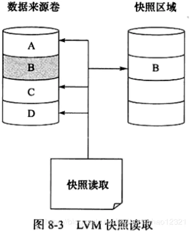

# 快照

>数据库快照是个什么东西呢？可以这样理解，就是在某个时间点对指定数据库拍了一张快照，所以它是静态的，只读的，但本质上还是一个数据库，只要是数据库我们就是可以从里面取数据的，但是数据库快照这个数据库取数据库的原理是这样的：快照生成之后，如果数据库中任何数据页都没有被修改（insert,delete,update等），这个时候快照的mdf文件是空的，几乎不占用任何磁盘空间，这个时候从数据库快照中取数据库其实还是从源数据库中取。快照生成之后，数据库中的数据发生变动，这个时候数据库快照的mdf文件中就有了数据，但是只限于刚刚被修改之前的数据，举例 ： 10 被修改为 100，这个时候数据库快照中存放10，源数据库中存放100.如果从数据库快照中去的数据既有被修改的也有没有被修改的，修改部分从数据库快照的mdf文件中获得，没有被修改的还是从源数据库中获得。

>B区块被修改了,因此历史数据放人了快照区域。读取快照数据时,A、C、D块还是从原有卷中读取,而B块就需要从快照读取了。

