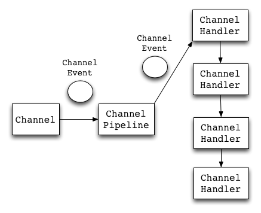
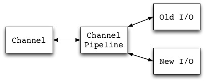
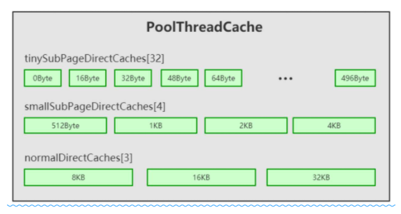
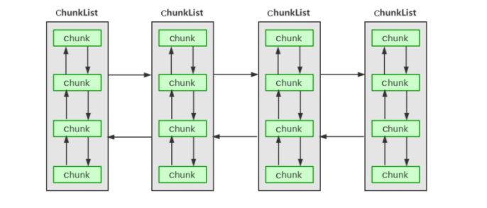
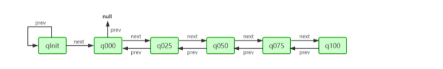
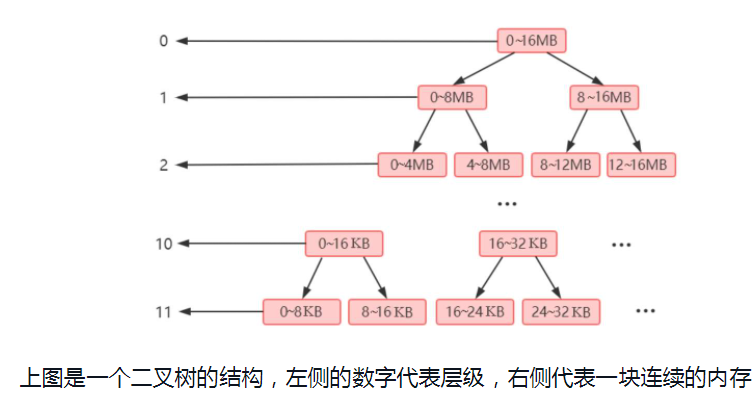

# netty

### Pipeline解决的问题
>一是提供了ChannelHandler的编程模型，基于ChannelHandler开发业务逻辑，基本不需要关心网络通讯方面的事情，专注于编码/解码/逻辑处理就可以了。Handler也是比较方便的开发模式，在很多框架中都有用到。
>二是实现了所谓的"Universal Asynchronous API"。这也是Netty官方标榜的一个功能。用过OIO和NIO的都知道，这两套API风格相差极大，要从一个迁移到另一个成本是很大的。即使是NIO，异步和同步编程差距也很大。而Netty屏蔽了OIO和NIO的API差异，通过Channel提供对外接口，并通过ChannelPipeline将其连接起来，因此替换起来非常简单

## buff & cache & zero_copy

### Arena分配内存的基本流程有三个步骤
>（1）优先从对象池里获得PooledByteBuf进行复用。
>（2）然后在缓存中进行内存分配。
>（3）最后考虑从内存堆里进行内存分配

### chunk & page

>根据Chunk的内存使用率划分ChunkList

