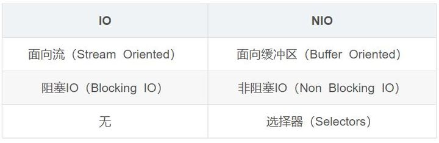
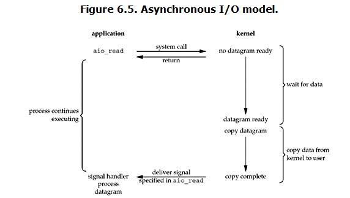

# 五种不同IO类型

## IO模型主要分类
>1，同步(synchronous) IO和异步(asynchronous) IO
>2，阻塞(blocking) IO和非阻塞(non-blocking)IO
>3，同步阻塞(blocking-IO)简称BIO
>4，同步非阻塞(non-blocking-IO)简称NIO
>5，异步非阻塞(synchronous-non-blocking-IO)简称AIO

## 同步与异步
>1，A synchronous I/O operation causes the requesting process to be blocked until that I/O operation completes;

>2，An asynchronous I/O operation does not cause the requesting process to be blocked;

## BIO:blocking IO

## NIO:non-blocking IO :用户进程其实是需要不断的主动询问kernel数据好了没有

>NIO重点是把Channel（通道），Buffer（缓冲区），Selector（选择器）三个类之间的关系弄清楚。

### 1.缓冲区Buffer
>在NIO中，所有的数据都是用缓冲区处理
>Buffer是一个对象。它包含一些要写入或者读出的数据。在面向流的I/O中，可以将数据写入或者将数据直接读到Stream对象中
>缓冲区实质是一个数组,缓冲区不仅仅是一个数组，缓冲区提供了对数据的结构化访问以及维护读写位置（limit）等信息。

### 2.通道Channel
>Channel是一个通道，可以通过它读取和写入数据，他就像自来水管一样，网络数据通过Channel读取和写入。
>通道和流不同之处在于通道是双向的，流只是在一个方向移动，而且通道可以用于读，写或者同时用于读写。
>因为Channel是全双工的，所以它比流更好地映射底层操作系统的API，特别是在UNIX网络编程中，底层操作系统的通道都是全双工的，同时支持读和写。
>Channel有四种实现：
>1，FileChannel:是从文件中读取数据。
>2，DatagramChannel:从UDP网络中读取或者写入数据。
>3，SocketChannel:从TCP网络中读取或者写入数据。
>4，ServerSocketChannel:允许你监听来自TCP的连接，就像服务器一样。每一个连接都会有一个SocketChannel产生。

### 3.多路复用器Selector
>Selector选择器可以监听多个Channel通道感兴趣的事情(read、write、accept(服务端接收)、connect，实现一个线程管理多个Channel，节省线程切换上下文的资源消耗。Selector只能管理非阻塞的通道，FileChannel是阻塞的，无法管理。

#### 关键对象
>1，Selector：选择器对象，通道注册、通道监听对象和Selector相关。
>2，SelectorKey：通道监听关键字，通过它来监听通道状态

#### 监听注册：监听注册在Selector
>socketChannel.register(selector, SelectionKey.OP_READ);

#### 监听的事件有
>1，OP_ACCEPT: 接收就绪，serviceSocketChannel使用的
>2，OP_READ: 读取就绪，socketChannel使用
>3，OP_WRITE: 写入就绪，socketChannel使用
>4，OP_CONNECT: 连接就绪，socketChannel使用

## IO multiplexing：select（线性遍历），epoll（回调）：event driven IO

## Asynchronous-IO
>从kernel的角度，当它受到一个asynchronous read之后，首先它会立刻返回，所以不会对用户进程产生任何block。然后，kernel会等待数据准备完成，然后将数据拷贝到用户内存，当这一切都完成之后，kernel会给用户进程发送一个signal，告诉它read操作完成了

