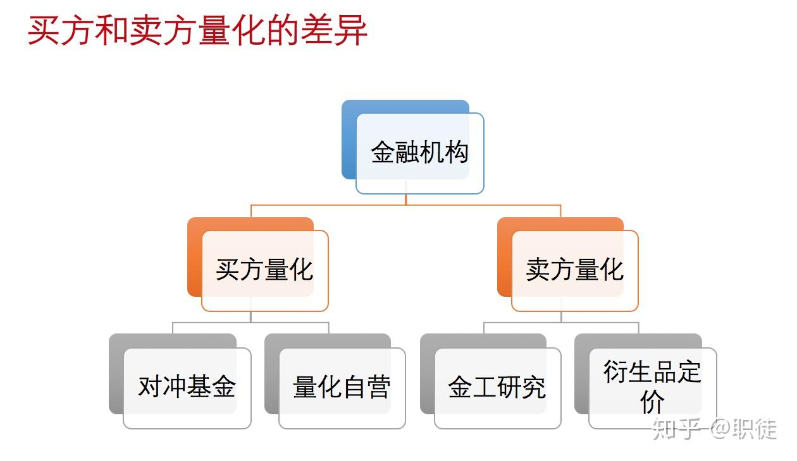

 /Users/mac/.m2/settings.xml

>1，聚宽量化（JoinQuant）：聚宽量化平台为用户提供了丰富的金融数据和量化交易服务，包括行情数据、财务数据、宏观数据等。聚宽还提供策略回测、模拟交易和实盘交易功能。网址：https://www.joinquant.com/    
>2，掘金量化（MyQuant）：掘金量化平台提供了全球股票、期货、期权、数字货币等多种金融产品的数据和量化交易服务。用户可以使用 Python、C++、C# 等多种语言进行策略研究和回测。掘金量化还支持模拟交易和实盘交易。网址：https://www.myquant.cn/   
>3，BigQuant：BigQuant 是一个基于人工智能的量化投资平台，提供了丰富的金融数据、机器学习算法和量化策略研究工具。用户可以使用 BigQuant 的在线编程环境进行策略研究、回测和优化。网址：https://bigquant.com/    
>4，优矿（Uqer）：优矿是 DataYes（万得数据）旗下的量化投资平台，提供了丰富的金融数据和量化策略研究工具。用户可以使用优矿的在线编程环境进行策略研究、回测和优化。网址：https://uqer.io/    
>5，vn.py：vn.py 是一款基于 Python 的开源量化交易框架，支持股票、期货、期权、数字货币等多种金融产品的交易。用户可以基于 vn.py 进行策略研究、回测、模拟交易和实盘交易。Github：https://github.com/vnpy/vnpy    

## 聚宽：
数据方面：提供2005年至今完整的股市Leve1数据、上市公司财务数据、完整的停复权信息。实时更新行情数据，盘后更新财务数据。此外还提供基金（包括ETF、LOF、分级A/B基金、货币基金）的行情和净值数据，金融期货数据、股票指数数据、行业板块数据、概念板块数据、宏观数据、行情数据等。

研究方面：提供基于IPython Notebook的研究平台，支持Tick级数据，支持Python2、Python3。提供API（Application Programming Interface）。

回测方面：支持股票、基金、期货等品种的回测，支持日、分钟、Tick级回测。

模拟交易方面：支持股票、股指期货、商品期货、ETF等品种的日、分钟、Tick级别的模拟交易。

实盘交易方面：和第一创业合作，支持股票、场内基金、期货的自动化实盘交易。

交流社区方面：“聚宽社区”，活跃度很高。

公司地址：北京市朝阳区

## bigquant

数据方面：提供日/分钟级别的股票、期货、基金等数据的实时和历史数据，以及新闻、社交等新型数据。

研究方面：支持Python，提供AI开发策略。提供API。

回测方面：支持股票、期货等品种的回测，支持日、分钟、Tick级回测。

模拟交易方面：支持日、分钟级别的股票、期货等品种的模拟交易。

实盘交易方面：可推送秒级交易信号，提供API接口对接交易终端，由用户手动交易。

交流社区方面：“Bigquant量化社区”，活跃度较高。

公司地址：成都市高新区。