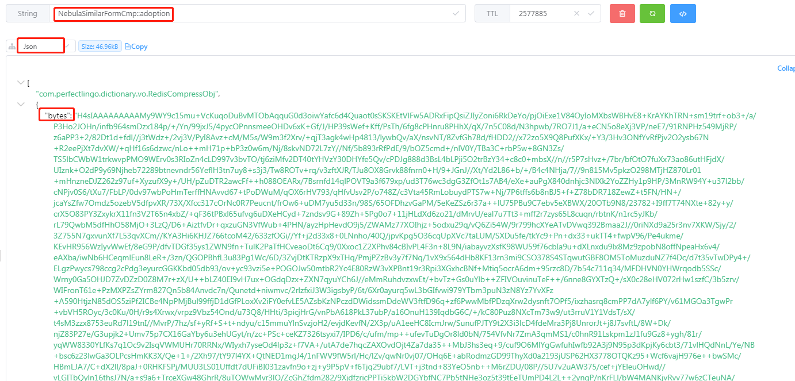

# 用Gzip数据压缩方式优化redis大对象缓存

## 现象
>1，业务需要，存入redis中的缓存数据过大，占用了10+G的内存，内存作为重要资源，需要优化一下大对象缓存

## 选择GZIP的原因
>1，参照如下图，gzip的压缩比和压缩效率都还算中上，重要的是， 当我们用gzip压缩，我们用http返回业务数据的时候，直接以gzip方式返回，减少解压开销
>2，减少redis内存占用，减少网络带宽

### 文中以一个445M的文件对常见的压缩方式进行了比较
* [图片参考引用](https://www.shenyanchao.cn/blog/2019/02/13/redis-serializer/)


## 初步探索

* [参考：jedis-gzip-二进制方式](https://www.codeleading.com/article/61855817861/)
  
### 相关代码

#### 方案一：做序列化，再做Gzip压缩，再存入redis，获取时，反向操作
>1，弊端就是需要解压，反序列化，增加了开销
>2，当下只能用jedis，才能存储byte[] 二进制数据数据，但是jedis是线程不安全的，且项目中已经有了lecture作为redis client，不好再引入jedis
>3，redis还只能存储gzip压缩之后的二进制数据，否则会解析不出来，lecture的API又没有操作二进制的方法，如果二进制转string，就会发生string得不到原二进制数据

```

import com.fasterxml.jackson.annotation.JsonAutoDetect;
import com.fasterxml.jackson.annotation.PropertyAccessor;
import com.fasterxml.jackson.databind.ObjectMapper;
import lombok.extern.slf4j.Slf4j;
import org.apache.tomcat.util.http.fileupload.IOUtils;
import org.springframework.data.redis.serializer.Jackson2JsonRedisSerializer;
import org.springframework.data.redis.serializer.JdkSerializationRedisSerializer;
import org.springframework.data.redis.serializer.RedisSerializer;
import org.springframework.data.redis.serializer.SerializationException;

import java.io.ByteArrayInputStream;
import java.io.ByteArrayOutputStream;
import java.util.zip.GZIPInputStream;
import java.util.zip.GZIPOutputStream;

@Slf4j
public class CompressRedis extends JdkSerializationRedisSerializer {

    public static final int BUFFER_SIZE = 4096;
    // 序列化器
    private RedisSerializer<Object> innerSerializer;

    public CompressRedis() {
        this.innerSerializer = getValueSerializer();
    }

    @Override
    public byte[] serialize(Object graph) throws SerializationException {
        if (graph == null) {
            return new byte[0];
        }
        ByteArrayOutputStream bos = null;
        GZIPOutputStream gzip = null;
        try {
            // 先序列化
            byte[] bytes = innerSerializer.serialize(graph);
            bos = new ByteArrayOutputStream();
            gzip = new GZIPOutputStream(bos);
            // 再压缩
            gzip.write(bytes);
            gzip.finish();
            byte[] result = bos.toByteArray();
            return result;
        } catch (Exception e) {
            throw new SerializationException("Gzip Serialization Error", e);
        } finally {
            IOUtils.closeQuietly(bos);
            IOUtils.closeQuietly(gzip);
        }
    }

    @Override
    public Object deserialize(byte[] bytes) throws SerializationException {
        if (bytes == null || bytes.length == 0) {
            return null;
        }
        ByteArrayOutputStream bos = null;
        ByteArrayInputStream bis = null;
        GZIPInputStream gzip = null;
        try {
            bos = new ByteArrayOutputStream();
            bis = new ByteArrayInputStream(bytes);
            gzip = new GZIPInputStream(bis);
            byte[] buff = new byte[BUFFER_SIZE];
            int n;
            // 先解压
            while ((n = gzip.read(buff, 0, BUFFER_SIZE)) > 0) {
                bos.write(buff, 0, n);
            }
            // 再反序列化
            Object result = innerSerializer.deserialize(bos.toByteArray());
            return result;
        } catch (Exception e) {
            throw new SerializationException("Gzip deserizelie error", e);
        } finally {
            IOUtils.closeQuietly(bos);
            IOUtils.closeQuietly(bis);
            IOUtils.closeQuietly(gzip);
        }
    }

    private static RedisSerializer getValueSerializer() {
        Jackson2JsonRedisSerializer jackson2JsonRedisSerializer = new Jackson2JsonRedisSerializer(Object.class);
        ObjectMapper om = new ObjectMapper();
        om.setVisibility(PropertyAccessor.ALL, JsonAutoDetect.Visibility.ANY);
        om.enableDefaultTyping(ObjectMapper.DefaultTyping.NON_FINAL);
        jackson2JsonRedisSerializer.setObjectMapper(om);
        return jackson2JsonRedisSerializer;
    }

}

```
>2，jedis存储二进制gzip数据
```
public byte[] getCompressAndSave(String word) {
		String key= SimilarFormResourceKeyCompress+"::"+word;
		Jedis jedis=new Jedis();
		byte[] compress=jedis.get(key.getBytes());

		if(compress==null) {
			SimilarForm similarForm = getNebulaSimilarForm(word);
			Result result = Result.success(similarForm);
			String content = JSONObject.toJSONString(result);
			compress = CompressUtil.compress(content);


			jedis.set(key.getBytes(), compress);
		}

		return compress;
	}


```

#### 方案二：完整应答对象（Result{code，msg，data}）转json字符串，再Gzip压缩，获取时，直接作为http Gzip数据流应答
>1，优势则是不用额外解压和反序列化
>2，直接作为http gzip数据流应答，减少网络带宽，提升效率

#### 设计基于lecture redis client的gzip缓存方法
>1，原因：redis还只能存储gzip压缩之后的二进制数据，否则会解析不出来，lecture的API又没有操作二进制的方法，如果二进制转string，就会发生string得不到原二进制数据
>2，解决办法就是，再设计一个RedisCompressObj，只用来存储byte[]数据，包装一层，以避免直接操作二进制数组
```
@Data
public class RedisCompressObj implements Serializable {
	private static final long serialVersionUID = 1849342735494672132L;

	private byte[] bytes;
}
```

>1，完整应答对象（Result{code，msg，data}）转json字符串，再Gzip压缩，再作为RedisCompressObj存入redis，不会破坏gzip二进制数据，又可以统一用@Cacheable
```
@Cacheable(value =SimilarFormResourceKeyCompress, key = "#word", unless = "#result == null")
	public RedisCompressObj getResource(String word) {
		SimilarForm similarForm = getNebulaSimilarForm(word);
		Result result = Result.success(nebulaSimilarForm);
		String content = JSONObject.toJSONString(result);
		byte[] compress = CompressUtil.compress(content);
		RedisCompressObj redisCompressObj = new RedisCompressObj();
		redisCompressObj.setBytes(compress);

		return redisCompressObj;
	}
```

>2，json字符串，直接Gzip压缩
```
public class CompressUtil {
	
	public static byte[] compress(String content){
		if (StringUtils.isEmpty(content)) {
			return null;
		}
		ByteArrayOutputStream bos = null;
		GZIPOutputStream gzip = null;
		try {

			bos = new ByteArrayOutputStream();
			gzip = new GZIPOutputStream(bos);
			// 再压缩
			gzip.write(content.getBytes());
			gzip.finish();
			return bos.toByteArray();
		} catch (Exception e) {
			throw new SerializationException("Gzip Serialization Error", e);
		} finally {
			IOUtils.closeQuietly(bos);
			IOUtils.closeQuietly(gzip);
		}
    }
}
```

#### 作为http gzip数据流直接应答，减少带宽
```
public ResponseEntity<byte[]> getWordCompress(@RequestParam(value = "word") String word) {
		String uid = getCurrentUserId();
		RedisCompressObj redisCompressObj = similarFormHandle.getResource(word, uid, true);

		byte[] json = redisCompressObj.getBytes();
		MultiValueMap<String, String> headers = new HttpHeaders();
		headers.add("Content-Encoding", "gzip");
		headers.add("Content-Type", "application/json");

		ResponseEntity<byte[]> rspEntity = new ResponseEntity<byte[]>(json, headers, HttpStatus.OK);

		return rspEntity;
	}
```

### 对方案二做测试
>1，工具postman，用来查看接口应答，有gzip和没有gzip之间的应答数据量情况
>2，redis桌面工具Another-Redis-Desktop，用来查看在redis中，gzip压缩之后和没有压缩之后所占内存情况


资源 | 不压缩http应答 | 压缩http应答| 不压缩redis内存占用 | 压缩redis内存占用| 备注
---------|----------|---------|----------|---------|----------
 boot | 749KB | 29KB| 1.2MB | 39.5KB| http接口应答优化96.2%，redis内存占用优化 96.8%
 mistreat | 199.5KB | 13.9KB| 487.5KB | 14K| http接口应答优化93.1%，redis内存占用优化 97.2%
 Monday | 55.7KB | 5.1KB| 134KB | 6.7KB| http接口应答优化90.9%，redis内存占用优化 95%
  allocation | 4.22MB | 252.6KB| 10.3MB | 336.6KB| http接口应答优化94%，redis内存占用优化 96.8%
 adoption | 659.5KB | 35.4KB| 1.59MB | 46.9KB| http接口应答优化94.7%，redis内存占用优化 97.2%





## 结论
>1，用gzip做压缩优化内存，是当前几种压缩算法中算法压缩比和加压缩性能，属于中上，但是很适合http，可以避免解压和反序列开销
>2，基于lecture redis client不能操作二进制数据，但是gzip二进制数据不能转string，会反转失败
>3，基于lecture redis client和@Cacheable结合的缓存机制，会把对象序列化成json（项目中配置的是jackson2JsonRedisSerializer），并还会额外保存引用的对象，利于反序列化成对象，多占用了内存
>4，用redis缓存RedisCompressObj(byte[])，是当前方案中，比较适用的方式，不会出现乱码，格式转换失败的异常
>5，用gzip压缩大对象优化redis缓存和接口流量，效果都达到90%以上
